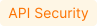

# CLAUDE.md

This file provides guidance to Claude Code (claude.ai/code) when working with code in this repository.

## Build & Serve Commands

This is a documentation site built with **zensical** (MkDocs-based). Python dependencies are in `requirements.txt`.

```bash
# Install dependencies
pip install -r requirements.txt

# Serve locally (7.x version — the current/default version)
cp -R images/ docs/7.x/images/ && zensical serve -f mkdocs-7.x.yml
# After stopping, clean up: rm -rf docs/7.x/images/

# Serve locally (6.x version)
cp -R images/ docs/6.x/images/ && zensical serve -f mkdocs-6.x.yml

# Build a specific version
cp -R images/ docs/7.x/images/ && zensical build -f mkdocs-7.x.yml && rm -rf docs/7.x/images/
```

Images must be copied into the version's `docs_dir` before build/serve because zensical does not follow symlinks. Always clean up after.

There are no tests or linters. Validation happens via Netlify preview builds on PRs.

## Repository Architecture

### Content flow: latest → version wrappers → site

```
docs/latest/         ← SOURCE OF TRUTH. All editing happens here.
  ├── about-wallarm/
  ├── agentic-ai/
  ├── api-discovery/
  ├── api-sessions/
  ├── human-identity/
  ├── installation/
  ├── updating-migrating/
  ├── user-guides/
  └── ...30+ section folders

docs/7.x/           ← Version wrapper. Each file is a one-line include:
  └── section/page.md    contains:  --8<-- "latest/section/page.md"

docs/6.x/           ← Same pattern, older version
```

`mkdocs-7.x.yml` and `mkdocs-6.x.yml` inherit from `mkdocs-base.yml` and define navigation + version-specific extras. The `6.x` config sets `is_latest: true` (serves at site root `/`), while `7.x` serves under `/7.x/`.

### Reusable content (includes)

```
include/             ← English snippets shared across pages
include-ja/          ← Japanese translated snippets
include-ar/          ← Arabic translated snippets
```

Referenced from docs via `--8<-- "../include/snippet.md"`. The snippet base path is `docs/` (configured in `mkdocs-base.yml` under `pymdownx.snippets`), so paths in snippet directives are relative to the `docs/` directory.

### Images

`images/` at repo root is the single source for all screenshots/diagrams. Version directories (`docs/6.x/images/`, `docs/7.x/images/`) are either symlinks or get images copied in at build time.

### Reference files

- `.doc-agent/glossary.md` — official terminology with approved/forbidden synonyms
- `.doc-agent/style-guide.md` — writing conventions
- Confluence glossary: https://wallarm.atlassian.net/wiki/spaces/PRO/pages/1629651226/Glossary
- Confluence style guide: https://wallarm.atlassian.net/wiki/spaces/PRO/pages/1610350667/Technical+documentation+style+guide

## Page Templates

Use the appropriate template structure depending on the document type. These patterns are derived from real pages in the repository.

### Feature page (most common)

Used for documenting new Wallarm capabilities. Examples: `agentic-ai/mcp-discovery.md`, `agentic-ai/mcp-mitigation-controls.md`, `human-identity/web-antibot.md`.

```markdown
# Feature Name <a href="../../about-wallarm/subscription-plans/#core-subscription-plans"></a>

Short intro: 1-3 sentences explaining what this feature does and its value.

## Requirements

* The [subscription plan](../about-wallarm/subscription-plans.md#core-subscription-plans) name
* [NGINX Node](../installation/nginx-native-node-internals.md#nginx-node) X.Y.Z or higher, or [Native Node](../installation/nginx-native-node-internals.md#native-node) A.B.C or higher

## How [feature] works

Explanation of the mechanism.


## [Feature-specific sections]

### Configuration

| Parameter | Description |
|---|---|
| **Parameter name** | What it does. |

### Attack type (if applicable)

What attack type is registered when detection triggers.

### Example

Concrete scenario with:
* Specific values
* Screenshot of the configured control/feature

## [Additional sections as needed]
```

The subscription badge is included in H1 only when the feature requires a specific subscription plan (Advanced API Security, Security Testing, etc.). Check existing pages in the same section for whether to include it.

### Release notes / changelog

Used for version history. Examples: `updating-migrating/native-node/node-artifact-versions.md`, `updating-migrating/what-is-new.md`.

```markdown
# [Artifact Type] Versions and Changelog

Intro paragraph with link to versioning policy.

## [Artifact form factor]

[How to upgrade](link-to-upgrade-guide.md)

### X.Y.Z (YYYY-MM-DD)

* Added [feature name](link) — short description
* Fixed [issue description](link-if-CVE)
* Changed [what changed] — from X to Y
* Removed [what was removed]
```

Rules for changelog entries:
- Start each bullet with a verb: Added, Fixed, Changed, Removed, Bumped
- Link new features to their documentation pages
- Link CVEs to NVD: `[CVE-YYYY-NNNNN](https://nvd.nist.gov/vuln/detail/CVE-YYYY-NNNNN)`
- Group related changes under a parent bullet with sub-bullets
- Use tables for metrics changes: `| Change | Metric |`

### Installation / deployment guide

Examples: `installation/native-node/all-in-one.md`, `installation/native-node/docker-image.md`.

```markdown
# Deploying [Artifact] with [Method]

Short intro: what this artifact is and what it is for.

## Use cases and deployment modes

* When [scenario 1]. Use the installer in `mode-name` mode.
* When [scenario 2]. Use the installer in `mode-name` mode.

## Requirements

Bullet list of prerequisites (OS, architecture, network access, roles).

## Limitations

Bullet list of known limitations.

## Installation

### 1. Step name

Instructions with code blocks.

### 2. Step name

=== "Option A"
    ```bash
    command
    ```
=== "Option B"
    ```bash
    command
    ```
```

### Overview / landing page

Examples: `agentic-ai/overview.md`, `api-discovery/overview.md`.

```markdown
# Topic Overview

Context paragraph: why this matters, what problem it solves.

## [Challenge / Problem area]

Bullet list of specific problems.

## Wallarm's [Topic] Capabilities

### Capability 1
Description with links.

### Capability 2
Description with links.

## How It Works

1. **Step** - description
2. **Step** - description

## Getting Started

* [Link to guide 1](path)
* [Link to guide 2](path)
```

## Creating a New Page

1. Write the page in `docs/latest/<section>/new-page.md`
2. Create wrapper in `docs/7.x/<section>/new-page.md`:
   ```
   --8<-- "latest/<section>/new-page.md"
   ```
3. Create wrapper in `docs/6.x/<section>/new-page.md` (same pattern)
4. Add to navigation in **both** `mkdocs-7.x.yml` and `mkdocs-6.x.yml`
5. Use lowercase filenames with hyphens: `api-discovery-setup.md`
6. Place in an appropriate existing section folder

## Formatting Rules

### Markdown extensions (Material for MkDocs)

- **Admonitions**: `!!! info "Title"`, `!!! warning "Title"`, `!!! info ""` (no title)
- **Tabs**: `=== "Tab name"`
- **Collapsible sections**: `??? "Title"` (collapsed), `???+ "Title"` (expanded)
- **Code blocks**: triple backticks with language identifier
- **Snippets/includes**: `--8<-- "path/to/file.md"`

### Cross-references

- Sibling: `[Link text](sibling.md)`
- Other section: `[Link text](../section/page.md)`
- With anchor: `[Link text](../section/page.md#section-anchor)`
- Never use absolute paths or full URLs to docs.wallarm.com
- Use informative link text: `follow the [Wallarm documentation](url)` not `[click here](url)`
- Exclude articles from link text

### Images

- Place in root `images/` directory, organized by section (e.g., `images/about-wallarm-waf/api-discovery-2.0/`)
- Reference: ``
- Non-zoomable: ``
- Missing screenshots: `<!-- TODO: add screenshot -->`
- Do not create diagrams/schemes — Wallarm uses Figma. Leave TODO placeholders.
- Use `.png` extension

### Tables

- Always include column headers
- Prefer tables for: configuration parameters, version comparisons, feature mappings
- Configuration tables use: `| Parameter | Description |` or `| Parameter | Description | Default |`
- Comparison tables use: `| | Option A | Option B |`
- Do not overload tables with text; move long descriptions to sub-bullets or paragraphs

### Numbered steps

- Use `1.` for all steps (MkDocs auto-numbers)
- For sub-steps within numbered lists, indent with 4 spaces
- Add code blocks, images, and admonitions inside steps with 4-space indentation

## Writing Style

- **American English**, no contractions ("do not" not "don't")
- **Present tense, active voice, second person**: "You configure..." not "Configuration is performed..."
- **Imperative for instructions**: "Open the file" not "You should open the file"
- **No marketing language** — state facts
- **Shorter sentences**: aim for 15-20 words average
- **Write positively**: avoid "damage", "fatal", "kill", "catastrophic"
- **Connect sentences**: use transitions; avoid disconnected content
- **Conditional clauses before instructions**: "For more information, see..." not "See... for more information"
- **State purpose first**: briefly describe what the instruction achieves before the steps
- **First person (we)**: only for Wallarm recommendations: "We recommend..." or "Wallarm recommends..."
- **Stay polite moderately**: use "please" only for expressing excuse. Never use "thank you"

### Terminology

Check `.doc-agent/glossary.md` before using any Wallarm-specific term. Key rules:

| Use | Do NOT use |
|-----|------------|
| NGINX Node | Nginx Node, nginx node |
| Native Node | native Node (lowercase n) |
| Wallarm Console | Wallarm portal, Wallarm UI, lowercase "console" |
| Wallarm Cloud | Wallarm cloud (lowercase c) |
| security issue / vulnerability | vuln |
| denylist / allowlist / graylist | blacklist / whitelist / greylist |
| postanalytics module / postanalytics | — |
| wstore | Tarantool (in latest versions) |
| Security Edge | — |
| deployment artifact | — |
| attack | threat (as a synonym for attack) |

External component names — always use official capitalization:
- **NGINX** (not nginx, Nginx)
- **Docker** (not docker, DOCKER)
- **Kubernetes** or **K8s** (Ingress capitalized, controller lowercase)
- **Amazon Web Services / AWS** (not Amazon AWS)
- **Google Cloud Platform / Google Cloud** (not Google cloud)
- **GitLab** (not Gitlab)

### Highlighting

- **Bold**: UI element names the user clicks ("Press **Save**"), important text
- **`Code`**: anything user enters, code blocks, file/method/parameter/value names, CLI commands
- **Info admonition**: useful links, alternative steps, term definitions
- **Warning admonition**: critical info affecting instructions, security alerts, restrictions
- **→ symbol**: sequence of UI actions: "Go to Wallarm Console → **Triggers**"
- **Avoid**: quotation marks and brackets for highlighting

### Placeholders in code

- Format: `<UPPERCASE_WITH_UNDERSCORES>` (e.g., `<YOUR_API_TOKEN>`, `<YOUR_SECRET_KEY>`)
- Use realistic but fake example values for domains, IPs, tokens:
  - Domains: `api.example.com`, `example.com`
  - IPs: `1.1.1.1`, `2.2.2.2`
  - Names: John Doe, John Smith
  - Emails: `johndoe@example.com`

### Version requirements

When a feature needs a minimum Node version, include a version table:

```markdown
| Required [NGINX Node](../installation/nginx-native-node-internals.md#nginx-node) version | Required [Native Node](../installation/nginx-native-node-internals.md#native-node) version |
| --- | --- |
| 6.12.0 | 0.25.0 |
```

### Numbers and dates

- Spell out numbers at sentence start, use numerals otherwise
- Commas for numbers over 3 digits: `999`, `1,000`
- Use `%` symbol, not "percent"
- Space between numeral and unit: `10 MB`, `100 RPS`
- Date format: **Month day, year** (March 19, 2019) — never MM/DD/YYYY

## Common Tasks

### Version bump across docs

When bumping Node versions (Docker tags, installer URLs, Helm chart versions):

1. Identify all files referencing the old version:
   - `docs/latest/admin-en/installation-docker-en.md` — Docker image tags
   - `docs/latest/installation/native-node/all-in-one.md` — installer download URLs
   - `include/waf/installation/all-in-one-installer-run.md` — run commands
   - `include/waf/installation/all-in-one/launch-options.md` — option tables
   - `docs/latest/updating-migrating/native-node/node-artifact-versions.md` — changelog
2. Use grep to find all occurrences of the old version string
3. Replace in all files consistently
4. Do NOT modify `docs/6.x/` or `docs/7.x/` wrapper files — only edit `docs/latest/` and `include/`

### Adding support for a new cloud region

When adding a new Wallarm Cloud region (e.g., ME Cloud):

1. Update `include/wallarm-cloud-ips.md` with the new IPs
2. Update `include/cloud-ip-by-request.md` if egress IPs differ
3. Update all requirement files in `include/waf/installation/` that list Cloud API URLs
4. Update all installation/deployment docs that contain Cloud URL selection (tabs or conditional text)
5. Add scanner IP addresses file: `docs/latest/downloads/scanner-ip-addresses-<region>.txt`

### Reusing content with includes

- If text is repeated in 2+ articles, extract it to `include/` directory
- Reference via `--8<-- "../include/path/to/snippet.md"` (path relative to `docs/`)
- Check existing includes before creating new ones — many common patterns already exist in `include/waf/installation/`

## What NOT to Do

- Do NOT edit `mkdocs-base.yml`, `netlify.toml`, or files in `stylesheets/`
- Do NOT edit files in `docs/6.x/` or `docs/7.x/` directly — they are include wrappers (exception: creating new wrappers for new pages)
- Do NOT invent features not described in the source material
- Do NOT add content in languages other than English
- Do NOT remove existing content unless explicitly instructed
- Do NOT modify files outside the `docs/`, `images/`, `include/`, and `mkdocs-*.yml` scope
- Do NOT place images inside `docs/` directories — always use the root `images/` folder
- Do NOT modify installation/deployment docs unless explicitly required by the ticket
- Do NOT use contractions (it's, don't, can't)
- Do NOT use "blacklist" / "whitelist" — use "denylist" / "allowlist"
- Do NOT use full URLs to docs.wallarm.com for cross-references
- Do NOT use directional language ("in the right sidebar") — UI can change
- Do NOT skip header levels for styling
- Do NOT start titles with articles ("The configuration of...")
