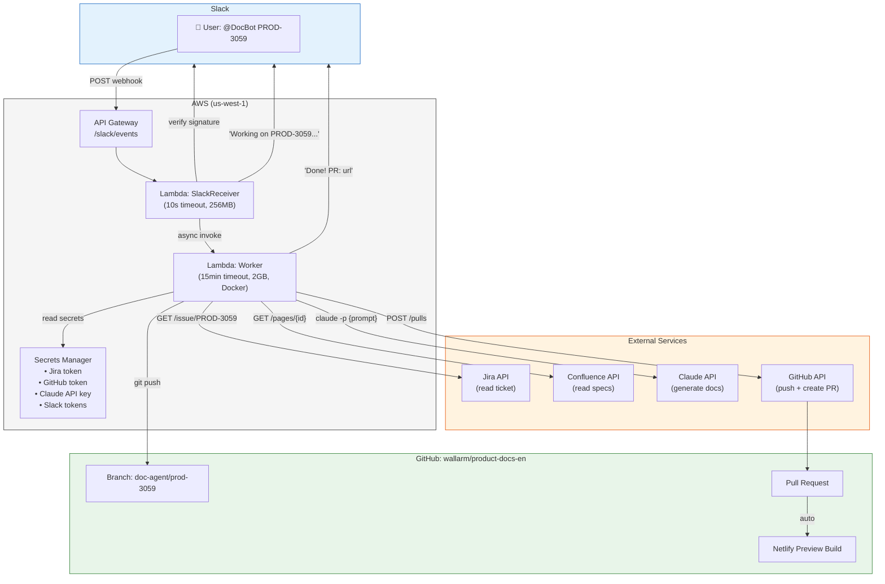
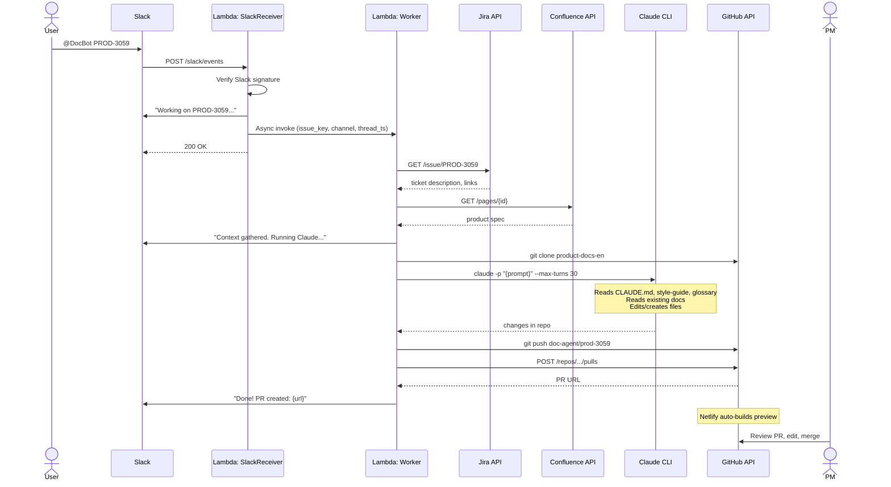

# Doc Agent Architecture

## System diagram

## Sequence diagram

## How to export

1. Copy a diagram block above
2. Paste into https://mermaid.live
3. Export as PNG or SVG
4. Or paste into Confluence — it renders Mermaid natively with the Mermaid plugin
