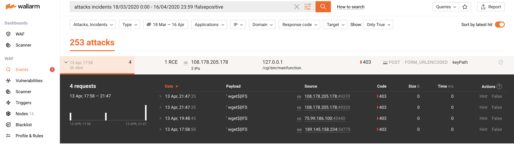

# Glossary

## Vulnerability
A vulnerability is an error made due to negligence or inadequate information when building or implementing a web application that can lead to an information security risk.

The information security risks are:

* Unauthorized data access; for example, access to read and modify user data.
* Denial of service.
* Data corruption and other.

A vulnerability is not a characteristic of the Internet. A vulnerability is a characteristic of your system. Whether or not you have vulnerabilities does not depend on your Internet traffic. The Internet traffic, however, can be used to detect the vulnerabilities, which is what Wallarm does, among other functions.

## Hit

A hit is a malicious request detected and possibly blocked by WAF node depending on [filtering mode configuration](admin-en/configure-wallarm-mode.md). For example:

## Attack

An attack is a collection of similar hits that target the same end-point using the same attack vector and come from the same or different IP addresses. An attack can include a single hit or multiple hits.

An example of an attack including a single hit:

An example of an attack including many hits:

## Attack Vector
An attack vector is a path or means by which a hacker can gain access to a network resource to deliver a payload.

## Security Incident
A security incident is an occurrence of a vulnerability exploitation. An incident is an attack targeted at a confirmed vulnerability.
An incident, just like an attack, is an entity external to your system and is a characteristic of the outside Internet, not the system itself. Despite the fact that the attacks targeted at existing vulnerabilities are a minority, they are of the utmost importance in terms of information security. Wallarm automatically detects the attacks targeted at existing vulnerabilities and displays them as a separate object.

## MITM
A man in the middle (MITM) attack consists of an attacker secretly relaying the communication between two parties who believe they are directly communicating with each other.
[See OWASP](https://owasp.org/www-community/attacks/Man-in-the-middle_attack).

## Circular Buffer
A circular buffer is a data structure that uses a single, fixed‑size buffer as if it were connected end‑to‑end.
[See Wikipedia](https://en.wikipedia.org/wiki/Circular_buffer).

## LOM
LOM stands for Local Objective Model. LOM is a set of rules for a particular web application. The set of rules is generated based on user requests to the web application and the application's responses.

## Invalid Request
A request that was checked by filter node and does not match LOM rules.

## Reverse Proxy
A reverse proxy is a type of proxy server that retrieves resources on behalf of a client from a server and returns the resources to the client as if they originated from the Web server itself.
[See Wikipedia](https://en.wikipedia.org/wiki/Reverse_proxy).

## Certificate Authority
A certificate authority is an entity that issues digital certificates.
[See Wikipedia](https://en.wikipedia.org/wiki/Certificate_authority).
