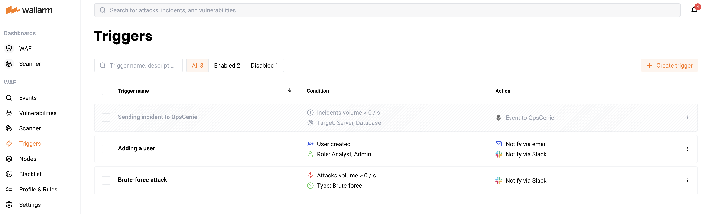

# Disabling Triggers

To temporarily stop sending notifications and reactions to events, you can disable the trigger. To permanently disable the trigger, you can [delete](delete-trigger.md) the trigger.

Triggers are disabled in your Wallarm account > the **Triggers** section via the **Disable** button. The section is available only for users with the **Administrator** [role](../settings/users.md).

A disabled trigger will be displayed in the lists with **All** and **Disabled** triggers.

To re‑enable sending notifications and reactions to events, the **Enable** option is used.
