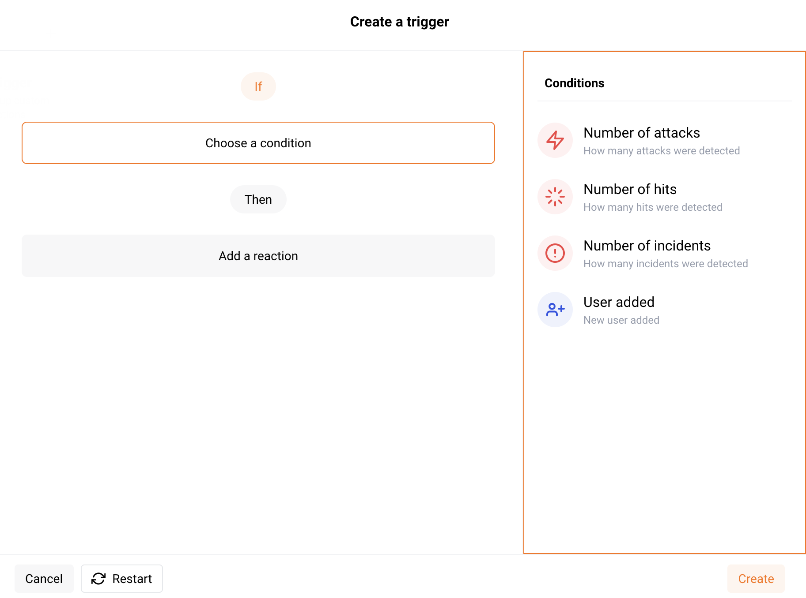

# Working with triggers

## What are triggers

Triggers are tools that are used to set up custom notifications and reactions to events. Using triggers, you can receive alerts on major events via the tools you use for your day-to-day workflow, for example via corporate messengers or incident management systems.

To reduce the amount of noise, you can also configure the parameters of events to be notified about. The following events are available for setup:

* [Attacks](../../glossary-en.md#attack)
* [Incidents](../../glossary-en.md#security-incident)
* [Hits](../../glossary-en.md#hit)
* Users added to the account

To receive notifications and reports, you can use Slack, email, Sumo Logic and other [integrations](../settings/integrations/integrations-intro.md).

Triggers are configured in the **Triggers** section of the Wallarm Console. The section is available only for users with the **Administrator** [role](../settings/users.md).

## Creating triggers

1. Click the **Create trigger** button.
2. [Choose](#step-1-choosing-a-condition) conditions.
3. [Add](#step-2-adding-filters) filters.
4. [Add](#step-3-adding-reactions) reactions.
5. [Save](#step-4-saving-the-trigger) the trigger.

### Step 1: Choosing a condition

A condition is a system event to be notified about. The following conditions are available for notification:
* Number of attacks
* Number of hits
* Number of incidents
* User added

Choose a condition in the Wallarm Console interface and set the lower threshold for the reaction, if the setting is available.

### Step 2: Adding filters

Filters are used for condition detailing. For example, you can set up reactions to attacks of certain types, such as brute-force attacks, SQL injections and others.

The following filters are available:

* **Type** is a [type](../../attacks-vulns-list.md) of attack detected in the request or a type of vulnerability the request is directed to.
* **Application** is the [application](../settings/applications.md) that receives the request or in which an incident is detected.
* **IP** is the IP address from which the request is sent.
* **Domain** is the domain that receives the request or in which an incident is detected.
* **Response status** is the response code returned to the request.
* **Target** is an application architecture part that the attack is directed at or in which the incident is detected. It can take the following values: `Server`, `Client`, `Database`.
* **User's role** is the role of the added user. It can take the following values: `Deploy`, `Analyst`, `Admin`.

Choose one or more filters in the Wallarm Console interface and set values for them.

### Step 3: Adding reactions

A reaction is an action that should be performed if the specified condition and filters are met. Reactions are divided into the **Notifications** and **Event management** groups. The tools in groups are configured as [integrations](../settings/integrations/integrations-intro.md). You can select one or more integrations from this list:
* Email
* Slack
* Telegram
* OpsGenie
* InsightConnect
* PagerDuty
* Splunk
* Sumo Logic
* Webhook

To add a reaction:
1. Set up integrations with email, messengers and incident management or SIEM systems as described in these [instructions](../settings/integrations/integrations-intro.md). To use an already existing integration, skip this step.
2. Choose the configured integration in the trigger creation modal window.

    

### Step 4: Saving the trigger

1. Click the **Create** button in the trigger creation modal window.
2. Specify the trigger's name and description (if required) and click the **Done** button.

The saved trigger will be displayed in the trigger list in the Wallarm Console.

## Disabling and deleting triggers

* To temporarily stop sending notifications and reactions to events, you can disable the trigger. A disabled trigger will be displayed in the lists with **All** and **Disabled** triggers. To re‑enable sending notifications and reactions to events, the **Enable** option is used.
* To permanently stop sending notifications and reactions to events, you can delete the trigger. Deleting a trigger cannot be undone. The trigger will be permanently removed from the trigger list.

To disable or delete the trigger, please select an appropriate option from the trigger menu and confirm the action if required.

## Demo videos

  <iframe width="1280" height="720" src="https://www.youtube.com/embed/ODHh-die9tY" frameborder="0" allow="accelerometer; autoplay; encrypted-media; gyroscope; picture-in-picture" allowfullscreen></iframe>

