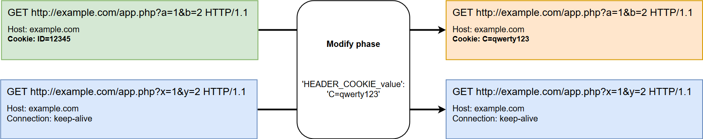

[link-points]:          points/intro.md
[link-ruby-regexp]:     http://ruby-doc.org/core-2.6.1/doc/regexp_rdoc.html
[link-ext-logic]:       logic.md

[img-modify]:           ../../images/dsl/common/phases/modify.png

# The Modify Phase

!!! info "Scope of the phase"
    This phase is used in a modifying extension and is optional for its operation (the `modify` section may be either absent or present in the YAML file).

    This phase should be absent from the non-modifying extension's YAML file.
    
    Read about the extension types in detail [here][link-ext-logic].

!!! info "Request elements description syntax"
    When creating a FAST extension, you need to understand the structure of the HTTP request sent to the application and that of the HTTP response received from the application in order to correctly describe the request elements that you need to work with using the points. 

    To see detailed information, proceed to this [link][link-points].
 
 This phase modifies values of a baseline request's parameters, if it is necessary. Note that you cannot add a new element that is absent from the baseline request using the Modify phase. For example, you cannot add the `Cookie` HTTP header if the baseline request does not contain it. 

The `modify` section in the extension YAML file contains an array of `<key: value>` pairs. Each pair describes a certain request element (the key) and data that should be inserted into this element (the value). The key can contain regular expressions in the [Ruby regular expressions format][link-ruby-regexp]. You cannot apply regular expressions to the key's value.

In the Modify phase, you can assign new values to the element or delete the element's data.

*   If the key's value is set, then this value will be assigned to the corresponding baseline request element. If there is no element corresponding to the key in the baseline request, then no new element insertion will be performed.
    
    
`'HEADER_COOKIE_value': 'C=qwerty123'`


    

*   If the key's value is not set, then the corresponding baseline request element's value will be cleared.
    
    
`'HEADER_COOKIE_value': ""`
    


In the example below, the baseline request will be modified in the following way:
1.  The `Content-Type` header's value will be replaced with `application/xml`.
2.  The `uid` GET parameter's value will be cleared (the parameter itself will not be removed).

```
modify:
  - "HEADER_CONTENT-TYPE_value": "application/xml"
  - "GET_uid_value": ""
```
