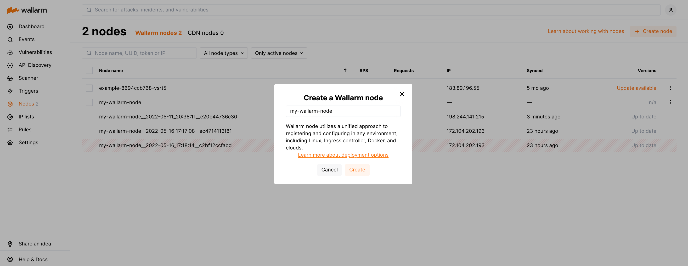

# Deploying Wallarm on AWS using Terraform

Wallarm provides the [Terraform module](https://registry.terraform.io/modules/wallarm/wallarm/aws/) to deploy the node to [AWS](https://aws.amazon.com/) from the Terraform-compatible environment. Use these instructions to explore the module and try the provided deployment examples.

By implementing the Wallarm Terraform module, we have provided the solution enabling **[in-line](../../../inline/overview.md) (which is proxy in this deployment method)** deployment of Wallarm Node. The deployment option is easily controlled by the `preset` Wallarm module variable.

## Use cases

Among all supported [Wallarm deployment options](../../../supported-deployment-options.md), Terraform module is recommended for Wallarm deployment in these **use cases**:

* Your existing infrastructure resides on AWS.
* You leverage the Infrastructure as Code (IaC) practice. Wallarm's Terraform module allows for the automated management and provisioning of the Wallarm node on AWS, enhancing efficiency and consistency.

## Requirements

* Terraform 1.0.5 or higher [installed locally](https://learn.hashicorp.com/tutorials/terraform/install-cli)
* Access to the account with the **Administrator** [role](../../../../user-guides/settings/users.md#user-roles) in Wallarm Console in the US or EU [Cloud](../../../../about-wallarm/overview.md#cloud)
* Access to `https://us1.api.wallarm.com` if working with US Wallarm Cloud or to `https://api.wallarm.com` if working with EU Wallarm Cloud. Please ensure the access is not blocked by a firewall
* Access to the IP addresses below for downloading updates to attack detection rules and [API specifications](../../../../api-specification-enforcement/overview.md), as well as retrieving precise IPs for your [allowlisted, denylisted, or graylisted](../../../../user-guides/ip-lists/overview.md) countries, regions, or data centers

    --8<-- "../include/wallarm-cloud-ips.md"

This topic does not include instructions for creating all AWS resources necessary to deploy Wallarm, such as a VPC cluster. For details, refer to the relevant [Terraform guide](https://learn.hashicorp.com/tutorials/terraform/module-use).

## How to use the Wallarm AWS Terraform Module?

To deploy Wallarm for production using the AWS Terraform module:

1. Sign up for Wallarm Console in the [US Cloud](https://us1.my.wallarm.com/signup) or [EU Cloud](https://my.wallarm.com/signup).
1. Open Wallarm Console → **Nodes** and create the node of the **Wallarm node** type.

    
1. Copy the generated node token.
1. Add the `wallarm` module code to your Terraform configuration:

    ```conf
    module "wallarm" {
      source = "wallarm/wallarm/aws"

      instance_type = "..."

      vpc_id     = "..."

      preset     = "proxy"
      proxy_pass = "https://..."
      token      = "..."

      ...
    }
    ```
1. Set variable values in the `wallarm` module configuration:

| Variable  | Description | Type | Required? |
| --------- | ----------- | --------- | --------- |
| `instance_type` | [Amazon EC2 instance type](https://aws.amazon.com/ec2/instance-types/) to be used for the Wallarm deployment, e.g.: `t3.small`. | string | Yes
| `vpc_id` | [ID of the AWS Virtual Private Cloud](https://docs.aws.amazon.com/managedservices/latest/userguide/find-vpc.html) to deploy the Wallarm EC2 instance to. | string | Yes
| `token` | [Wallarm node token](../../../../user-guides/nodes/nodes.md#creating-a-node) copied from the Wallarm Console UI.<br><div class="admonition info"> <p class="admonition-title">Using one token for several installations</p> <p>You can use one token in several installations regardless of the selected [platform](../../../../installation/supported-deployment-options.md). It allows logical grouping of node instances in the Wallarm Console UI. Example: you deploy several Wallarm nodes to a development environment, each node is on its own machine owned by a certain developer.</p></div> | string | Yes
| **Wallarm-specific variables** | | | |
| `host` | [Wallarm API server](../../../../about-wallarm/overview.md#cloud). Possible values:<ul><li>`us1.api.wallarm.com` for the US Cloud</li><li>`api.wallarm.com` for the EU Cloud</li></ul>By default, `api.wallarm.com`. | string | No
`upstream` | The [Wallarm node version](../../../../updating-migrating/versioning-policy.md#version-list) to be deployed. Minimum supported version is `4.0`.<br><br>By default, `4.8`. | string | No
| `preset` | Wallarm deployment scheme. Possible values: `proxy` (default). | string | No
| `proxy_pass` | Proxied server protocol and address. Wallarm node will process requests sent to the specified address and proxy legitimate ones to. As a protocol, 'http' or 'https' can be specified. The address can be specified as a domain name or IP address, and an optional port. | string | Yes, if `preset` is `proxy`
| `mode` | [Traffic filtration mode](../../../../admin-en/configure-wallarm-mode.md). Possible values: `off`, `monitoring`, `safe_blocking`, `block`.<br><br>By default, `monitoring`. | string | No
|`libdetection` | Whether to [use the libdetection library](../../../../about-wallarm/protecting-against-attacks.md#library-libdetection) during the traffic analysis.<br><br>By default, `true`. | bool | No
|`global_snippet` | Custom configuration to be added to the NGINX global configuration. You can put the file with the configuration to the Terraform code directory and specify the path to this file in this variable.<br><br>You will find the variable configuration example in the [example of the proxy advanced solution deployment](https://github.com/wallarm/terraform-aws-wallarm/tree/main/examples/advanced/main.tf#L17). | string | No
|`http_snippet` | Custom configuration to be added to the `http` configuration block of NGINX. You can put the file with the configuration to the Terraform code directory and specify the path to this file in this variable.<br><br>You will find the variable configuration example in the [example of the proxy advanced solution deployment](https://github.com/wallarm/terraform-aws-wallarm/tree/main/examples/advanced/main.tf#L18). | string | No
|`server_snippet` | Custom configuration to be added to the `server` configuration block of NGINX. You can put the file with the configuration to the Terraform code directory and specify the path to this file in this variable.<br><br>You will find the variable configuration example in the [example of the proxy advanced solution deployment](https://github.com/wallarm/terraform-aws-wallarm/tree/main/examples/advanced/main.tf#L19). | string | No
|`post_script` | Custom script to be run after the [Wallarm node initialization script (`cloud-init.py`)](../../cloud-init.md). You can put the file with any script to the Terraform code directory and specify the path to this file in this variable.<br><br>You will find the variable configuration example in the [example of the proxy advanced solution deployment](https://github.com/wallarm/terraform-aws-wallarm/tree/main/examples/advanced/main.tf#L34). | string | No
| **AWS deployment configuration** | | | |
| `app_name` | Prefix for the AWS resource names the Wallarm module will create.<br><br>By default, `wallarm`. | string | No
| `app_name_no_template` | Whether to use upper-case letters, numbers and special characters in the AWS resource names the Wallarm module will create. If `false`, resource names will include only lower-case letters.<br><br>By default, `false`. | bool | No
| `lb_subnet_ids` | [List of AWS Virtual Private Cloud subnets IDs](https://docs.aws.amazon.com/vpc/latest/userguide/VPC_Scenario2.html) to deploy an Application Load Balancer in. The recommended value is public subnets associated with a route table that has a route to an internet gateway. | list(string) | No
| `instance_subnet_ids` | [List of AWS Virtual Private Cloud subnets IDs](https://docs.aws.amazon.com/vpc/latest/userguide/VPC_Scenario2.html) to deploy Wallarm EC2 instances in. The recommended value is private subnets configured for egress-only connections. | list(string) | No
| `lb_enabled` | Whether to create an AWS Application Load Balancer. A target group will be created with any value passed in this variable unless a custom target group is specified in the `custom_target_group` variable.<br><br>By default, `true`. | bool | No
| `lb_internal` | Whether to make an Application Load Balancer an [internal load balancer](https://docs.aws.amazon.com/elasticloadbalancing/latest/classic/elb-internal-load-balancers.html). By default, an ALB has the internet-facing type. If using the asynchronous approach to handle connections, the recommended value is `true`.<br><br>By default, `false`. | bool | No
| `lb_deletion_protection` | Whether to enable protection for an [Application Load Balancer to be prevented from being deleted accidentally](https://docs.aws.amazon.com/elasticloadbalancing/latest/application/application-load-balancers.html#deletion-protection). For production deployments, the recommended value is `true`.<br><br>By default, `true`. | bool | No
| `lb_ssl_enabled` | Whether to [negotiate SSL connections](https://docs.aws.amazon.com/elasticloadbalancing/latest/application/create-https-listener.html#describe-ssl-policies) between a client and an Application Load Balancer. If `true`, the `lb_ssl_policy` and `lb_certificate_arn` variables are required. Recommended for production deployments.<br><br>By default, `false`. | bool | No
| `lb_ssl_policy` | [Security policy for an Application Load Balancer](https://docs.aws.amazon.com/elasticloadbalancing/latest/application/create-https-listener.html#describe-ssl-policies). | string | Yes, if `lb_ssl_enabled` is `true`
| `lb_certificate_arn` | [Amazon Resource Name (ARN)](https://docs.aws.amazon.com/acm/latest/userguide/acm-overview.html) of an AWS Certificate Manager (ACM) certificate. | string | Yes, if `lb_ssl_enabled` is `true`
| `custom_target_group` | Name of existing target group to [attach to the created Auto Scaling group](https://docs.aws.amazon.com/autoscaling/ec2/userguide/attach-load-balancer-asg.html). By default, a new target group will be created and attached. If the value is non-default, AWS ALB creation will be disabled. | string | No
| `inbound_allowed_ip_ranges` | List of source IPs and networks to allow inbound connections to Wallarm instances from. Please keep in mind that AWS masks load balancer traffic even if it is originated from public subnets.<br><br>By default:<ul><li>`"10.0.0.0/8",`</li><li>`"172.16.0.0/12",`</li><li>`"192.168.0.0/16"`</li></ul> | list(string) | No
| `outbound_allowed_ip_ranges` | List of source IPs and networks to allow Wallarm instance outbount connections to.<br><br>By default: `"0.0.0.0/0"`. | list(string) | No
| `extra_ports` | List of internal network extra ports to allow inbound connections to Wallarm instances from. The configuration will be applied to a security group. | list(number) | No
| `extra_public_ports` | List of public network extra ports to allow inbound connections to Wallarm instances from.| list(number) | No
| `extra_policies` | AWS IAM policies to be associated with the Wallarm stack. Can be helpful to use together with the `post_script` variable running the script that requests data from Amazon S3. | list(string) | No
| `source_ranges` | List of source IPs and networks to allow an AWS Application Load Balancer traffic from.<br><br>By default, `"0.0.0.0/0"`. | list(string) | No
| `https_redirect_code` | Code for HTTP request redirection to HTTPS. Possible values: <ul><li>`0` - redirect is disabled</li><li>`301` - permanent redirect</li><li>`302` - temporary redirect</li></ul>By default, `0`. | number | No
| `asg_enabled` | Whether to create an [AWS Auto Scaling group](https://docs.aws.amazon.com/autoscaling/ec2/userguide/auto-scaling-groups.html).<br><br>By default, `true` | bool | No
| `min_size` | Minimum number of instances in the created AWS Auto Scaling group.<br><br>By default, `1`.| number | No
| `max_size` | Maximum number of instances in the created AWS Auto Scaling group.<br><br>By default, `3`.| number | No
| `desired_capacity` | Inital number of instances in the created AWS Auto Scaling group. Must be greater than or equal to `min_size` and less than or equal to `max_size`.<br><br>By default, `1`.| number | No
| `autoscaling_enabled` | Whether to enable [Amazon EC2 Auto Scaling](https://docs.aws.amazon.com/autoscaling/ec2/userguide/what-is-amazon-ec2-auto-scaling.html) for the Wallarm cluster.<br><br>By default, `false`. | bool | No
| `autoscaling_cpu_target` | Average CPU utilization percentage to keep the AWS Auto Scaling group at. By default, `70.0`. | string | No
| `ami_id` | [ID of Amazon Machine Image](https://docs.aws.amazon.com/managedservices/latest/userguide/find-ami.html) to be used for the Wallarm instance deployment. By default (empty string), the latest image from upstream is used. You are welcome to create the custom AMI based on the Wallarm node. | string | No
| `key_name` | Name of [AWS key pair](https://docs.aws.amazon.com/AWSEC2/latest/UserGuide/ec2-key-pairs.html) to be used to connect to the Wallarm instances via SSH. By default, SSH connection is disabled. | string | No
| `tags` | Tags for AWS resources the Wallarm module will create.| map(string) | No

## Trying Wallarm Terraform Module with examples

We have prepared examples of different ways to use the Wallarm module, so you could try it before deploying it to production:

* [Proxy in AWS VPC](proxy-in-aws-vpc.md)
* [Proxy for Amazon API Gateway](proxy-for-aws-api-gateway.md)

## Further information about Wallarm and Terraform

Terraform supports a number of integrations (**providers**) and ready-to-use configurations (**modules**) available to users via the public [registry](https://www.terraform.io/registry#navigating-the-registry), populated by a number of vendors.

To this registry, Wallarm published:

* The [Wallarm module](https://registry.terraform.io/modules/wallarm/wallarm/aws/) to deploy the node to AWS from the Terraform-compatible environment. Described in the current article.
* The [Wallarm provider](../../../../admin-en/managing/terraform-provider.md) for managing Wallarm via Terraform.

These two are an independent elements used for different purposes, do not require each other.

## Limitations
* [Credential stuffing detection](../../../../about-wallarm/credential-stuffing.md) is currently unsupported