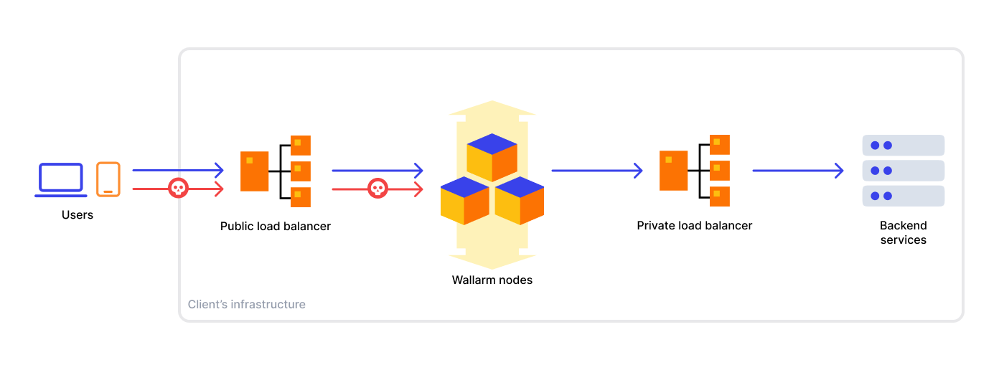

# In-line Deployment of Wallarm Node

Wallarm can be deployed in-line to mitigate threats in real-time. In this case, traffic to protected APIs passes through Wallarm node instances before it reaches the API. There is no chance of an attacker bypassing Wallarm nodes as long as they are inline and are the only path available to end users. This article explains the approach in details.

Wallarm node instances sit between the client and the servers, analyzing incoming traffic, mitigating malicious requests, and forwarding legitimate requests to the protected server. 

## Use cases

The Wallarm in-line solution is suitable for the following use cases:

* Mitigate malicious requests such as SQli, XSS injections, API abuse, brute force before they reach the application server.
* Get knowledge on active security vulnerabilities of your system and apply virtual patches before fixing the application code.
* Observe API inventory and track sensitive data.

## Advantages and specific requirements

The in-line deployment approach to the Wallarm deployment offers several advantages over other deployment methods, such as [OOB](../oob/overview.md) deployments:

* Wallarm instantly blocks malicious requests since traffic analysis proceeds in real time.
* All Wallarm features, including [API Discovery](../../api-discovery/overview.md) and [vulnerability detection](../../about-wallarm/detecting-vulnerabilities.md) work with no limitations as Wallarm has access to both incoming requests and server responses.

To implement an inline scheme, you will need to change the traffic route in your infrastructure. Additionally, carefully consider [resource allocation](../../admin-en/configuration-guides/allocate-resources-for-node.md) for Wallarm nodes to ensure uninterrupted service.

When deploying Wallarm nodes on public clouds like AWS or GCP for production environments it is required  to use properly configured autoscaling group for optimal performance, scalability and resilience (refer to articles for [AWS](../../admin-en/installation-guides/amazon-cloud/autoscaling-overview.md) or [GCP](../../admin-en/installation-guides/google-cloud/autoscaling-overview.md)).

## Deployment models and supported deployment methods

When it comes to deploying Wallarm in-line, there are the following common models to consider:

* Wallarm Security Edge
* Self-hosted node deployment on a compute instance
* Self-hosted node deployment on Kubernetes

You can choose the deployment model and method based on your infrastructure specifics. If you need assistance in choosing the right deployment model and method, please feel free to contact our [sales team](mailto:sales@wallarm.com) and provide them with additional information about your infrastructure for tailored guidance.

### Running Wallarm Security Edge

The Security Edge platform provides a managed service for deploying nodes across geographically distributed locations within a Wallarm-hosted environment. [Read more](../security-edge/inline/deployment.md)

### Running Wallarm on compute instances

In this model, you deploy Wallarm as a virtual appliance within your infrastructure. The virtual appliance can be installed as a VM, container, or cloud instance.

When deploying a Wallarm node, you have the flexibility to position it in different locations within your network topology. However, the recommended approach is to place the node instance behind a public load balancer, in front of your backend services, or a private load balancer, typically located before the backend services. The following diagram illustrates the typical traffic flow in this setup:

Load balancers can be classified into two types: L4 and L7. The load balancer type determines how SSL offloading is handled, which is crucial when integrating Wallarm into your existing infrastructure.

* If you use an L4 load balancer, commonly SSL offloading is handled by a web server placed behind the load balancer or through other means in your infrastructure without the Wallarm instance. However, when deploying the Wallarm node, you need to configure SSL offloading on the Wallarm instance.
* If you use an L7 load balancer, commonly SSL offloading is handled by the load balancer itself, and the Wallarm node will receive plain HTTP.

Wallarm offers the following artifacts and solutions for running Wallarm on compute instances:

**Amazon Web Services (AWS)**

* [AMI](compute-instances/aws/aws-ami.md)
* [ECS](compute-instances/aws/aws-ecs.md)
* Terraform module:
    * [Proxy in AWS VPC](compute-instances/aws/terraform-module-for-aws-vpc.md)
    * [Proxy for Amazon API Gateway](compute-instances/aws/terraform-module-for-aws-api-gateway.md)

**Google Cloud Platform (GCP)**

* [Machine image](compute-instances/gcp/machine-image.md)
* [GCE](compute-instances/gcp/gce.md)

**Microsoft Azure**

* [Azure Container Instances](compute-instances/azure/docker-image.md)

**Alibaba Cloud**

* [ECS](compute-instances/alibaba/docker-image.md)

**Docker images**

* [NGINX-based](compute-instances/docker/nginx-based.md)

**Linux packages**

* [All-in-one installer](compute-instances/linux/all-in-one.md)

### Running Wallarm on Kubernetes

If you utilize Kubernetes for container orchestration, Wallarm can be deployed as a Kubernetes-native solution. It seamlessly integrates with Kubernetes clusters, leveraging features such as ingress or sidecar controllers.

Wallarm offers the following artifacts and solutions for running Wallarm on Kubernetes:

* [NGINX Ingress controller](../../admin-en/installation-kubernetes-en.md)
* [Sidecar controller](../kubernetes/sidecar-proxy/deployment.md)
