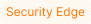

[se-connector-setup-img]:           ../images/waf-installation/security-edge/connectors/setup-view.png
[filtration-mode-docs]:             ../admin-en/configure-wallarm-mode.md
[se-connector-hosts-locations-img]: ../images/waf-installation/security-edge/connectors/hosts-locations.png

# Security Edge Connectors 

The **Security Edge** platform provides a managed service for deploying Wallarm nodes across geographically distributed locations within a Wallarm-hosted environment. One of its key deployment options is the [**connector**](connectors/overview.md) node deployment, offering robust protection for your entire API landscape without the need for any onsite installation.

## How it works

Security Edge service provides a secure cloud environment where the Wallarm node is deployed, hosted, and managed by Wallarm:

* Turnkey deployment: minimal setup is required for Wallarm to automatically deploy Wallarm nodes in globally distributed locations.
* Autoscaling: on varying traffic loads, node instances automatically scale horizontally without any manual setup needed.
* Reduced costs: lower operational overhead with Wallarm-managed nodes, allowing faster deployment and scalability.

!!! info "Supported platforms"
    Currently, Edge connectors are available only for MuleSoft, CloudFront, Cloudflare, Fastly.

## Running Security Edge Connectors

### 1. Deploying the Edge node for a connector

You only need to specify the connector settings. Wallarm will handle the deployment and provide you with an endpoint to route traffic from your platform.

One endpoint can handle multiple connections from different hosts.

1. The Security Edge deployment is available only with the corresponding subscription. Contact sales@wallarm.com to obtain it.
1. Proceed to Wallarm Console → **Security Edge** → **Connectors** → **Add connector**.

    ![!][se-connector-setup-img]
1. Specify the node deployment settings:

    * **Regions**: select one or more regions to deploy the Wallarm node for the connector. We recommend choosing regions close to where your APIs or applications are deployed. Multiple regions improve geo-redundancy by balancing the load if an instance becomes unavailable.
    * **Filtration mode**: [traffic analysis mode][filtration-mode-docs].
    * **Application**: general application ID. In Wallarm, [applications](../user-guides/settings/applications.md) help identify and organize parts of your infrastructure (e.g., domains, locations, instances).
    
        Each node requires a general application ID, with the option to assign specific IDs for locations or instances.
    
    * **Allowed hosts**: specify which hosts the node will accept and analyze traffic from.

        If a specified host does not exist or is unreachable, the 415 error will be returned, and the traffic will not be processed.
    
    * **Location configuration**: assign unique application IDs and traffic analysis mode to specific hosts and locations, if needed.

        ![!][se-connector-hosts-locations-img]
1. In the **Admin settings** section, you can select an [Edge node version](../updating-migrating/native-node/node-artifact-versions.md#all-in-one-installer) and enable [Auto update](#upgrading-the-edge-node) if needed. If no version is explicitly selected, the latest version is automatically deployed.
1. Once saved, it will take 3-5 minutes for Wallarm to deploy and configure the node for the connector.

    The status will change from **Pending** to **Active** when deployment is complete.
1. Copy the node endpoint as you will need it later to route traffic from your platform.

You can change the Edge node deployment settings at any time while the node is in **Active** status. The node will be re-deployed, starting from the **Pending** status to **Active**. The endpoint will not change, but it will be unavailable during the re-deployment process.

### 2. Injecting Wallarm code on a platform running your APIs

After deploying the Edge node, you will need to inject Wallarm code into your platform to route traffic to the deployed node.

1. Download a code bundle for your platform from the Wallarm Console UI.

    
1. Apply the bundle on your API management platform following the instructions:

    * [MuleSoft](connectors/mulesoft.md#2-obtain-and-upload-the-wallarm-policy-to-mulesoft-exchange)
    * [CloudFront](connectors/aws-lambda.md#2-obtain-and-deploy-the-wallarm-lambdaedge-functions)
    * [Cloudflare](connectors/cloudflare.md#2-obtain-and-deploy-the-wallarm-worker-code)
    * [Fastly](connectors/fastly.md#2-deploy-wallarm-code-on-fastly)
    * [IBM API Connect](connectors/ibm-api-connect.md#2-obtain-and-apply-the-wallarm-policies-to-apis-in-ibm-api-connect)

## Telemetry portal

The telemetry portal for Security Edge Connectors provides a Grafana dashboard with real-time insights into metrics on traffic processed by Wallarm.

The dashboard displays key metrics such as total processed requests, RPS, detected and blocked attacks, deployed Edge node number, resource consumption, number of 5xx responses, etc.

**Run telemetry portal** once the Node reaches the **Active** status. It becomes accessible via a direct link from the Security Edge section ~5 minutes after initiation.

From the Grafana home page, to reach the dashboard, navigate to **Dashboards** → **Wallarm** → **Portal Connector Overview**. For multiple nodes, switch the **Tenant ID** corresponding to the connector endpoint to view each dashboard.

## Upgrading the Edge node

When **Auto update** is enabled in **Admin settings**, the Edge node is automatically upgraded as soon as a new version is released. All your initial settings are preserved. Auto update is off by default.

To manually upgrade the Edge node, open your node for editing and select a version in the **Admin settings** section. Using the latest version is recommended for optimal performance and security.

For the changelog of versions, refer to the [article](../updating-migrating/native-node/node-artifact-versions.md#all-in-one-installer). The Edge node version follows the `<MAJOR_VERSION>.<MINOR_VERSION>.<PATCH_VERSION>` format, corresponding to the same version in the linked article. The build number in the Edge node version indicates minor changes.

Additionally, you might need to upgrade your connector code bundle. For the changelog and upgrade instructions, see the [Connector Code Bundle Changelog](connectors/code-bundle-inventory.md).

## Deleting the Edge node

If you delete the Edge node, its endpoint becomes unavailable, and you will no longer be able to redirect traffic through it for security analysis.

The Wallarm code bundle injected into your platform will still try to reach the node endpoint specified in the bundle settings. However, it will fail with the `failed: Couldn't resolve address` error, and traffic will continue to flow to its target without passing through the Edge node.

## Troubleshooting

--8<-- "../include/waf/installation/security-edge/connector-troubleshooting.md"
