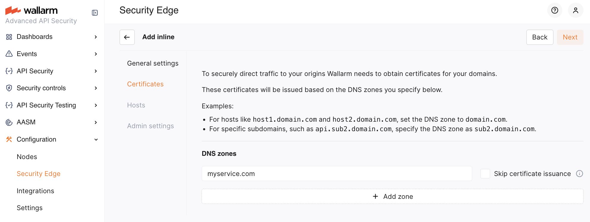

# Security Edge Inline Deployment <a href="../../../../about-wallarm/subscription-plans/#security-edge-paid-plan"></a>

To deploy the Wallarm [Security Edge for inline traffic analysis](overview.md), follow this guide.

## Requirements

* [Security Edge subscription](../../../about-wallarm/subscription-plans.md) (free or paid)
* Ability to edit DNS records for your domains to verify ownership and route traffic to Wallarm

## Configuration flow

To run the Edge inline, go to the Wallarm Console → **Security Edge** → **Inline** → **Configure**. If this section is unavailable, contact sales@wallarm.com to access the required subscription.

On the Free Tier, after deploying Edge Nodes via [Quick setup](../free-tier.md), the **Security Edge** section lets you adjust settings.

You can update the Edge Node deployment settings at any time. The Node will be re‑deployed with existing CNAME and A records remaining unchanged.

See a demo of the full configuration flow:

<div>
        <script src="https://js.storylane.io/js/v1/storylane.js"></script>
        <div class="sl-embed" style="position:relative;padding-bottom:calc(51.72% + 27px);width:100%;height:0;transform:scale(1)">
          <iframe class="sl-demo" src="https://wallarm.storylane.io/demo/d0rwdofmftda" name="sl-embed" allow="fullscreen" style="position:absolute;top:0;left:0;width:100%!important;height:100%!important;border:1px solid rgba(63,95,172,0.35);box-shadow: 0px 0px 18px rgba(26, 19, 72, 0.15);border-radius:10px;box-sizing:border-box;"></iframe>
        </div>
    </div>

## 1. Provider and region

Choose one or more regions (AWS or Azure) for Edge Node deployment. Select locations close to your APIs for optimal latency.

Available regions depend on your [Wallarm Cloud](../../../about-wallarm/overview.md#cloud) (US → US regions, EU → EU regions and UAE North).

[More about multi-region and multi-cloud deployment](multi-region.md)

## 2. Origins

Specify origins to which the Edge Node will forward filtered traffic. For each origin, provide a server IP address or FQDN with an optional port (default: 443).

If an origin has multiple servers, you can specify all of them. Requests are distributed as follows:

* The [round-robin](https://en.wikipedia.org/wiki/Round-robin_DNS) algorithm is used. The first request is sent to the first server, the second to the next, and so on, cycling back to the first server after the last.
* With IP-based session persistence, traffic from the same IP consistently routes to the same server.

**Securing access to origins**

To restrict your origins to trusted traffic only, allow Edge Node connections using one of the methods:

* (Recommended) Authenticate Edge Nodes with [mTLS](mtls.md). This avoids issues if Wallarm IPs change.
* Allow traffic only from the IP ranges of the selected deployment regions (IPs may change).

    ??? info "Show Wallarm IP ranges"
        * AWS

            === "US East 1"
                ```
                18.215.213.205
                44.214.56.120
                44.196.111.152
                ```
            === "US West 1"
                ```
                52.8.91.20
                13.56.117.139
                54.177.237.34
                50.18.177.184
                ```
            === "EU Central 1 (Frankfurt)"
                ```
                18.153.123.2
                18.195.202.193
                3.76.66.246
                3.79.213.212
                ```
            === "EU Central 2 (Zurich)"
                ```
                51.96.131.55
                16.63.191.19
                51.34.0.90
                51.96.67.145
                ```

        * Azure

            === "Central US"
                ```
                104.43.139.76
                104.43.139.77
                ```
            === "East US 2"
                ```
                20.65.88.253
                20.65.88.252
                ```
            === "West US 3"
                ```
                20.38.2.233
                20.38.2.232
                ```
            === "Germany West Central"
                ```
                20.79.250.104
                20.79.250.105
                ```
            === "Switzerland North"
                ```
                20.203.240.193
                20.203.240.192
                ```
            === "UAE North"
                ```
                20.74.249.13
                20.74.249.12
                ```


**Using custom keepalive settings**

(Optional) To use [custom keepalive settings](../inline/keepalive.md), select the corresponding option. 

## 3. Certificates

* If the Edge Inline Node is deployed as a direct, Internet-facing solution, Wallarm requires certificates to securely route traffic to your origin servers. Certificates are issued based on the DNS zones specified in this section.

    Once configuration is complete, Wallarm provides a CNAME for each DNS zone. Add this CNAME record to your DNS settings to verify domain ownership and complete the certificate issuance process.
* If your origin servers are behind a third-party service (e.g., a CDN or a DDoS protection provider like Cloudflare or Akamai) that proxies traffic, certificate issuance is not required. In this case, select the **Skip certificate issuance** option.



You can specify multiple DNS zones, each with a different certificate issuance approach.

<a name="caa-records-for-wallarm-se"></a>
!!! info "CAA records"
    Some organizations use [CAA](https://letsencrypt.org/docs/caa/) DNS records to restrict which Certificate Authorities (CAs) are allowed to issue certificates for their domains.

    If you maintain CAA records, make sure to allow Let's Encrypt with the Wallarm Account ID, otherwise certificates for Security Edge cannot be issued:

    ```
    0 issue "letsencrypt.org;validationmethods=dns-01;accounturi=https://acme-v02.api.letsencrypt.org/acme/acct/2513765531"
    ```

    You can check your current CAA records with:

    ```
    dig +short CAA your-domain.com
    ```

## 4. Hosts

Specify the public domains, ports and subdomains that will direct traffic to the Edge Node for analysis.

!!! info "Apex domains"
    Use `www.example.com` instead of apex domains when possible. Or configure a [redirection from the apex domain to `www.*`](host-redirection.md#recommended-redirect-from-apex-domain-to-www). This allows Wallarm to use a global CNAME and avoid manual traffic balancing with A records.

1. Specify your hosts. Each host entry must match a DNS zone (when specified in the **Certificates** section) and differ from origins to avoid routing loops.

    ??? note "Allowed ports"
        Directing traffic from HTTP ports to the Edge Node is not allowed. The following ports are supported:

        443, 444, 1443, 1760, 2001, 2087, 2096, 2122, 2143, 4333, 4334, 4430, 4440, 4443 4466, 4993, 5000, 5001, 5454, 7003, 7074, 7175, 7443, 7741, 8000, 8010, 8012, 8018, 8070, 8071, 8072, 8075, 8076, 8077, 8078, 8081, 8082, 8084, 8085, 8086, 8088, 8090, 8092, 8093, 8094, 8095, 8096, 8097, 8098, 8099, 8104, 8181, 8243, 8282, 8383, 8443, 8444, 8448, 8585, 8723, 8787, 8801, 8866, 9052, 9090, 9093, 9111, 9191, 9193, 9440, 9443, 9797, 44300, 44301, 44302, 44395, 44443, 52233, 55180, 55553, and 60000
1. (Optional) Associate the host's traffic with a [Wallarm application](../../../user-guides/settings/applications.md) to categorize and manage different API instances or services on the Wallarm platform.
1. Set the [Wallarm mode](../../../admin-en/configure-wallarm-mode.md) for each host.
1. (Optionally) Customize [server NGINX directives](nginx-overrides.md#server-level-directives). Defaults follow standard NGINX values.
1. For each host, define the configuration for the root location (`/`):

    * [Origin](#2-origins) where the Wallarm Node will forward the filtered traffic (if no other location-specific settings are defined). The location's path is automatically appended to the origin.
    * (Optionally) Wallarm application.
    * Filtration mode.


## 5. Locations

For specific **locations** within hosts, you can further customize:

* Origin. The path defined in the location will automatically append to the origin.
* Wallarm application.
* Filtration mode.
* [Location NGINX directives](nginx-overrides.md#location-level-directives). Defaults follow standard NGINX values.

Each location inherits settings from the host and root location, unless specifically overridden.

The below example configuration customizes settings per path to meet specific needs: `/auth` prioritizes security with blocking mode enabled, while `/data` allows larger uploads by increasing the `client_max_body_size` to 5MB.


In addition to standard prefix paths (`/path`), you can define locations using the following NGINX regular expression patterns:

* `= /path` - exact match
* `^~ /path` - priority prefix match
* `~ pattern` - case-sensitive regular expression
* `~* pattern` - case-insensitive regular expression

Examples:

* `~ ^/api/v[0-9]+/users$`
* `~* \.(jpg|png|gif)$`
* `= /health`
* `^~ /static/`

!!! info "Prohibited characters in locations"
    To prevent NGINX configuration injection, location values must not contain `{`, `}`, `;`, `#`, or newline characters.

## 6. Certificate CNAME configuration

For domain verification, add the CNAME records provided in the Wallarm Console to your DNS provider's settings for each DNS zone. These records are required for Wallarm to verify domain ownership and issue certificates.

!!! warning "Do not remove the certificate CNAME"
    The certificate CNAME record must stay in your DNS settings. It is needed for further deployment configuration updates and certificate renewal.


DNS changes can take up to 24 hours to propagate. Wallarm starts the Edge Node deployment once the CNAME records are verified (if needed).

## 7. Routing traffic to the Edge Node

To send client requests through the Edge Node, update your DNS records based on the type of domain you protect.

### CNAME record

If your protected host is a third-level (or higher-level) domain (e.g., `api.example.com`), you need to specify the CNAME record pointing to the Wallarm‑proided FQDN in your DNS zone.

Once the certificate CNAME is verified, a **Traffic CNAME** is available for each host. If no certificate is issued, the CNAME is available immediately after the configuration is complete.

* Single cloud deployment: use the **Traffic CNAME for the selected cloud provider**.
* Multi-cloud deployment: use the **Traffic CNAME (Global)** to automatically distribute traffic across all selected regions and providers.

    Per-provider CNAMEs are also available if you need to enforce routing to a specific provider - for example, to test latency or performance across providers.


DNS changes can take up to 24 hours to propagate. Once propagated, Wallarm will proxy all traffic to the configured origins.

### A records

If your protected host is an apex domain (e.g., `example.com`), a CNAME cannot be used. In this case, the DNS setup must use **A records**, which are returned once the deployment becomes [**Active**](upgrade-and-management.md#statuses).


Traffic routing in this case is managed by your DNS provider. By default, most DNS providers use [round-robin](https://en.wikipedia.org/wiki/Round-robin_DNS) logic, but some may support latency-based routing as well.

## More configuation options

* [Edge Node deployment in multi regions and providers](multi-region.md)
* [mTLS for Edge Node to origins](mtls.md)
* [Host redirection](host-redirection.md)
* [Custom block page](custom-block-page.md)
* [NGINX overrides](nginx-overrides.md)
* [Edge Node upgrade](upgrade-and-management.md)
* [Telemetry portal](telemetry-portal.md)
