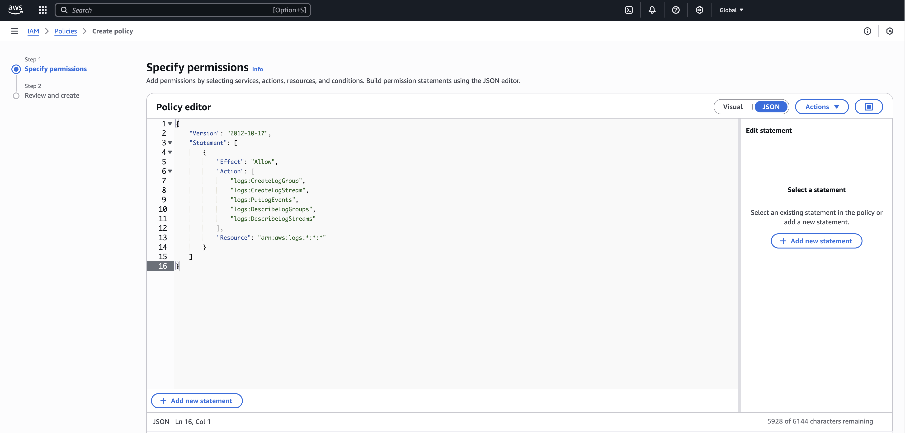
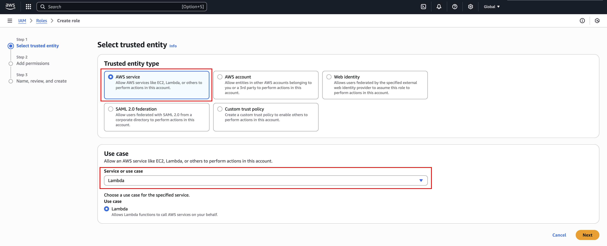
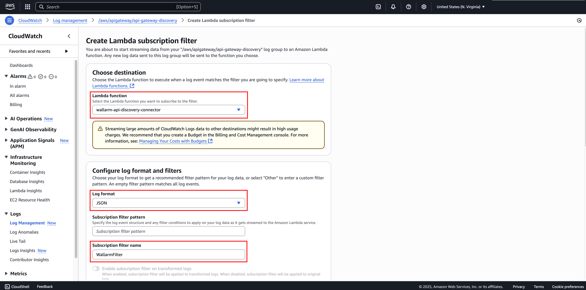
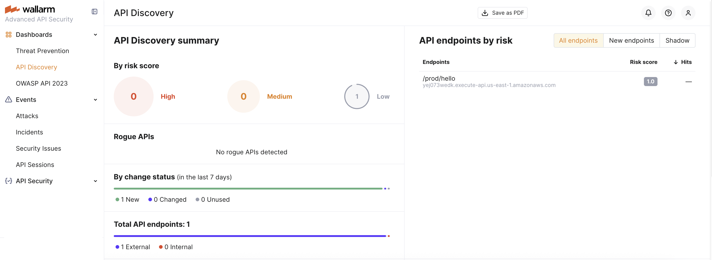

[api-discovery]:                ../../api-discovery/overview.md
[api-inventory]:                ../../api-discovery/exploring.md
[api-traffic]:                 ../../api-discovery/overview.md#noise-detection
[native-node]:                 ../../installation/nginx-native-node-internals.md#native-node
[native-node-versions]:        ../../updating-migrating/native-node/node-artifact-versions.md
[native-node-logs]:            ../../admin-en/configure-logging.md
[subscription]:                ../../about-wallarm/subscription-plans.md#core-subscription-plans


# Wallarm Connector for Amazon API Gateway (API Discovery) <a href="../../../about-wallarm/subscription-plans/#core-subscription-plans"></a>

The Wallarm Connector for Amazon API Gateway automatically builds an [API inventory][api-inventory] from real traffic by relying on CloudWatch logs.

## How it works

This connector does not inspect or block malicious requests. Instead, it uses a Lambda function to monitor CloudWatch logs from API Gateway, parse the log data, and forward relevant metadata to a Wallarm Native Node. The result is your [**API inventory**][api-inventory].

The solution consists of three AWS components (your API in API Gateway, CloudWatch Logs, and a Lambda function) and one Wallarm component (Native Node), which are connected in the following way:

1. **API Gateway** receives requests from clients and generates CloudWatch logs for each API call.
1. **CloudWatch logs** capture information about each request and make it available for processing.
1. A **Lambda function** subscribes to these logs, reads new entries, and extracts API metadata.
1. The Lambda function forwards the extracted metadata to the **Wallarm Native Node**.
1. The Native Node collects this metadata and build an [API inventory][api-inventory].

## Limitations

At the moment, this connector does not detect or monitor attacks. Its primary purpose is to build your [API inventory][api-inventory] using the [API Discovery][api-discovery] feature.

## Requirements

To proceed with the deployment, ensure that the following requirements are met:

* API managed by [Amazon API Gateway](https://docs.aws.amazon.com/apigateway/latest/developerguide/welcome.html)
* Understanding of [Amazon CloudWatch](https://docs.aws.amazon.com/AmazonCloudWatch/latest/monitoring/WhatIsCloudWatch.html), Amazon API Gateway, and [AWS Lambda](https://docs.aws.amazon.com/lambda/latest/dg/welcome.html) technologies
* [Native Node version 0.21.0 or later][native-node-versions]
* An [Advanced API Security subscription][subscription] that enables the API Discovery feature


## Deployment

### 1. Deploy a Wallarm node

The Wallarm node is a core component of the Wallarm platform that you need to deploy. It inspects incoming traffic, detects malicious activities, and can be configured to mitigate threats.

You can deploy it either hosted by Wallarm or in your own infrastructure, depending on the level of control you require.

=== "Edge node"
    To deploy a Wallarm-hosted node for the connector, follow the [instructions](../security-edge/se-connector.md).
=== "Self-hosted node"
    Choose an artifact for a self-hosted node deployment and follow the attached instructions:

    * [All-in-one installer](../native-node/all-in-one.md) for Linux infrastructures on bare metal or VMs
    * [Docker image](../native-node/docker-image.md) for environments that use containerized deployments
    * [Helm chart](../native-node/helm-chart.md) for infrastructures utilizing Kubernetes

### 2. Create an IAM role with an IAM policy for Lambda

1. Sign in to the AWS Management Console and go to [Identity and Access Management (IAM)](https://console.aws.amazon.com/iam/).
1. [Create the following IAM policy](https://docs.aws.amazon.com/IAM/latest/UserGuide/access_policies_create-console.html#access_policies_create-json-editor) using the JSON editor:

    ```json
    {
        "Version": "2012-10-17",
        "Statement": [
            {
                "Effect": "Allow",
                "Action": [
                    "logs:CreateLogGroup",
                    "logs:CreateLogStream",
                    "logs:PutLogEvents",
                    "logs:DescribeLogGroups",
                    "logs:DescribeLogStreams"
                ],
                "Resource": "arn:aws:logs:*:*:*"
            }
        ]
    }
    ```
    
    

1. Go to **Roles** and click **Create role**.
1. Select **AWS service** and **Lambda** for "Trusted entity type" and "Use case", respectively, and then click **Next**.

    

1. On the "Add permissions" step, select the IAM policy you have created earlier, and click **Next**.
1. Give your IAM role a recognizable name (e.g., `WallarmAPIDiscoveryLambdaRole`) and optionally edit the role's description. 
1. Click **Create role**.

You have created the IAM role and attached the IAM policy required by the Lambda function.

[See more details on creating roles and attaching policies](https://docs.aws.amazon.com/IAM/latest/UserGuide/access_policies_job-functions_create-policies.html).


### 3. Create a Lambda function

1. [Open the Functions page](https://us-east-1.console.aws.amazon.com/lambda/home?region=us-east-1#/functions) of the Lambda console and click **Create function**.
1. Select **Author from scratch**.
1. Give your function a recognizable name (e.g., `wallarm-api-discovery-connector`).
1. Choose **Python 3.13** and **x86_64** under "Runtime" and "Architecture", respectively.
1. Under "Permissions", expand **Change default execution role**, select **Use an existing role**, and then select the IAM role you created in Step 2 (`WallarmAPIDiscoveryLambdaRole`)

    

1. Click **Create function**.

You have created a Lambda function. You now need to configure it to process CloudWatch logs and forward API metadata to the Wallarm node.

### 4. Configure the Lambda function

1. To configure the Lambda function, you need the Wallarm code bundle. Go to Wallarm Console → **Security Edge** → **Connectors** → **Download code bundle** and download the code bundle for your platform.

    If you are running a self-hosted node, contact sales@wallarm.com to get the code bundle.
1. Extract the code bundle archive, open the `cw-resend-lambda/lambda_function.py` file, and copy its contents.
1. In your Lambda function, go to the **Code** tab and paste the copied code into the "Code source" section.
1. Click **Deploy**.

    

1. Go to the **Configuration** tab → **Environment variables** → **Edit**.
1. Click **Add environment variable** and specify the following environment variables for Node communication:

    * [`X_NODE_URL`](#1-deploy-a-wallarm-node) - Native Node DNS name or IP address, including a port if necessary (e.g., `node.example.com` or `192.0.2.1`).

        !!! info "Port requirement"        
            `X_NODE_URL` must include the port that the Native Node is listening on. For example, if the Native Node is deployed in `connector-server` mode with [`connector.address`](../native-node/all-in-one-conf.md#connectoraddress-required) set to `:5050`, `X_NODE_URL` must include the port `5050` (e.g., `192.0.2.1:5050`).

    * `X_NODE_SCHEME` - Native Node protocol (`http` or `https`), depending on how the Node was deployed and whether TLS is enabled.

    

1. Click **Save**.
1. Go to the **Configuration** tab → **General configuration** → **Edit**.
1. Under "Timeout", set a value sufficient for processing a batch of logs (e.g., 30 seconds to 1 minute).
1. Click **Save**.

You have now configured the Lambda function so it can receive log events and forward metadata to the Wallarm node. 

### 5. Configure CloudWatch API logging using the API Gateway console

1. [Go to the API Gateway console](https://console.aws.amazon.com/apigateway).
1. In the main navigation panel, choose **APIs**, then click the name of your API.
1. Go to **Stages** → your stage (e.g., `prod`), scroll down to the **Logs and tracing** section, and then click **Edit**.
1. Under **CloudWatch logs**, select **Errors and info logs** and toggle on **Custom access logging**.
1. Under **Access log destination ARN**, specify the ARN of the CloudWatch log group where logs will be written.

    If the group does not exist, [create it](https://docs.aws.amazon.com/AmazonCloudWatch/latest/logs/Working-with-log-groups-and-streams.html#:~:text=To%20create%20a%20log%20group,then%20choose%20Create%20log%20group.) and copy the ARN. The ARN has the following format: `arn:aws:logs:region:account-id:log-group:group-name.`

1. In the **Log format** section, paste the following JSON log format (optimized to include only essential fields):

    ```json
    { "requestId": "$context.requestId", "httpMethod": "$context.httpMethod", "path": "$context.path", "protocol": "$context.protocol", "status": "$context.status", "responseLength": "$context.responseLength", "requestTime": "$context.requestTime", "requestTimeEpoch": "$context.requestTimeEpoch", "responseLatency": "$context.responseLatency", "integrationLatency": "$context.integrationLatency", "integrationStatus": "$context.integrationStatus", "errorMessage": "$context.error.message", "stage": "$context.stage", "domainName": "$context.domainName", "sourceIp": "$context.identity.sourceIp", "userAgent": "$context.identity.userAgent" }
    ```

1. Click **Save**.

You have configured CloudWatch API logging in API Gateway. The Lambda function is now able to process logs once the subscription filter is active.

### 6. Connect CloudWatch Logs to Lambda (subscription filter)

1. [Go to CloudWatch Console](https://eu-north-1.console.aws.amazon.com/cloudwatch/home?region=eu-north-1#) → **Logs** → **Log groups**.
1. Find and select the log group you have specified in the API Gateway console in Step 3.
1. Click **Actions** → **Subscription filters** → **Create Lambda subscription filter**.
1. Select the Lambda function you have created in Step 3 (e.g., `wallarm-api-discovery-connector`).
1. Under "Log format", select JSON.
1. You can leave "Subscription filter pattern" empty or [configure filtering](https://docs.aws.amazon.com/AmazonCloudWatch/latest/logs/FilterAndPatternSyntax.html) if necessary.
1. Under "Subscription filter name", specify a filter name (e.g., `WallarmFilter`).
1. Click **Start streaming**.

    

By completing this step, you have linked the API Gateway log group to the Lambda function. The function will now start receiving and processing log events.

### 7. Check the API Discovery inventory

If the AWS infrastructure was deployed correctly, the [API Discovery][api-discovery] feature is automatically enabled.

Generate traffic to your API endpoints (e.g., using `curl`) to build the [API inventory][api-inventory] and populate the API Discovery dashboard.

Wallarm builds the API inventory only after receiving a [sufficient number of requests for each endpoint][api-traffic].



If you have any issues, refer to the ["Logs and troubleshooting" section](#logs-and-troubleshooting).

## Logs and troubleshooting

If API Discovery is not working:

* Verify the environment variables in the Lambda function
* [Check the Native Node connectivity](../../admin-en/uat-checklist-en.md#node-registers-all-traffic)

For troubleshooting, you can also review the following logs:

* Native Node logs: `/opt/wallarm/var/log/wallarm/go-node.log`
* Lambda logs: `/aws/lambda/<your-lambda-function-name>` (e.g., `/aws/lambda/wallarm-api-discovery-connector`)
* API Gateway logs: `/aws/apigateway/<your-api-gateway-name>`
