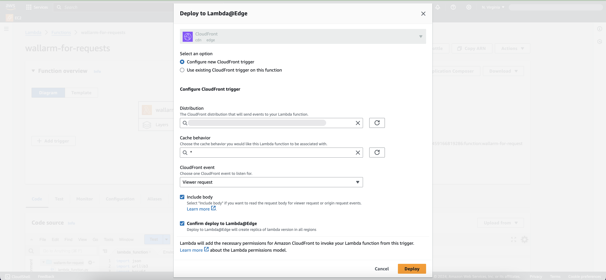

[ptrav-attack-docs]:                ../../attacks-vulns-list.md#path-traversal
[attacks-in-ui-image]:              ../../images/admin-guides/test-attacks-quickstart.png
[filtration-mode-docs]:             ../../admin-en/configure-wallarm-mode.md
[se-connector-setup-img]:           ../../images/waf-installation/se-connector-setup.png
[ip-list-docs]:                     ../../user-guides/ip-lists/overview.md
[api-token]:                        ../../user-guides/settings/api-tokens.md
[api-spec-enforcement-docs]:        ../../api-specification-enforcement/overview.md
[helm-chart-native-node]:           ../native-node/helm-chart.md
[custom-blocking-page]:             ../../admin-en/configuration-guides/configure-block-page-and-code.md
[rate-limiting]:                    ../../user-guides/rules/rate-limiting.md
[multi-tenancy]:                    ../multi-tenant/overview.md

# Wallarm Connector for Amazon CloudFront

[CloudFront](https://aws.amazon.com/cloudfront/) is a content delivery network operated by Amazon Web Services. Wallarm can act as a connector to secure and monitor traffic delivered through CloudFront.

To use Wallarm as a connector for CloudFront, you need to **deploy the Wallarm node externally** and **run Wallarm-provided Lambda@Edge functions** to route traffic to the Wallarm node for analysis.

The CloudFront connector supports both [in-line](../inline/overview.md) and [out-of-band](../oob/overview.md) traffic analysis:

=== "In-line traffic flow"

    If Wallarm is configured to block malicious activity:

    
=== "Out-of-band traffic flow"
    

!!! info "Security note"
    The provided solution is designed following the principle of least privilege. The functions request only the minimal set of permissions required to operate with CloudFront and Wallarm Node, ensuring secure deployment by default.

## Use cases

Among all supported [Wallarm deployment options](../supported-deployment-options.md), this solution is recommended in case when you deliver traffic through Amazon CloudFront.

## Limitations

* Lambda@Edge function-level restrictions:

    * Lambda@Edge functions are not triggered by viewer responses with HTTP status codes 4xx.
    * Lambda@Edge does not allow access to the response body in both origin response and viewer response events, restricting the ability to perform any actions based on the content of the response.
    * The body size is limited to 40 KB for viewer requests and 1MB for origin requests.
    * The maximum response time from the Wallarm node is 5 seconds for viewer requests and 30 seconds for origin requests.
    * Lambda@Edge does not support private networks (VPC).
    * The default limit for concurrent requests is 1,000 per region, but it can be increased up to tens of thousands.
    * Wallarm Lambda@Edge functions operate at the origin level, meaning they do not monitor requests handled by CDN cache. Thus, potential attacks in such requests go undetected.
* Feature restrictions:
    * When deploying the Wallarm service with the `LoadBalancer` type using the [Helm chart][helm-chart-native-node], a **trusted** SSL/TLS certificate is required for the Node instance domain. Self-signed certificates are not yet supported.
    * [Custom blocking page and blocking code][custom-blocking-page] configurations are not yet supported.
    * Vulnerability detection based on [passive detection](../../about-wallarm/detecting-vulnerabilities.md#passive-detection) and API [response structure in API Discovery](../../api-discovery/exploring.md#endpoint-details) are limited due to Lambda@Edge response trigger restrictions. Since Wallarm functions cannot receive response bodies and rely on them, these features are unavailable.
    * [Rate limiting](../../user-guides/rules/rate-limiting.md) by the Wallarm rule is not supported.
    * [Multitenancy][multi-tenancy] is not supported on Security Edge hosting, but it is supported for self-hosted nodes deployed with the connector.

## Requirements

To proceed with the deployment, ensure that you meet the following requirements:

* Understanding of AWS CloudFront and Lambda technologies.
* APIs or traffic running through CloudFront CDN.

## Deployment

### 1. Deploy a Wallarm node

The Wallarm node is a core component of the Wallarm platform that you need to deploy. It inspects incoming traffic, detects malicious activities, and can be configured to mitigate threats.

You can deploy it either hosted by Wallarm or in your own infrastructure, depending on the level of control you require.

=== "Edge node"
    To deploy a Wallarm-hosted node for the connector, follow the [instructions](../security-edge/se-connector.md).
=== "Self-hosted node"
    Choose an artifact for a self-hosted node deployment and follow the attached instructions:

    * [All-in-one installer](../native-node/all-in-one.md) for Linux infrastructures on bare metal or VMs
    * [Docker image](../native-node/docker-image.md) for environments that use containerized deployments
    * [AWS AMI](../native-node/aws-ami.md) for AWS infrastructures
    * [Helm chart](../native-node/helm-chart.md) for infrastructures utilizing Kubernetes

### 2. Obtain and deploy the Wallarm Lambda@Edge functions

To connect your CloudFront CDN with the Wallarm node, you need to deploy the Wallarm Lambda@Edge functions on AWS.

There are two Python-based functions: one for request forwarding and analysis, and another for response forwarding and analysis.

=== "Manual download and deploy"
    1. Proceed to Wallarm Console → **Security Edge** → **Connectors** → **Download code bundle** and download a code bundle for your platform.

        If running a self-hosted node, contact sales@wallarm.com to get the code bundle.
    1. Proceed to your AWS Console → **Services** → **Lambda** → **Functions**.
    1. Select the `us-east-1` (N. Virginia) region which is [required for Lambda@Edge functions](https://docs.aws.amazon.com/AmazonCloudFront/latest/DeveloperGuide/lambda-edge-how-it-works-tutorial.html#lambda-edge-how-it-works-tutorial-create-function).
    1. **Create function** with the following settings:

        * Runtime: Python 3.x.
        * Execution role: **Create a new role from AWS policy templates** → **Basic Lambda@Edge permissions (for CloudFront trigger)**.
        * Other settings can remain as default.
    1. Once the function is created, on the **Code** tab, paste the Wallarm request processing code.
    1. Update the following parameters in the code:

        * `wlrm_node_addr`: your Wallarm node URL.
        * `wlrm_inline`: if using [asynchronous (out-of-band)](../oob/overview.md) mode, set to `False`.
        * If necessary, modify other parameters.
    1. Proceed to **Actions** → **Deploy to Lambda@Edge** and specify the following settings:

        * Configure new CloudFront trigger.
        * Distribution: your CDN that routes traffic to the origin you want to protect.
        * Cache behavior: the cache behavior for the Lambda function, typically `*`.
        * CloudFront event: 
            
            * **Origin request**: executes the function only when CloudFront CDN requests data from the backend. If CDN returns a cached response, the function will not be executed.
            * **Viewer request**: executes the function for every request to CloudFront CDN.
        * Check **Include body**.
        * Check **Confirm deploy to Lambda@Edge**.

        
    1. Repeat the procedure for the Wallarm-provided response function, selecting responses as the trigger.

        Ensure the response trigger matches the request trigger (origin response for origin request, viewer response for viewer request).
=== "Deploying functions from AWS SAR"
    You can deploy both functions directly from the AWS Serverless Application Repository (SAR). The functions will be deployed in the `us-east-1` (N. Virginia) region which is [required for Lambda@Edge functions](https://docs.aws.amazon.com/AmazonCloudFront/latest/DeveloperGuide/lambda-edge-how-it-works-tutorial.html#lambda-edge-how-it-works-tutorial-create-function).

    1. Go to [Wallarm policies on AWS Serverless Application Repository](https://serverlessrepo.aws.amazon.com/applications/us-east-1/381492110259/wallarm-connector) → **Deploy**.
    1. Leave the deployment settings as default.
    1. After the deployment is complete, go to the created IAM roles → **Trust relationships**, and update both roles (one for requests and one for responses) with the following policy:

        ```json
        {
            "Version": "2012-10-17",
            "Statement": [
                {
                    "Effect": "Allow",
                    "Principal": {
                        "Service": [
                            "edgelambda.amazonaws.com",
                            "lambda.amazonaws.com"
                        ]
                    },
                    "Action": "sts:AssumeRole"
                }
            ]
        }
        ```

    1. Proceed to your AWS Console → **Services** → **Lambda** → **Functions**.
    1. Open the `serverlessrepo-wallarm-connector-RequestHandler-xxx` function.
    1. On the **Code** tab, update the following parameters:

        * `wlrm_node_addr`: your [Wallarm node instance](#1-deploy-a-wallarm-node) address.
        * `wlrm_inline`: if using [out-of-band](../oob/overview.md) mode, set to `False`.
        * If necessary, modify other parameters.
    1. Proceed to **Actions** → **Deploy to Lambda@Edge** and specify the following settings:

        * Configure new CloudFront trigger.
        * Distribution: your CDN that routes traffic to the origin you want to protect.
        * Cache behavior: the cache behavior for the Lambda function, typically `*`.
        * CloudFront event: 
            
            * **Origin request**: executes the function only when CloudFront CDN requests data from the backend. If CDN returns a cached response, the function will not be executed.
            * **Viewer request**: executes the function for every request to CloudFront CDN.
        * Check **Include body**.
        * Check **Confirm deploy to Lambda@Edge**.

        
    1. Return to your AWS Console → **Services** → **Lambda** → **Functions**.
    1. Open the `serverlessrepo-wallarm-connector-ResponseHandler-xxx` function.
    1. Repeat the procedure for the Wallarm-provided response function, selecting responses as the trigger.

        Ensure the response trigger matches the request trigger (origin response for origin request, viewer response for viewer request).

## Testing

To test the functionality of the deployed functions, follow these steps:

1. Send the request with the test [Path Traversal][ptrav-attack-docs] attack to your CloudFront CDN:

    ```
    curl http://<CLOUDFRONT_CDN>/etc/passwd
    ```
1. Open Wallarm Console → **Attacks** section in the [US Cloud](https://us1.my.wallarm.com/attacks) or [EU Cloud](https://my.wallarm.com/attacks) and make sure the attack is displayed in the list.
    
    ![Attacks in the interface][attacks-in-ui-image]

    If the Wallarm node mode is set to [blocking](../../admin-en/configure-wallarm-mode.md) and the traffic flows in-line, the request will also be blocked.

## Upgrading the Lambda@Edge functions

To upgrade the deployed Lambda@Edge function to a [newer version](code-bundle-inventory.md#cloudfront):

=== "Manual download and deploy"
    1. Proceed to Wallarm Console → **Security Edge** → **Connectors** → **Download code bundle** and download the updated Wallarm Lambda@Edge functions.

        If running a self-hosted node, contact sales@wallarm.com to get the updated code bundle.
    1. Replace the code in your deployed Lambda@Edge functions with the updated bundle.

        Preserve the existing values for parameters like `wlrm_node_addr`, `wlrm_inline`, and others.

        Keep the existing function triggers unchanged.
    1. **Deploy** the updated functions.
=== "Deploying functions from AWS SAR"
    1. Repeat the steps outlined in the [2nd step](#2-obtain-and-deploy-the-wallarm-lambdaedge-functions) using the new version of the functions.
    1. After linking the updated functions to your distributions, remove the previous versions of the functions from the CloudFront triggers to avoid conflicts.

Function upgrades may require a Wallarm node upgrade, especially for major version updates. See the [Native Node changelog](../../updating-migrating/native-node/node-artifact-versions.md) for the self-hosted Node release notes and upgrade instructions or the [Edge connector upgrade procedure](../security-edge/se-connector.md#upgrading-the-edge-node). Regular node updates are recommended to avoid deprecation and simplify future upgrades.
