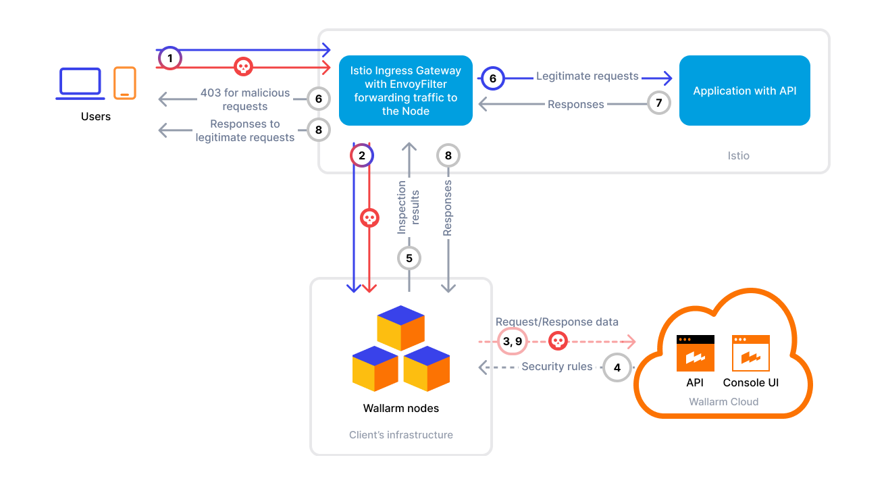

[attacks-in-ui-image]:              ../../images/admin-guides/test-attacks-quickstart.png
[custom-blocking-page-docs]:        ../../admin-en/configuration-guides/configure-block-page-and-code.md
[ptrav-attack-docs]:                ../../attacks-vulns-list.md#path-traversal
[multitenancy-overview]:            ../multi-tenant/overview.md
[applications-docs]:                ../../user-guides/settings/applications.md
[available-filtration-modes]:       ../../admin-en/configure-wallarm-mode.md#available-filtration-modes
[ui-filtration-mode]:              ../../admin-en/configure-wallarm-mode.md#general-filtration-mode
[self-hosted-connector-node-helm-conf]: ../native-node/helm-chart-conf.md
[helm-chart-native-node]:           ../native-node/helm-chart.md
[custom-blocking-page]:             ../../admin-en/configuration-guides/configure-block-page-and-code.md
[rate-limiting]:                    ../../user-guides/rules/rate-limiting.md
[multi-tenancy]:                    ../multi-tenant/overview.md

# Wallarm Filter for Istio Ingress

This guide describes how to secure your APIs managed by Istio using the Wallarm Connector for [Istio Ingress](https://istio.io/latest/docs/tasks/traffic-management/ingress/).

To use Wallarm with Istio, you need to **deploy a Wallarm Node** (either externally or within your cluster) and **apply a gRPC-based External Processing filter** (`ext_proc`) in Envoy to forward traffic to the Node for analysis.

The Wallarm connector for Istio ingress supports both [synchronous (in-line)](../inline/overview.md) and [asynchronous (out‑of‑band)](../oob/overview.md) traffic analysis:

=== "Synchronous traffic flow"
    
=== "Asynchronous traffic flow"
    

## Use cases

This connector is the optimal choice when you need protection for workloads managed by Istio and Envoy.

## Limitations

* A **trusted** SSL/TLS certificate is required for the Wallarm Node domain. Self-signed certificates are not supported.
* [Custom blocking page and blocking code][custom-blocking-page] configurations are not yet supported.
    
    All [blocked](../../admin-en/configure-wallarm-mode.md) malicious traffic is returned with status code `403` and the default block page.
* [Rate limiting][rate-limiting] by Wallarm rules is not supported.
    
    Rate limiting cannot be enforced on the Wallarm side for this connector. If you need rate limiting, use the features built into your API gateway or cloud platform.

## Requirements

Before deploying the connector, make sure that:

* You have a Kubernetes cluster with Istio installed
* Envoy v1.30.0+ is used
* Applications are deployed and reachable through an Istio Gateway and VirtualService
* Access to the **Administrator** account in Wallarm Console for the [US Cloud](https://us1.my.wallarm.com/) or [EU Cloud](https://my.wallarm.com/)
* A Wallarm Native Node v0.13.0+ is used
* A trusted TLS certificate and private key are available for the domain used by the Node

## Deployment

### 1. Deploy a Wallarm Node

The Wallarm node is a core component of the Wallarm platform that you need to deploy. It inspects incoming traffic, detects malicious activities, and can be configured to mitigate threats.

Choose an artifact for a self-hosted node deployment and follow the instructions attached for the `envoy-external-filter` mode:

* [All-in-one installer](../native-node/all-in-one.md) for Linux infrastructures on bare metal or VMs
* [Docker image](../native-node/docker-image.md) for environments that use containerized deployments
* [AWS AMI](../native-node/aws-ami.md) for AWS infrastructures
* [Helm chart](../native-node/helm-chart.md) for infrastructures utilizing Kubernetes

### 2. Configure Istio (Envoy) to forward traffic to the Wallarm Node

Add the Wallarm filter to your Istio IngressGateway using the External Processing (`ext_proc`) filter.

You can either create a new `EnvoyFilter` in the `istio-system` namespace (**recommended**) or modify your existing one.

If you already have a gateway `EnvoyFilter`, merge the `HTTP_FILTER` and `CLUSTER` patches into it.

#### If your Wallarm Node is publicly reachable

=== "Synchronous (inline) analysis"
    ```yaml hl_lines="25-26 28 45-46 55"
    apiVersion: networking.istio.io/v1alpha3
    kind: EnvoyFilter
    metadata:
      name: wallarm-filter
      namespace: istio-system
    spec:
      configPatches:
        - applyTo: HTTP_FILTER
          match:
            context: GATEWAY
            listener:
              filterChain:
                filter:
                  name: "envoy.filters.network.http_connection_manager"
          patch:
            operation: INSERT_BEFORE
            value:
              name: envoy.filters.http.ext_proc
              typed_config:
                "@type": type.googleapis.com/envoy.extensions.filters.http.ext_proc.v3.ExternalProcessor
                grpc_service:
                  envoy_grpc:
                    cluster_name: wallarm_cluster
                processing_mode:
                  request_body_mode: STREAMED
                  response_body_mode: STREAMED
                request_attributes: ["request.id", "request.time", "source.address"]
                failure_mode_allow: <TRUE/FALSE>
        - applyTo: CLUSTER
          match:
            context: GATEWAY
          patch:
            operation: ADD
            value:
              name: wallarm_cluster
              connect_timeout: 30s
              type: STRICT_DNS
              load_assignment:
                cluster_name: wallarm_cluster
                endpoints:
                - lb_endpoints:
                  - endpoint:
                      address:
                        socket_address:
                          address: <WALLARM_NODE_FQDN>
                          port_value: 5080
              http2_protocol_options: {}
              transport_socket:
                name: envoy.transport_sockets.tls
                typed_config:
                  "@type": type.googleapis.com/envoy.extensions.transport_sockets.tls.v3.UpstreamTlsContext
                  common_tls_context:
                    validation_context:
                      match_subject_alt_names:
                        - exact: <WALLARM_NODE_FQDN>
                      trusted_ca:
                        filename: /etc/ssl/certs/ca-certificates.crt
    ```
=== "Asynchronous (out-of-band) analysis"
    ```yaml hl_lines="25-26 28 45-46 56"
    apiVersion: networking.istio.io/v1alpha3
    kind: EnvoyFilter
    metadata:
      name: wallarm-filter
      namespace: istio-system
    spec:
      configPatches:
        - applyTo: HTTP_FILTER
          match:
            context: GATEWAY
            listener:
              filterChain:
                filter:
                  name: "envoy.filters.network.http_connection_manager"
          patch:
            operation: INSERT_BEFORE
            value:
              name: envoy.filters.http.ext_proc
              typed_config:
                "@type": type.googleapis.com/envoy.extensions.filters.http.ext_proc.v3.ExternalProcessor
                grpc_service:
                  envoy_grpc:
                    cluster_name: wallarm_cluster
                processing_mode:
                  request_body_mode: STREAMED
                  response_body_mode: STREAMED
                request_attributes: ["request.id", "request.time", "source.address"]
                failure_mode_allow: <TRUE/FALSE>
                observability_mode: true
        - applyTo: CLUSTER
          match:
            context: GATEWAY
          patch:
            operation: ADD
            value:
              name: wallarm_cluster
              connect_timeout: 30s
              type: STRICT_DNS
              load_assignment:
                cluster_name: wallarm_cluster
                endpoints:
                - lb_endpoints:
                  - endpoint:
                      address:
                        socket_address:
                          address: <WALLARM_NODE_FQDN>
                          port_value: 5080
              http2_protocol_options: {}
              transport_socket:
                name: envoy.transport_sockets.tls
                typed_config:
                  "@type": type.googleapis.com/envoy.extensions.transport_sockets.tls.v3.UpstreamTlsContext
                  common_tls_context:
                    validation_context:
                      match_subject_alt_names:
                        - exact: <WALLARM_NODE_FQDN>
                      trusted_ca:
                        filename: /etc/ssl/certs/ca-certificates.crt
    ```

* `request_body_mode: STREAMED` and `response_body_mode: STREAMED` — may cause Envoy to use chunked transfer encoding for the backend. Ensure that your backend supports chunked decoding; otherwise, requests may fail.
    
    Use `BUFFERED` or `BUFFERED_PARTIAL`, or ensure backend compatibility with chunked encoding if needed.
* `failure_mode_allow` — defines the behavior if the Wallarm Node is unreachable:

    * `true`: fail-open (traffic continues without analysis)
    * `false`: fail-closed (traffic rejected with `500`)
* `<WALLARM_NODE_FQDN>` — your Wallarm Node FQDN, without protocol or trailing slash.
* `port_value: 5080` — change if the Wallarm Node listens on another port.
* The `connect_timeout` parameter defines how long Envoy waits to establish a connection with the Wallarm Node before considering it failed.
    
    The example value of `30s` works for most environments. However, under heavy load or network congestion, a long timeout may delay fail-open behavior and cause traffic to stall. In such cases, consider reducing the timeout — for example, to `10s` (the Istio default for TCP connections).

Apply the configuration:

```
kubectl apply -f <ENVOYFILTER_FILE_NAME>.yaml
```

#### If your Wallarm Node is internal (`ClusterIP`)

=== "Synchronous (inline) analysis"
    ```yaml hl_lines="30 35-36 56-57 66"
    apiVersion: v1
    items:
    - apiVersion: networking.istio.io/v1alpha3
      kind: EnvoyFilter
      metadata:
        annotations:
          kubectl.kubernetes.io/last-applied-configuration: |
            {"apiVersion":"networking.istio.io/v1alpha3","kind":"EnvoyFilter","metadata":{"annotations":{},"name":"wallarm-filter","namespace":"istio-system"},"spec":{"configPatches":[{"applyTo":"HTTP_FILTER","match":{"context":"GATEWAY","listener":{"filterChain":{"filter":{"name":"envoy.filters.network.http_connection_manager"}}}},"patch":{"operation":"INSERT_BEFORE","value":{"name":"envoy.filters.http.ext_proc","typed_config":{"@type":"type.googleapis.com/envoy.extensions.filters.http.ext_proc.v3.ExternalProcessor","failure_mode_allow":false,"grpc_service":{"envoy_grpc":{"cluster_name":"wallarm_cluster"}},"processing_mode":{"request_body_mode":"STREAMED","response_body_mode":"STREAMED"},"request_attributes":["request.id","request.time","source.address"]}}}},{"applyTo":"CLUSTER","match":{"context":"GATEWAY"},"patch":{"operation":"ADD","value":{"connect_timeout":"30s","load_assignment":{"cluster_name":"wallarm_cluster","endpoints":[{"lb_endpoints":[{"endpoint":{"address":{"socket_address":{"address":"native-processing.wallarm.svc.cluster.local","port_value":5080}}}}]}]},"name":"wallarm_cluster","type":"STRICT_DNS"}}}]}}
        creationTimestamp: "2025-06-04T01:41:30Z"
        generation: 5
        name: wallarm-filter
        namespace: istio-system
        resourceVersion: "49980160"
        uid: db2ec99d-2a65-4694-8773-0be30f3060f2
      spec:
        configPatches:
        - applyTo: HTTP_FILTER
          match:
            context: GATEWAY
            listener:
              filterChain:
                filter:
                  name: envoy.filters.network.http_connection_manager
          patch:
            operation: INSERT_BEFORE
            value:
              name: envoy.filters.http.ext_proc
              typed_config:
                '@type': type.googleapis.com/envoy.extensions.filters.http.ext_proc.v3.ExternalProcessor
                failure_mode_allow: <TRUE/FALSE>
                grpc_service:
                  envoy_grpc:
                    cluster_name: wallarm_cluster
                processing_mode:
                  request_body_mode: STREAMED
                  response_body_mode: STREAMED
                request_attributes:
                - request.id
                - request.time
                - source.address
        - applyTo: CLUSTER
          match:
            context: GATEWAY
          patch:
            operation: ADD
            value:
              connect_timeout: 30s
              http2_protocol_options: {}
              load_assignment:
                cluster_name: wallarm_cluster
                endpoints:
                - lb_endpoints:
                  - endpoint:
                      address:
                        socket_address:
                          address: <HOST.DOMAIN.COM>
                          port_value: 5080
              name: wallarm_cluster
              transport_socket:
                name: envoy.transport_sockets.tls
                typed_config:
                  '@type': type.googleapis.com/envoy.extensions.transport_sockets.tls.v3.UpstreamTlsContext
                  common_tls_context:
                    validation_context:
                      match_subject_alt_names:
                      - exact: <HOST.DOMAIN.COM>
                      trusted_ca:
                        filename: /etc/ssl/certs/ca-certificates.crt
              type: STRICT_DNS
    ```
=== "Asynchronous (out-of-band) analysis"
    ```yaml hl_lines="30 36-37 57-58 67"
    apiVersion: v1
    items:
    - apiVersion: networking.istio.io/v1alpha3
      kind: EnvoyFilter
      metadata:
        annotations:
          kubectl.kubernetes.io/last-applied-configuration: |
            {"apiVersion":"networking.istio.io/v1alpha3","kind":"EnvoyFilter","metadata":{"annotations":{},"name":"wallarm-filter","namespace":"istio-system"},"spec":{"configPatches":[{"applyTo":"HTTP_FILTER","match":{"context":"GATEWAY","listener":{"filterChain":{"filter":{"name":"envoy.filters.network.http_connection_manager"}}}},"patch":{"operation":"INSERT_BEFORE","value":{"name":"envoy.filters.http.ext_proc","typed_config":{"@type":"type.googleapis.com/envoy.extensions.filters.http.ext_proc.v3.ExternalProcessor","failure_mode_allow":false,"grpc_service":{"envoy_grpc":{"cluster_name":"wallarm_cluster"}},"processing_mode":{"request_body_mode":"STREAMED","response_body_mode":"STREAMED"},"request_attributes":["request.id","request.time","source.address"]}}}},{"applyTo":"CLUSTER","match":{"context":"GATEWAY"},"patch":{"operation":"ADD","value":{"connect_timeout":"30s","load_assignment":{"cluster_name":"wallarm_cluster","endpoints":[{"lb_endpoints":[{"endpoint":{"address":{"socket_address":{"address":"native-processing.wallarm.svc.cluster.local","port_value":5080}}}}]}]},"name":"wallarm_cluster","type":"STRICT_DNS"}}}]}}
        creationTimestamp: "2025-06-04T01:41:30Z"
        generation: 5
        name: wallarm-filter
        namespace: istio-system
        resourceVersion: "49980160"
        uid: db2ec99d-2a65-4694-8773-0be30f3060f2
      spec:
        configPatches:
        - applyTo: HTTP_FILTER
          match:
            context: GATEWAY
            listener:
              filterChain:
                filter:
                  name: envoy.filters.network.http_connection_manager
          patch:
            operation: INSERT_BEFORE
            value:
              name: envoy.filters.http.ext_proc
              typed_config:
                '@type': type.googleapis.com/envoy.extensions.filters.http.ext_proc.v3.ExternalProcessor
                failure_mode_allow: <TRUE/FALSE>
                observability_mode: true
                grpc_service:
                  envoy_grpc:
                    cluster_name: wallarm_cluster
                processing_mode:
                  request_body_mode: STREAMED
                  response_body_mode: STREAMED
                request_attributes:
                - request.id
                - request.time
                - source.address
        - applyTo: CLUSTER
          match:
            context: GATEWAY
          patch:
            operation: ADD
            value:
              connect_timeout: 30s
              http2_protocol_options: {}
              load_assignment:
                cluster_name: wallarm_cluster
                endpoints:
                - lb_endpoints:
                  - endpoint:
                      address:
                        socket_address:
                          address: <HOST.DOMAIN.COM>
                          port_value: 5080
              name: wallarm_cluster
              transport_socket:
                name: envoy.transport_sockets.tls
                typed_config:
                  '@type': type.googleapis.com/envoy.extensions.transport_sockets.tls.v3.UpstreamTlsContext
                  common_tls_context:
                    validation_context:
                      match_subject_alt_names:
                      - exact: <HOST.DOMAIN.COM>
                      trusted_ca:
                        filename: /etc/ssl/certs/ca-certificates.crt
              type: STRICT_DNS
    ```

* `failure_mode_allow` — defines the behavior if the Wallarm Node is unreachable:

    * `true`: fail-open (traffic continues without analysis)
    * `false`: fail-closed (traffic rejected with `500`)
* `request_body_mode: STREAMED` and `response_body_mode: STREAMED` — may cause Envoy to use chunked transfer encoding for the backend. Ensure that your backend supports chunked decoding; otherwise, requests may fail.
    
    Use `BUFFERED` or `BUFFERED_PARTIAL`, or ensure backend compatibility with chunked encoding if needed.
* `<HOST.DOMAIN.COM>` — the fully qualified domain name (FQDN) of your Wallarm Node, without protocol or trailing slash.
    
    This must be the same domain for which the SSL/TLS certificate was issued and which resolves internally to the Node’s service (e.g., through a CoreDNS rewrite).
* `port_value: 5080` — change if the Wallarm Node listens on another port.
* The `connect_timeout` parameter defines how long Envoy waits to establish a connection with the Wallarm Node before considering it failed.
    
    The example value of `30s` works for most environments. However, under heavy load or network congestion, a long timeout may delay fail-open behavior and cause traffic to stall. In such cases, consider reducing the timeout — for example, to `10s` (the Istio default for TCP connections).

Apply the configuration:

```
kubectl apply -f <ENVOYFILTER_FILE_NAME>.yaml
```

### 3. Optional: AWS kOps proxy protocol support

For AWS kOps clusters, enable proper `X-Forwarded-For` propagation:

```
kubectl patch svc istio-ingressgateway -n istio-system \
  --type=merge \
  -p '{"metadata":{"annotations":{"service.beta.kubernetes.io/aws-load-balancer-proxy-protocol":"*"}}}'

kubectl edit configmap -n istio-system istio
```

Then add:

```yaml
data:
  mesh: |-
    defaultConfig:
      gatewayTopology:
        proxyProtocol: {}
```

## Testing

To test the functionality of the deployed filter, follow these steps:

1. Send the request with the test [Path Traversal][ptrav-attack-docs] attack:

    ```
    curl https://<YOUR_APP_DOMAIN>/etc/passwd
    ```
1. Open Wallarm Console → **Attacks** section in the [US Cloud](https://us1.my.wallarm.com/attacks) or [EU Cloud](https://my.wallarm.com/attacks) and make sure the attack is displayed in the list.

    ![Attacks in the interface][attacks-in-ui-image]

    If the Wallarm node mode is set to [blocking](../../admin-en/configure-wallarm-mode.md) and the traffic flows in-line, the request will also be blocked.

## Advanced configuration options

In addition to the basic `EnvoyFilter` examples described above (which apply Wallarm filtering to all Istio Ingress Gateway traffic), you can use the following alternative configurations to handle more specific use cases:

* Limit Wallarm inspection to selected domains or namespaces
* Mirror intra-cluster traffic in addition to external ingress traffic
* Exclude certain routes or services from inspection

### Filter only selected domains (external traffic only)

If you prefer to manage a single `EnvoyFilter` in the `istio-system` namespace and prevent other namespaces from disabling inspection, use this configuration.

It mirrors only specific domains defined by their SNI values:

```yaml
apiVersion: networking.istio.io/v1alpha3
kind: EnvoyFilter
metadata:
  annotations:
  name: wallarm-filter
  namespace: istio-system
spec:
  configPatches:
######
## COPY AND PASTE THIS SECTION FOR EVERY DOMAIN YOU WANT TO INSPECT
## MODIFY ONLY THE match.listener.filterChain.sni VALUE
######
  - applyTo: HTTP_FILTER
    match:
      context: GATEWAY
      listener:
        filterChain:
          sni: <APP_DOMAIN>
          filter:
            name: envoy.filters.network.http_connection_manager
    patch:
      operation: INSERT_BEFORE
      value:
        name: envoy.filters.http.ext_proc
        typed_config:
          '@type': type.googleapis.com/envoy.extensions.filters.http.ext_proc.v3.ExternalProcessor
          failure_mode_allow: false
          grpc_service:
            envoy_grpc:
              cluster_name: wallarm_cluster
          processing_mode:
            request_body_mode: STREAMED
            response_body_mode: STREAMED
          request_attributes:
          - request.id
          - request.time
          - source.address
########
## END COPY/PASTE SECTION
########

########
## PASTE ANY OTHER DOMAINS TO INSPECT HERE BEFORE THE CLUSTER CONFIG
########

  - applyTo: CLUSTER
    match:
      context: GATEWAY
    patch:
      operation: ADD
      value:
        connect_timeout: 30s
        http2_protocol_options: {}
        load_assignment:
          cluster_name: wallarm_cluster
          endpoints:
          - lb_endpoints:
            - endpoint:
                address:
                  socket_address:
                    address: <WALLARM_NODE_FQDN>
                    port_value: <PORT>
        name: wallarm_cluster
        transport_socket:
          name: envoy.transport_sockets.tls
          typed_config:
            '@type': type.googleapis.com/envoy.extensions.transport_sockets.tls.v3.UpstreamTlsContext
            common_tls_context:
              validation_context:
                match_subject_alt_names:
                - exact: <WALLARM_NODE_FQDN>
                trusted_ca:
                  filename: /etc/ssl/certs/ca-certificates.crt
        type: STRICT_DNS
```

### Filter selected domains (intra-cluster + external traffic)

You can also deploy an `EnvoyFilter` inside each application namespace to inspect not only ingress but also service-to-service (sidecar) traffic.

This setup supports Istio's internal mTLS and client-side mTLS:

```yaml
# NOTE THE spec.configPatches.applyTo.match.context ARE FOR SIDECAR NOT GATEWAY
# IF YOU ALSO WANT TO INSPECT OUTBOUND REQUESTS THE APP MAKES, ADD ANOTHER
# "- applyTo: HTTP_FILTER" WITH "context: SIDECAR_OUTBOUND"

apiVersion: networking.istio.io/v1alpha3
kind: EnvoyFilter
metadata:
  name: wallarm-filter
spec:
  configPatches:
  - applyTo: HTTP_FILTER
    match:
      context: SIDECAR_INBOUND
      listener:
        filterChain:
          filter:
            name: envoy.filters.network.http_connection_manager
    patch:
      operation: INSERT_BEFORE
      value:
        name: envoy.filters.http.ext_proc
        typed_config:
          '@type': type.googleapis.com/envoy.extensions.filters.http.ext_proc.v3.ExternalProcessor
          failure_mode_allow: false
          grpc_service:
            envoy_grpc:
              cluster_name: wallarm_cluster
          processing_mode:
            request_body_mode: STREAMED
            response_body_mode: STREAMED
          request_attributes:
          - request.id
          - request.time
          - source.address
  - applyTo: CLUSTER
    match:
      context: SIDECAR_OUTBOUND
    patch:
      operation: ADD
      value:
        connect_timeout: 30s
        http2_protocol_options: {}
        load_assignment:
          cluster_name: wallarm_cluster
          endpoints:
          - lb_endpoints:
            - endpoint:
                address:
                  socket_address:
                    address: <WALLARM_NODE_FQDN>
                    port_value: <PORT>
        name: wallarm_cluster
        transport_socket:
          name: envoy.transport_sockets.tls
          typed_config:
            '@type': type.googleapis.com/envoy.extensions.transport_sockets.tls.v3.UpstreamTlsContext
            common_tls_context:
              validation_context:
                match_subject_alt_names:
                - exact: <WALLARM_NODE_FQDN>
                trusted_ca:
                  filename: /etc/ssl/certs/ca-certificates.crt
        type: STRICT_DNS
```

### Excluding specific domains or routes

If you have a complex routing setup and experience duplicated or unwanted mirrored traffic, you can exclude selected routes from inspection.

This method uses `ExtProcPerRoute` configuration and is based on the `route.name` label in your `VirtualService` objects:

1. Make sure that each `VirtualService` has a `spec.http[0].name` field specified — this name will be referenced when configuring exclusions:

    ```yaml
    apiVersion: networking.istio.io/v1
    kind: VirtualService
    metadata:
      name: httpbin-vs
      namespace: httpbin
    spec:
      gateways:
      - <GATEWAY>
      hosts:
      - <HOST>
      http:
      - match:
        - uri:
            prefix: /
        name: <ROUTE_NAME> ## <---- ENSURE NAME IS DEFINED FOR ALL VS OBJECTS
        route:
        - destination:
            host: httpbin
            port:
              number: 80
    ```
1. Deploy a single `EnvoyFilter` in the `istio-system` namespace to mirror all ingress traffic and exclude selected routes based on their names.

    In the following example, all traffic is mirrored except for `httpbin2` and `httpbin4`, which are explicitly excluded:

    ```yaml
    apiVersion: networking.istio.io/v1alpha3
    kind: EnvoyFilter
    metadata:
      name: wallarm-route
      namespace: istio-system
    spec:
      workloadSelector:
        labels:
          istio: ingressgateway
      configPatches:

      # === 1. Apply the Wallarm ext_proc filter to all inbound traffic ===
      - applyTo: HTTP_FILTER
        match:
          context: GATEWAY
          listener:
            filterChain:
              filter:
                name: envoy.filters.network.http_connection_manager
        patch:
          operation: INSERT_BEFORE
          value:
            name: envoy.filters.http.ext_proc
            typed_config:
              '@type': type.googleapis.com/envoy.extensions.filters.http.ext_proc.v3.ExternalProcessor
              failure_mode_allow: false
              grpc_service:
                envoy_grpc:
                  cluster_name: wallarm_cluster
              processing_mode:
                request_body_mode: STREAMED
                response_body_mode: STREAMED
              request_attributes:
              - request.id
              - request.time
              - source.address

      # === 2. Define the Wallarm Node cluster for traffic mirroring ===
      - applyTo: CLUSTER
        match:
          context: GATEWAY
        patch:
          operation: ADD
          value:
            name: wallarm_cluster
            connect_timeout: 30s
            type: STRICT_DNS
            load_assignment:
              cluster_name: wallarm_cluster
              endpoints:
              - lb_endpoints:
                - endpoint:
                    address:
                      socket_address:
                        address: <WALLARM_NODE_FQDN>
                        port_value: <PORT>
            http2_protocol_options: {}
            transport_socket:
              name: envoy.transport_sockets.tls
              typed_config:
                '@type': type.googleapis.com/envoy.extensions.transport_sockets.tls.v3.UpstreamTlsContext
                common_tls_context:
                  validation_context:
                    match_subject_alt_names:
                    - exact: <WALLARM_NODE_FQDN>
                    trusted_ca:
                      filename: /etc/ssl/certs/ca-certificates.crt

      # === 3. Exclude specific routes from mirroring ===
      # Example: Exclude httpbin2
      - applyTo: HTTP_ROUTE
        match:
          context: GATEWAY
          routeConfiguration:
            vhost:
              name: httpbin2.example.com:443
              route:
                name: httpbin2-route
        patch:
          operation: MERGE
          value:
            typed_per_filter_config:
              envoy.filters.http.ext_proc:
                '@type': type.googleapis.com/envoy.extensions.filters.http.ext_proc.v3.ExtProcPerRoute
                disabled: true

      # Example: Exclude httpbin4
      - applyTo: HTTP_ROUTE
        match:
          context: GATEWAY
          routeConfiguration:
            vhost:
              name: httpbin4.example.com:443
              route:
                name: httpbin4-route
        patch:
          operation: MERGE
          value:
            typed_per_filter_config:
              envoy.filters.http.ext_proc:
                '@type': type.googleapis.com/envoy.extensions.filters.http.ext_proc.v3.ExtProcPerRoute
                disabled: true
    ```

## Manual setup (standalone Envoy)

If you are running Envoy outside Istio, insert the filter and cluster directly in your `envoy.yaml`:

1. In your `envoy.yaml` → `http_filters` section, configure the external processing filter for sending requests and responses to the external Wallarm Node for analysis:

    ```yaml
    ...

    http_filters:
    - name: ext_proc
      typed_config:
        "@type": type.googleapis.com/envoy.extensions.filters.http.ext_proc.v3.ExternalProcessor
        grpc_service:
          envoy_grpc:
            cluster_name: wallarm_cluster
        processing_mode:
          request_body_mode: STREAMED
          response_body_mode: STREAMED
        request_attributes: ["request.id", "request.time", "source.address"]
    ```
1. In your `envoy.yaml` → `clusters` section, configure the Wallarm cluster used to forward data to the Wallarm Node:

    ```yaml
    clusters:
    - ...
    - name: wallarm_cluster
      connect_timeout: 30s
      load_assignment:
        cluster_name: wallarm_cluster
        endpoints: # Wallarm Node endpoint
        - lb_endpoints:
          - endpoint:
              address:
                socket_address:
                  address: <WALLARM_NODE_FQDN>
                  port_value: 5080
      http2_protocol_options: {} # must be set for enabling http2
      transport_socket:
        name: envoy.transport_sockets.tls
        typed_config:
          "@type": type.googleapis.com/envoy.extensions.transport_sockets.tls.v3.UpstreamTlsContext
          common_tls_context:
            validation_context:
              trusted_ca:
                filename: /path/to/node-ca.pem
    ```

## Upgrading the filter

To upgrade the filter:

1. Re-apply your `EnvoyFilter` if schema changes are introduced:

    ```
    kubectl apply -f <UPDATED_ENVOYFILTER_FILE_NAME>.yaml
    kubectl rollout restart deploy/istio-ingressgateway -n istio-system
    ```
1. Verify the new configuration:

    ```
    istioctl pc listeners -n istio-system <INGRESS_POD> | grep ext_proc
    ```

Filter upgrades may require a Wallarm node upgrade, especially for major version updates. See the [Native Node changelog](../../updating-migrating/native-node/node-artifact-versions.md) for the self-hosted Node release notes. Regular node updates are recommended to avoid deprecation and simplify future upgrades.
