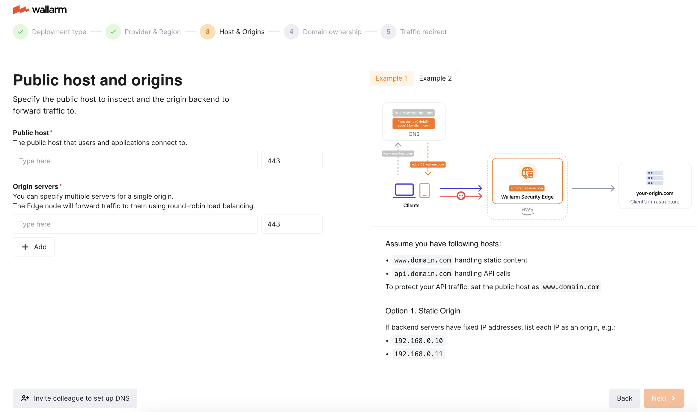
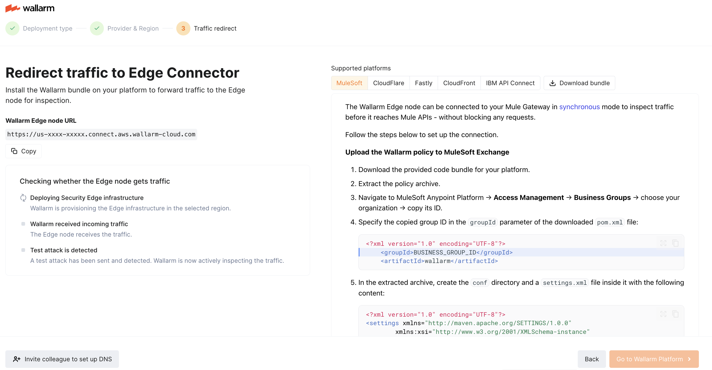

# Security Edge Free Tier

The Free Tier of [Security Edge](overview.md) lets you evaluate the Wallarm platform and protect up to **500,000 requests per month - free of charge**, without hosting the Wallarm Node yourself.

With the Security Edge Free Tier, you gain access to the Wallarm platform as [Advanced API Security](../../about-wallarm/subscription-plans.md#core-subscription-plans), including most features, but with some [limitations](#limitations).

## Getting started

To start using the Security Edge Free Tier, **sign up for Wallarm in either the [US](https://us1.my.wallarm.com/signup/?utm_source=wallarm_docs&utm_campaign=se_free_tier_guide) or [EU Cloud](https://my.wallarm.com/signup/?utm_source=wallarm_docs&utm_campaign=se_free_tier_guide)**.

After signing up, you will be automatically redirected to the [Welcome Wizard](../../quickstart/getting-started.md#welcome-wizard) to test demo traffic. Once you complete it, you will proceed to the **Security Edge Quick Setup wizard.**

## Quick setup wizard

The wizard walks you through the basic [Inline](inline/overview.md) or [Connector](se-connector.md) Security Edge deployment.

Edge Nodes start in **monitoring** [mode](../../admin-en/configure-wallarm-mode.md), so requests are not blocked.

=== "Security Edge Inline"
    1. Choose a region for deployment.
    1. Specify a public host (the domain your users connect to).
    1. Define an origin to forward analyzed traffic to.

        If the origin has multiple servers, you can specify all of them. The Edge Node will forward traffic to them using [round-robin](https://en.wikipedia.org/wiki/Round-robin_DNS) load balancing.

        Origins must differ from hosts to avoid loops.
    1. Add the provided **Certificate CNAME** record in your DNS zone to verify domain ownership.
    1. Point your host's DNS to the provided **Traffic CNAME** to complete routing.

        Traffic CNAME is provided once the certificate CNAME is verified.

    
=== "Security Edge Connector"
    1. Choose a region for deployment.
    1. Copy the provided Node URL — the entry point for the Connector.
    1. **Download code bundle** for your platform.
    1. Apply the bundle on your API management platform following the instructions:

        * [MuleSoft Mule Gateway](../connectors/mulesoft.md#2-obtain-and-upload-the-wallarm-policy-to-mulesoft-exchange)
        * [MuleSoft Flex Gateway](../connectors/mulesoft-flex.md#2-obtain-and-upload-the-wallarm-policy-to-mulesoft-exchange)
        * [Apigee](../connectors/apigee.md#2-obtain-the-connector-code-bundle)
        * [Akamai](../connectors/akamai-edgeworkers.md#2-obtain-the-wallarm-code-bundle-and-create-edgeworkers) 
        * [CloudFront](../connectors/aws-lambda.md#2-obtain-and-deploy-the-wallarm-lambdaedge-functions)
        * [Amazon API Gateway](../connectors/aws-api-gateway.md)
        * [Cloudflare](../connectors/cloudflare.md#2-obtain-and-deploy-the-wallarm-worker-code)
        * [Standalone Kong API Gateway](../connectors/standalone-kong-api-gateway.md#2-prepare-the-wallarm-lua-plugin)
        * [Fastly](../connectors/fastly.md#2-deploy-wallarm-code-on-fastly)
        * [IBM DataPower](../connectors/ibm-api-connect.md#2-obtain-and-apply-the-wallarm-policies-to-apis-in-ibm-api-connect)
        * [Azure API Management](../connectors/azure-api-management.md#2-create-named-values-in-azure)

    

After setup, a test attack is automatically sent to the Edge Node. Once detected, you gain access to the Wallarm Console with full Free Tier functionality. The attack will appear in the [**Attacks**](../../user-guides/events/check-attack.md) section.

You can also invite teammates to join the onboarding. They will be assigned the **Administrator** [role](../../user-guides/settings/users.md#user-roles) and receive an invitation link by email.

You can reopen the wizard later via the **Quick setup** in the Security Edge section or at `/onboarding`.

## Limitations

Compared to the full Security Edge configuration flow, the **Quick setup** wizard has the following restrictions:

* Host fine-tuning is not supported: filtration modes, Wallarm applications, NGINX directives
* Security Edge Inline:

    * Apex domains not supported in hosts
    * Only one origin can be added
    * Cannot skip [domain ownership verification](inline/deployment.md#3-certificates) (e.g. if your origin is behind a proxy like Cloudflare)
    * [Host redirection](inline/host-redirection.md) is not supported
    * [Custom block page](inline/custom-block-page.md)
    * [NGINX overrides](inline/nginx-overrides.md)
    * [Mutual TLS](inline/mtls.md) configuration is unavailable

Some features are not available in the Free Tier, regardless of whether the quick setup or the full configuration flow is used:

* [Vulnerability assessment](../../user-guides/vulnerabilities.md)
* [API Abuse Prevention](../../api-abuse-prevention/overview.md)
* Limited to 3 users per company account
* Telemetry portal of Security Edge
* Deployment in Microsoft Azure
* Multi-cloud and multi-region Security Edge Inline deployment
* Multiple Security Edge Connectors — only one connector can be deployed, with a single endpoint provided for traffic redirection

## Next steps

* [Security Edge Inline: full configuration flow](inline/deployment.md)
* [Security Edge Connector: full configuration flow](se-connector.md)
