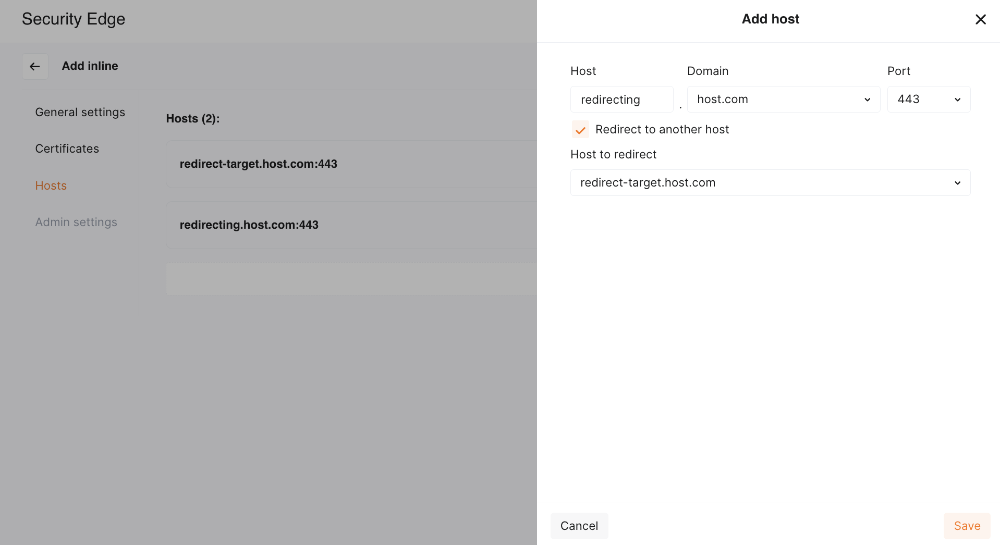

# Host Redirection in Security Edge Inline 

Wallarm [Security Edge Inline](deployment.md) provides a host redirection feature to help you unify traffic entry points.

## How it works

When host redirection is enabled, the Edge Node automatically redirects client requests from one host (the **redirecting host**) to another (the **target host**).

The redirected request is then processed according to the configuration - including origin, filtration mode, and other settings - of the target host.

!!! info "TLS requirement"
    The DNS zone of the redirecting host must have [certificate issuance enabled](deployment.md#5-certificate-cname-configuration).

The Edge Node responds to incoming requests on the redirecting host with an HTTP 301 or 302 redirect, instructing the client to request the same resource on the target host.

The original path and query string are preserved while redirecting requests.

## Enabling host redirection

To enable host redirection:

1. Add the target [host](deployment.md#4-hosts) - the host to which client requests will be redirected.
1. Fully configure it with the required origin, filtration mode, and other necessary settings.

    
1. Add the redirecting host - the host from which users will be redirected.
1. Enable the **Redirect to another host** checkbox and select the target host from the list.

    

No origin is required for the redirecting host - it only returns an HTTPS redirect and does not proxy traffic.

## Examples

Below are some common use cases where host redirection is useful.

### Recommended: redirect from apex domain to `www.*`

* Redirecting host: `example.com`
* Protected host: `www.example.com`

To securely handle traffic to your apex domain, we recommend using a subdomain like `www.example.com` as the primary protected host whenever possible.

This approach allows Wallarm to manage traffic routing across multiple regions and cloud providers using a global CNAME, eliminating the need for [multiple A records](deployment.md#a-records) and manual traffic distribution.

Configuration steps:

1. Add the [host](deployment.md#4-hosts) `www.example.com` to Security Edge and configure it fully (origin, mode, etc.).
1. Add the host `example.com` as a separate host and enable redirection to `www.example.com`.

### Legacy API endpoint redirect

* Old host: `old-api.customer.com`
* New protected host: `new-api.customer.com`

If your API was previously available at `old-api.customer.com` but has moved to `new-api.customer.com`, use host redirection to ensure backward compatibility.

Configuration steps:

1. Add the [host](deployment.md#4-hosts) `new-api.customer.com` to Security Edge and configure it fully (origin, mode, etc.).
1. Add the host `old-api.customer.com` as a separate host and enable redirection to `new-api.customer.com`.
