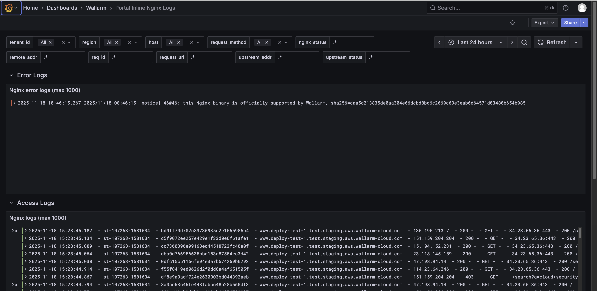

# Portal Inline NGINX Logs 

This article describes one of the two dashboards in the [Security Edge Inline telemetry portal](overview.md), called **Portal Inline NGINX Logs**.

The **Portal Inline NGINX Logs** dashboard shows recent NGINX logs to help monitor incoming traffic, identify errors, and troubleshoot server or configuration issues. Monitoring these logs is useful because the Edge Node is built on NGINX, making it a core functional part of the Node alongside Wallarm services.

The dashboard includes two rows:

* Error Logs – Displays the most recent NGINX error log entries (up to 1,000). This panel helps identify server issues, configuration problems, or failed requests.

* Access Logs – Shows the most recent NGINX access log entries (up to 1,000). This panel provides detailed information about incoming requests, including timestamps, client IPs, request methods, response codes, and requested URIs.



Each log entry in the Error Logs and Access Logs panels is collapsible. In collapsed view, it shows a summary like:

```
2x  2025-11-18 15:28:45.182  - st-107263-1581634 - bd9ff70d702c83736935c2e1565985c4 - 
www.deploy-test-1.test.staging.aws.wallarm-cloud.com - 135.195.213.7 - 
200 - - GET - - 34.23.65.36:443 - 200 /search?q=cloud+security
```


To analyze each request in detail, expand the log entry. When expanded, the log entry shows detailed structured fields, including but not limited to:

* Log metadata: `_msg`, `_stream_id`
* Cloud and cluster data: cloud, cluster, region
* NGINX details: `nginx_http_host`, `nginx_request_method`, `nginx_request_uri`, `nginx_status`, `nginx_upstream_response_time`, `nginx_time`
* Wallarm-specific fields: `wallarm_attack_type`, `wallarm_mode`, `wallarm_request_id`, `wallarm_request_time`, `se_wallarm_com_tenant_id`
* Other metadata: severity, stream, `tenant_id`, type, etc.


