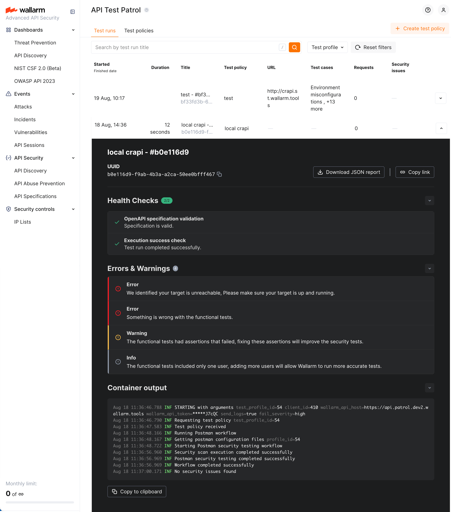

---
search:
  exclude: true
hide:
  - navigation
---

<meta name="robots" content="noindex, noarchive, nofollow">

# Exploring Test Run Results <a href="../../../about-wallarm/subscription-plans/#core-subscription-plans"></a>

**Schema-Based Testing:** [Overview](overview.md) &middot; [Setup](setup.md) &middot; Exploring results

This article explains how to read the results of a Schema-Based Testing run.

## Test runs

Go to Wallarm Console → **Security Testing** → **Schema-Based** → **Test runs**. Each row shows when the run started and finished, how long it took, which test policy produced it, how many test cases ran, how many requests were sent, and how many security issues resulted.


To narrow the list, filter by test policy or search by run title.

## Test run details

Click a test run to expand it.



The expanded row shows:

* **Test run health** - whether the specification or Postman collection was valid and the run succeeded.
* **Errors and warnings**, if any occurred.
* **Docker container output**, with a **Copy to clipboard** action.
* **Tests**, grouped by strategy.

From here you can also download a JSON report for the run and copy a link to share.

## Tests and verdicts

Inside an expanded run, the **Tests** section groups every generated test under the strategy that produced it - BOLA, BFLA, JWT Authentication Flaws, and so on - with a count of outcomes per group.

Each test ends with one of these verdicts:

| Verdict | Meaning |
| --- | --- |
| **Vulnerable** | The test demonstrated the vulnerability. The evidence - request, response, and reasoning - is attached, and a security issue is created. |
| **Not vulnerable** | The test ran and the application behaved correctly, for example by returning `401` or `403` where access should be denied. |
| **Inconclusive** | The test ran but the result does not establish either outcome. |

!!! info "Reading `inconclusive`"
    `Inconclusive` means the evidence was insufficient, not that the application is safe. The most common cause is a missing precondition: BOLA and BFLA need traffic from [two authenticated users](setup.md#authorization-testing-with-two-users), and with a single user they cannot reach a verdict. A group of BOLA or BFLA tests that is entirely `inconclusive` usually indicates the test input had one identity, not that the application passed.

Open an individual test to see the hypothesis the engine formed, the generated test script, and the request and response captured when it ran.

## Security issues

Tests with the **Vulnerable** verdict are published to the Console's [**Security Issues**](../../api-attack-surface/security-issues.md) section, where they are managed alongside issues from other detection methods.

To see only the issues from Schema-Based Testing, filter **Discovered by** by **Schema-Based Testing**. To see the issues from one run, open the run and follow the link to its security issues.

Each issue carries its type, severity, affected endpoint, a description of the problem, and remediation guidance.

## Docker container output

Results also appear in the container output, for example:

```
Sep  2 18:26:40.222 INF STARTING with arguments test_profile_id=60 client_id=5 wallarm_api_host=https://us1.api.wallarm.com wallarm_api_token=*****FWmup send_logs=true fail_severity=high
Sep  2 18:26:40.228 INF Running pre-flight checks
Sep  2 18:26:40.698 INF Successfully authenticated with Wallarm API
Sep  2 18:26:40.698 INF All pre-flight checks passed
Sep  2 18:26:40.698 INF Requesting test policy test_profile_id=60
Sep  2 18:26:41.926 INF Test policy received
Sep  2 18:26:42.383 INF Running Postman workflow
Sep  2 18:26:43.168 INF Running target URL connectivity check with Newman
Sep  2 18:27:40.723 INF Target URL connectivity check with Newman passed total_requests=47 failed_requests=9 failure_ratio=0.19148936170212766 threshold=0.75
Sep  2 18:27:40.727 INF Starting Postman security testing workflow
Sep  2 18:33:51.069 INF Postman security testing completed successfully
Sep  2 18:33:57.283 INF Security issues summary total_issues=17 severity_counts.high=16 severity_counts.medium=1
Sep  2 18:33:57.411 ERR Exiting with code 1 due to security issues meeting fail-severity threshold fail_severity=high count=16
```

Note the exit code `1`, caused by findings meeting the configured fail-severity threshold. Use this in CI/CD to fail a pipeline on findings of a given severity.

## Troubleshooting

| Symptom | Likely cause |
| --- | --- |
| BOLA and BFLA groups are entirely `inconclusive` | The test input contained a single authenticated user. See [Business logic security testing](setup.md#authorization-testing-with-two-users). |
| No BOLA or BFLA tests were generated at all | The strategies are not selected on the policy. See [Selecting strategies](setup.md#selecting-strategies). |
| Most tests are `inconclusive` and the run sent few requests | The target rejected the traffic, commonly because authentication was not configured or the client IP is not allowlisted. Check the target's access log for `401` responses and review [Prerequisites](setup.md#prerequisites). |
| The run found nothing after a previous successful run | The credentials used by the test input may have been changed by the earlier run. Re-create the test accounts - see [Test accounts](setup.md#test-accounts). |
