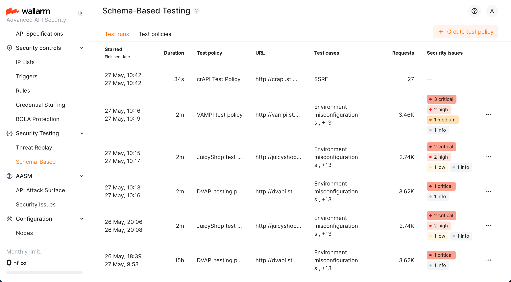
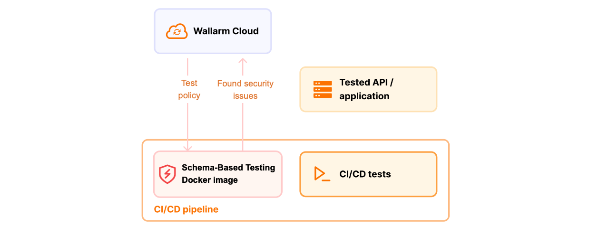

---
search:
  exclude: true
hide:
  - navigation
---

<meta name="robots" content="noindex, noarchive, nofollow">

# Schema-Based Testing 

**Schema-Based Testing:** Overview &middot; [Setup](setup.md) &middot; [Exploring results](explore.md)

Wallarm's Schema-Based Testing is a dynamic application security testing (DAST) solution that enables "shift-left" security. It uses an API's schema - an OpenAPI specification, a RAML specification, or a Postman collection - as a blueprint to automatically generate and execute targeted security tests against a running application.

Because the tests run outside production traffic and need no [Wallarm node](../../about-wallarm/api-security-overview.md#how-wallarm-api-security-works), you can run them against staging or pre-release environments and fix findings before release.

!!! info "Early access"
    Schema-Based Testing is available as an early-access feature and is actively evolving — new strategies and detection improvements ship regularly. Your feedback helps shape it; contact [sales@wallarm.com](mailto:sales@wallarm.com) with questions or suggestions.

## How it works

1. **Create a test policy**: specify the target application, provide its OpenAPI specification, RAML specification, or Postman collection, set the base URL, and select the tests to run.
1. **Copy the Docker command**: find your test policy on the **Test policies** tab, click it, and copy the provided Docker command.
1. **Run and monitor**: start the agent with the command. Track progress and view results on the **Test runs** tab.

## Test basis

Schema-Based Testing can base its tests on:

* **OpenAPI specification (OAS)** - a machine-readable blueprint of your API. You can use an OAS [exported from API Discovery](../../api-discovery/exploring.md#openapi-oas-export) or from any other source. OAS-based testing covers input validation, injection, and misconfiguration detection, and - with [two test users](setup.md#authorization-testing-with-two-users) on the policy - authorization flaws (BOLA and BFLA).
* **RAML specification** - if your API is documented using [RAML](https://raml.org/), you can upload it directly. RAML files are converted to OpenAPI specifications automatically and the policy behaves like an OAS one. See [details](setup.md#raml-based-test-policies).
* **Postman collection** - if you use [Postman](https://www.postman.com/), the functional tests in its [collections](https://www.postman.com/product/collections/) are used to build security tests alongside. A Postman collection can also carry the two users for authorization testing within the collection itself. See [details](setup.md#postman-collection-based-test-policies).

## Detection coverage

Schema-Based Testing runs a set of **strategies**, each targeting a class of vulnerability. The table maps them to the [OWASP API Security Top 10 (2023)](https://owasp.org/API-Security/editions/2023/en/0x11-t10/).

| OWASP category | Strategies | Test basis required |
| --- | --- | --- |
| API1:2023 Broken Object Level Authorization | BOLA | **Two test users** - see [requirements](#requirements-for-authorization-testing) |
| API2:2023 Broken Authentication | JWT Authentication Flaws, Unauthenticated Access | Any |
| API3:2023 Broken Object Property Level Authorization | Mass Assignment, Excessive Data Exposure | Any |
| API4:2023 Unrestricted Resource Consumption | Resource Exhaustion | Any |
| API5:2023 Broken Function Level Authorization | BFLA | **Two test users** (different privilege levels) - see [requirements](#requirements-for-authorization-testing) |
| API6:2023 Unrestricted Access to Sensitive Business Flows | Business Logic Abuse | Any |
| API7:2023 Server Side Request Forgery | SSRF | Any |
| API8:2023 Security Misconfiguration | Security Headers, Service Internals, Secrets Management | Any |

Additional strategies not tied to a single OWASP category: SQL Injection, NoSQL Injection, AI/LLM Vulnerabilities, Data Exposure, Web Vulnerabilities.

You can also define your own strategies on the **Strategies** tab.

## Requirements for authorization testing

Authorization flaws cannot be proven from a single user's traffic: demonstrating that one user can reach another user's object requires both users to be present. Accordingly:

| Vulnerability | Input requirement |
| --- | --- |
| API1:2023 BOLA | Traffic from **at least two authenticated users**, so the test can show whether object-level authorization is enforced between them. |
| API5:2023 BFLA | Requests from users with **different privilege levels**, so the test can show whether function-level authorization is enforced consistently. |

If the input contains only one authenticated user, BOLA and BFLA tests complete with the `inconclusive` verdict rather than reporting a vulnerability - there is no second identity against which to test. This is expected behavior, not an error.

!!! info "How to provide two users"
    Configure **two test users** on the test policy - each with its own authentication (for example, its own `Authorization` header) and, for BFLA, a different privilege level. This works with an **OpenAPI, RAML, or Postman** policy: the run replays the API traffic as each user. A Postman collection can alternatively carry the two users itself. See [Authorization testing with two users](setup.md#authorization-testing-with-two-users). With only one user configured, BOLA and BFLA return `inconclusive`.

!!! warning "Use disposable test accounts"
    Tests exercise authentication endpoints, including password reset and email change. Credentials of the accounts used for testing may be changed by the test run itself. Use accounts created for testing, re-create them before each run, and never use accounts that people rely on.

## What Schema-Based Testing does not cover

Schema-Based Testing does not currently test for:

* Forced browsing and administrative endpoint discovery
* HTTP method tampering
* API path and version manipulation
* Password policy strength and account lockout behavior

Two OWASP API Security Top 10 (2023) categories also fall outside its scope by design, because they are not properties the schema-driven tests can prove against a single running target:

* **API9:2023 Improper Inventory Management** - shadow, deprecated, and undocumented endpoints. Wallarm addresses these with [API Discovery](../../api-discovery/overview.md) and [API Attack Surface Management](../../api-attack-surface/overview.md), which build and monitor your API inventory from real traffic and external scanning.
* **API10:2023 Unsafe Consumption of APIs** - risks introduced by the third-party and upstream APIs your application consumes. Schema-Based Testing exercises your own API's surface, not the behavior of its upstream dependencies.

Credential stuffing is not a Schema-Based Testing capability either: it is an attack against a running application rather than a property of the API, and Wallarm addresses it with runtime [mitigation controls](../../user-guides/mitigation-controls.md).

## Run duration

A full run with all strategies enabled typically takes **about 20 minutes**, for a Postman collection as well as for an OpenAPI or RAML specification. A specification is converted into a runnable collection in seconds, so it no longer adds meaningful time to the run.

Actual duration scales with the number of endpoints and the strategies you enable. Plan for a scheduled or per-release run rather than a per-commit gate.

## Where results appear

Findings are shown on the **Test runs** tab, grouped by strategy, and are published to the Wallarm Console's [**Security Issues**](../../api-attack-surface/security-issues.md) section with **Discovered by** set to **Schema-Based Testing**. See [Exploring test run results](explore.md).
