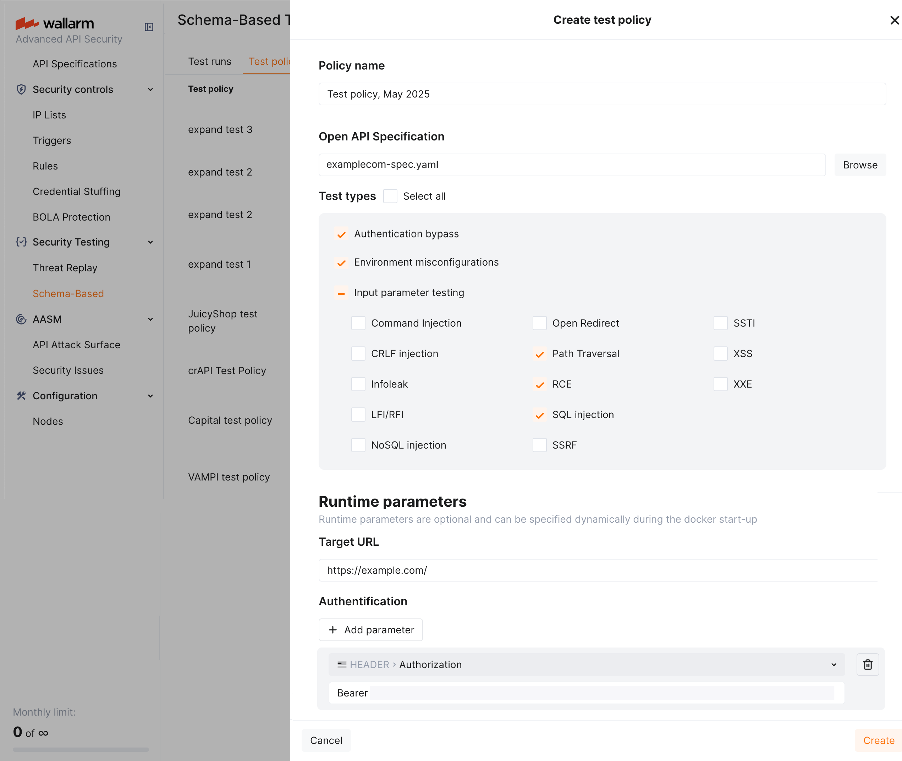
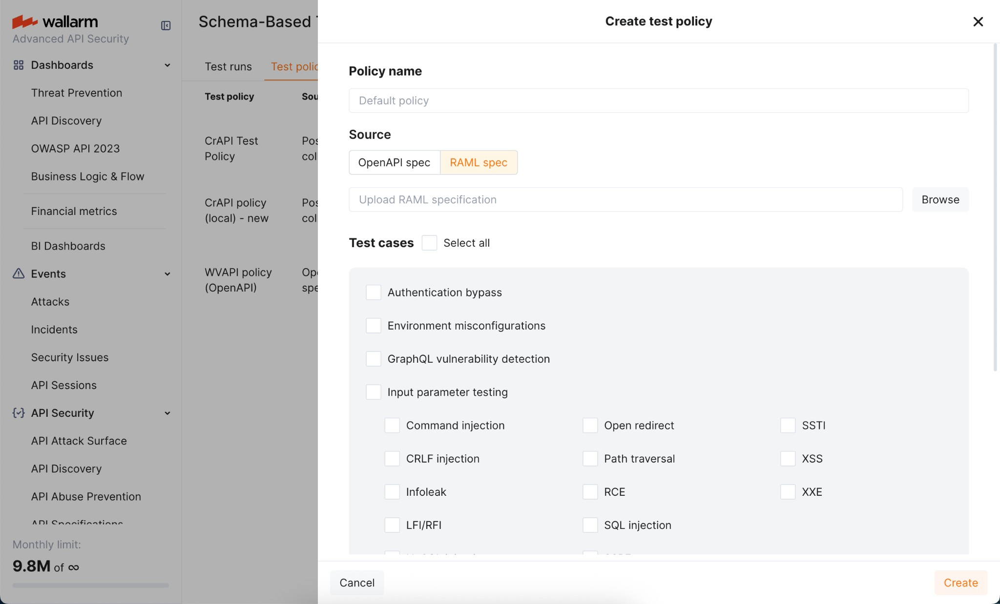
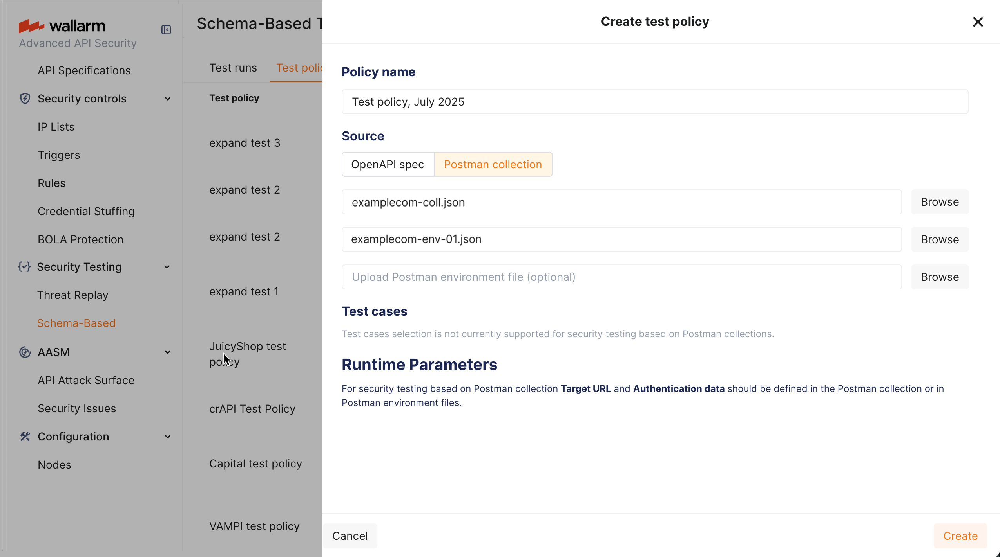
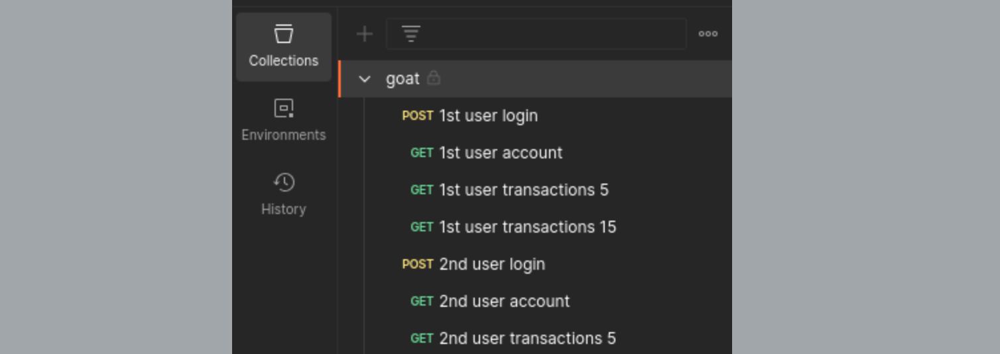
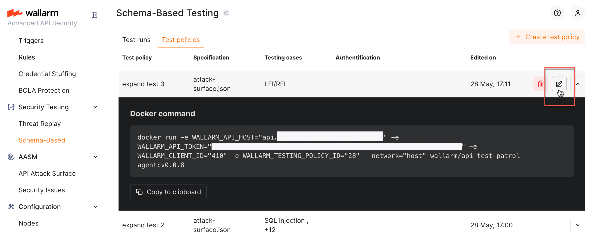

---
search:
  exclude: true
hide:
  - navigation
---

<meta name="robots" content="noindex, noarchive, nofollow">

# Schema-Based Testing Setup <a href="../../../about-wallarm/subscription-plans/#core-subscription-plans"></a>

**Schema-Based Testing:** [Overview](overview.md) &middot; Setup &middot; [Exploring results](explore.md)

This article explains how to enable Schema-Based Testing, create a test policy, and run the testing agent.

## Enable

Schema-Based Testing is disabled by default. To enable:

1. Contact sales@wallarm.com to activate the [**Security Testing** subscription plan](../../about-wallarm/subscription-plans.md#core-subscription-plans) for your account.
1. Go to the **Security Testing** → **Schema-Based** → **Test policies** tab and create [at least one policy](#test-policy-types).

## Prerequisites

### Token

Schema-Based Testing requires a [token](../../user-guides/settings/api-tokens.md) for authorizing data exchange between the running Docker container and Wallarm Cloud. The token can be created in two ways:

* **Automatically** - Schema-Based Testing creates it and includes it in the `docker run` command the first time you copy that command from any policy. Other policies re-use the existing token.
* **Manually** - in Wallarm Console, go to **Settings** → **API Tokens**, click **New token**, and set **Token usage** to `Schema-Based Testing agent`. All policies then use this token.

!!! info "The token is shown only in the Console"
    The Docker command displayed in the policy row contains the token. The API returns it masked, so copy the command from the Console.

### Allowlist

When running Schema-Based Testing against domains protected by security tools, add the client IP - the IP the Docker command runs from - to the allowlist. Otherwise most requests are blocked and vulnerabilities are not found.

This includes the case where Wallarm itself protects those domains - see Wallarm's [allowlist](../../user-guides/ip-lists/overview.md).

### Test accounts

Tests exercise authentication endpoints, including password reset and email change, using the credentials you supply. **A test run can therefore change the credentials of the accounts it tests with.**

* Use accounts created specifically for testing.
* Re-create them before each run if your test input authenticates with a password.
* Never use accounts that people depend on.

## Test policy types

You can configure a test policy [based](overview.md#test-basis) on an OpenAPI specification (OAS), a RAML specification, or a Postman collection. One test policy covers one type of testing.

* **OAS and RAML** cover input validation, injection, and misconfiguration detection, and - when you add [two test users](#authorization-testing-with-two-users) to the policy - authorization flaws (BOLA and BFLA).
* **Postman** covers the same, and can additionally carry the two users for authorization testing inside the collection itself.

## Selecting strategies

Each policy selects the **strategies** - the classes of test - that its runs execute.

!!! warning "Select strategies explicitly"
    If no strategy is selected, the policy falls back to a legacy list of test types that **does not include BOLA or BFLA**. Runs then complete normally and report nothing for those categories. When authorization testing matters, confirm that **BOLA** and **BFLA** are selected on the policy.

Available strategies are listed on the **Security Testing** → **Schema-Based** → **Strategies** tab, split into **active** checks, which send requests, and **passive** checks, which analyze the traffic the other tests produce. You can add your own strategies there as well.

## Service context

The **Custom context** field on a policy is free-form text describing the application under test. It is passed to the test generator, which uses it to build more relevant tests. Useful content:

* Which accounts exist, their roles, and their credentials
* Which objects each account owns - identifiers of orders, documents, vehicles, and so on
* Which identifiers the client controls, and in which part of the request
* Anything unusual about the authentication flow

Example:

```
Two regular accounts exist: user-a@example.com owns order 8 and document 4tse3T4;
user-b@example.com owns order 9 and document yXuvZZ. Both have the "user" role; an
admin role also exists. Object identifiers are client-controlled in the path, query
string, and body.
```

## OAS-based test policies

An OAS-based test policy persistently defines the application's **OpenAPI specification** and the tests to run. It may also include **runtime parameters** that each run can override, which is useful in CI/CD pipelines:

* **Target URL** (an initial value is required even though it can be overridden)
* Authentication parameters

To configure the policy:

1. Go to Wallarm Console → **Security Testing** → **Schema-Based** → **Test policies**.
1. Click **Add policy** and attach the OpenAPI specification file.

    !!! info "Using OAS from API Discovery"
        You can use an OpenAPI specification exported from [API Discovery](../../api-discovery/exploring.md#openapi-oas-export). In **API Discovery**, select a host, click **Download report** → **OpenAPI (OAS 3.1, JSON)** → **Generate OAS**, then attach the downloaded file.
1. Select the [strategies](#selecting-strategies) to run.
1. Set the **Target URL**.
1. Add the authentication header under **Runtime parameters**, for example `Authorization: Bearer <token>`.
1. Fill in [Custom context](#service-context).

    

!!! info "Authorization testing needs two users"
    BOLA and BFLA cannot be proven from a single identity. To test them with an OpenAPI or RAML policy, define **two test users** on the policy - each with its own authentication (for example, its own `Authorization: Bearer <token>` header). The run replays the traffic as each user, so the test can check whether one user reaches the other's objects. For BFLA, give the two users different privilege levels. See [Authorization testing with two users](#authorization-testing-with-two-users). With only one user configured, BOLA and BFLA tests return `inconclusive`.

## RAML-based test policies

If your API is documented in [RAML](https://raml.org/), attach the RAML file when creating the policy. Wallarm converts it to an OpenAPI specification and the policy then behaves like an [OAS-based policy](#oas-based-test-policies).



## Postman collection-based test policies

A Postman collection carries its own requests, authentication, and target, so a Postman-based policy does not ask for a target URL or an authentication header - both come from the collection and its environment files.

To configure the policy:

1. Verify the collection runs cleanly against the target on its own. Requests that fail in Postman also fail during testing and produce no findings.
1. Go to **Security Testing** → **Schema-Based** → **Test policies** and click **Add policy**.
1. Attach the collection and, optionally, environment files.
1. Select the [strategies](#selecting-strategies) to run.
1. Fill in [Custom context](#service-context).

    

## Authorization testing with two users

[OWASP API1:2023 Broken Object Level Authorization (BOLA)](https://github.com/OWASP/API-Security/blob/master/editions/2023/en/0xa1-broken-object-level-authorization.md) and [OWASP API5:2023 Broken Function Level Authorization (BFLA)](https://github.com/OWASP/API-Security/blob/master/editions/2023/en/0xa5-broken-function-level-authorization.md) cannot be proven from a single identity - the test needs two authenticated users, preferably with different privileges, so it can show whether one user reaches the other's objects or functions.

| Vulnerability | Input requirements |
| ---- | ---- |
| [OWASP API1:2023 BOLA](https://github.com/OWASP/API-Security/blob/master/editions/2023/en/0xa1-broken-object-level-authorization.md) | Two authenticated users, so the test can demonstrate whether object-level authorization is enforced between them. |
| [OWASP API5:2023 BFLA](https://github.com/OWASP/API-Security/blob/master/editions/2023/en/0xa5-broken-function-level-authorization.md) | Users with different privilege levels, so the test can evaluate whether function-level authorization is enforced consistently. |

For the strongest result, make sure each user **owns objects that the other does not** - have both users create an order, a document, or whatever your domain objects are, before the tests read them back, so there are concrete identifiers to cross-check.

Provide the two users in either of the following ways.

### Test users on the policy (OpenAPI, RAML, or Postman)

Define two **test users** on the test policy, each with its own authentication - for example, its own `Authorization: Bearer <token>` header - and a role to mark its privilege level. The run replays the API traffic as each user in turn, which is what lets BOLA and BFLA compare access between them. This is the simplest way to add authorization testing to an **OpenAPI or RAML** policy, and it works for Postman policies as well.

### Two users in a Postman collection

A Postman policy can instead carry both users in the collection or its environment files.

#### Example 1: one collection with requests from two users

1. Create a Postman collection containing requests from two authenticated users. For example, include login and activity requests from `User A` and `User B` in the same collection.

    

1. Verify all requests execute correctly.
1. Create a test policy with that collection.

#### Example 2: Postman environments for multiple users

1. Create two Postman environment files, each holding the credentials of a different user, for example `env1.json` for `User A` and `env2.json` for `User B`.
1. Create a test policy that uses your collection and both environment files.

    The collection is executed twice - once with each environment - so every request runs under both user contexts.

## Editing an existing policy

Clicking a policy opens its Docker command. To change the policy itself, click the edit button to open the edit dialog.



## Running the agent

### Requirements

* Docker
* Network access from the machine running the container to the target application
* Network access to the Wallarm API

### Running with a test policy

Copy the command from the policy row and run it:

```bash
docker run --network host \
  -e WALLARM_API_HOST="us1.api.wallarm.com" \
  -e WALLARM_API_TOKEN="<token>" \
  -e WALLARM_CLIENT_ID="<client id>" \
  -e WALLARM_TESTING_POLICY_ID="<policy id>" \
  wallarm/security-testing:<version> <openapi|postman>
```

The final argument matches the policy's test basis: `openapi` for OAS and RAML policies, `postman` for Postman policies.

Use `WALLARM_API_HOST="api.wallarm.com"` for the EU cloud.

### Environment variables

| Variable | Description |
| --- | --- |
| `WALLARM_API_HOST` | Wallarm API host: `us1.api.wallarm.com` (US cloud) or `api.wallarm.com` (EU cloud) |
| `WALLARM_API_TOKEN` | Token with the `Schema-Based Testing agent` usage |
| `WALLARM_CLIENT_ID` | Your Wallarm client identifier |
| `WALLARM_TESTING_POLICY_ID` | Identifier of the test policy to run |
| `TARGET_URL` | Overrides the policy's target URL (specification-based policies only) |
| `AUTH_HEADER` | Overrides the policy's authentication header (specification-based policies only) |
| `LOG_LEVEL` | `info` by default; set to `debug` for verbose output |
| `LOG_FORMAT` | `colored` by default |

!!! info "Postman policies ignore TARGET_URL and AUTH_HEADER"
    For Postman-based policies the target and authentication come from the collection and its environment files.

## Deleting policies

Deleting a policy removes it from the **Test policies** tab. Test runs already produced by that policy, and the security issues created from them, are retained.
