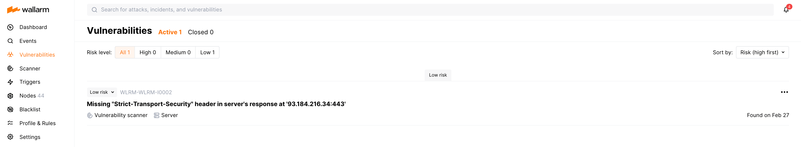

[whitelist-scanner-addresses]: ../user-guides/ip-lists/whitelist.md

# Detecting vulnerabilities

## What is a vulnerability?

A vulnerability is an error made due to negligence or inadequate information when building or implementing a web application that can lead to an information security risk. The information security risks are:

* Unauthorized data access: for example, access to read and modify user data
* Denial of service
* Data corruption and much more

## Vulnerability detection methods

When scanning the application for open vulnerabilities, Wallarm sends requests with attack signs to the protected application address and analyzes application responses. If the response matches one or more pre‑defined vulnerability signs, Wallarm records open vulnerability.

For example: if the response to the request sent to read the `/etc/passwd` contents returns the `/etc/passwd` contents, protected application is vulnerable to the Path Traversal attacks. Wallarm will record the vulnerability with an appropriate type.

To detect vulnerabilities in the application, Wallarm sends requests with attack signs using the following methods:

* **Passive detection**: the vulnerability was found due to the security incident that occurred.
* **Active threat verification** with the main component **Attack rechecker** lets you turn attackers into penetration testers and discover possible security issues from their activity as they probe your apps/APIs for vulnerabilities. The module **Attack rechecker** finds possible vulnerabilities by probing application endpoints using real attack data from the traffic. By default this method is disabled.
* **Vulnerability scanner**: all elements of the scope are scanned for typical vulnerabilities.

### Passive detection

With passive detection, Wallarm detects a vulnerability due to the security incident that occurred. If an application vulnerability has been exploited during an attack, Wallarm records the security incident and the exploited vulnerability.

Passive vulnerability detection is enabled by default.

### Active threat verification

#### How it works

--8<-- "../include/how-attack-rechecker-works.md"

#### Potential risks from the Attack rechecker activity

* In rare cases when a legitimate request is detected by Wallarm as an attack, the request will be replayed by **Attack rechecker**. If the request is not idempotent (for example, an authenticated request creating a new object in the application), then the **Attack rechecker** requests may create many new unwanted objects in the user account or perform other unexpected operations.

    To minimize the risk of the described situation, **Attack rechecker** will automatically strip the following HTTP headers from the replayed requests:

    * `Cookie`
    * `Authorization: Basic`
    * `Viewstate`
* In cases when the application uses a non-standard authentication method or does not require authenticating the requests, **Attack rechecker** may replay any request from the traffic and harm the system. For example: repeat 100 and more money transactions or orders. To minimize the risk of the described situation, it is recommended to [use testing or staging environments for attack replaying](../admin-en/attack-rechecker-best-practices.md#optional-configure-attack-rechecker-request-rewriting-rules-run-tests-against-a-copy-of-the-application) and [mask non-standard request authentication parameters](../admin-en/attack-rechecker-best-practices.md#configure-proper-data-masking-rules).

#### Configuration

The module **Attack rechecker** is disabled by default. It should be enabled and properly configured to work correctly. Please learn the **Attack rechecker** configuration options and best practices for these options setup from [this document](../admin-en/attack-rechecker-best-practices.md).

### Vulnerability scanner

#### How it works

Vulnerability scanner checks all elements of the company scope for typical vulnerabilities. The scanner sends requests to application addresses from fixed IP addresses and adds the header `X-Wallarm-Scanner-Info` to the requests.

#### Configuration

* The scanner can be [enabled or disabled](../user-guides/scanner/configure-scanner-modules.md) in the Wallarm Console → **Scanner** section. By default, the scanner is enabled.
* The list of [vulnerabilities that can be detected](../user-guides/scanner/configure-scanner-modules.md) by the scanner can be configured in the Wallarm Console → **Scanner** section. By default, vulnerability scanner detects all available vulnerabilities.
* The [limit of requests sent from the scanner](../user-guides/scanner/configure-scanner.md#scanners-rps-limits) can be configured in the Wallarm Console → **Scanner** section.
* If you use additional facilities (software or hardware) to automatically filter and block traffic, it is recommended that you configure a whitelist with the IP addresses for the Wallarm Scanner. This will allow Wallarm components to seamlessly scan your resources for vulnerabilities.

    * [Scanner IP address registered in Wallarm EU Cloud](../admin-en/scanner-address-en.md)
    * [Scanner IP address registered in Wallarm US Cloud](../admin-en/scanner-address-us-en.md)

    If you do not use additional facilities but use Wallarm Scanner, you do not need to manually whitelist Scanner IP addresses. Starting with Wallarm node 3.0, Scanner IP addresses are automatically whitelisted.

## False positives

**False positive** occurs when attack signs are detected in the legitimate request or when legitimate entity is qualified as a vulnerability. [More details on false positives in attack detection →](protecting-against-attacks.md#false-positives)

False positives in vulnerability scanning may occur due to the protected application specificities. Similar responses to similar requests may indicate an open vulnerability in one protected application and be expected behavior for another protected application.

If a false positive for a vulnerability is detected, you can add an appropriate mark to the vulnerability in Wallarm Console. A vulnerability marked as a false positive will be switched to an appropriate status and will not be rechecked. [More about managing false positives via Wallarm Console →](../user-guides/vulnerabilities/false-vuln.md)

If the detected vulnerability exists in the protected application but cannot be fixed, we recommend setting up the [**Create a virtual patch**](../user-guides/rules/vpatch-rule.md) rule. This rule will allow blocking attacks exploiting the detected type of vulnerability and will eliminate the risk of an incident.

## Managing discovered vulnerabilities

All detected vulnerabilities are displayed in the Wallarm Console → **Vulnerabilities** section. You can manage vulnerabilities through the interface as follows:

* View and analyze vulnerabilities
* Run vulnerability status recheck: still opened or fixed on the application side
* Close vulnerabilities or mark them as false positives

For more information on managing vulnerabilities, see the instructions on [working with vulnerabilities](../user-guides/vulnerabilities/check-vuln.md).

