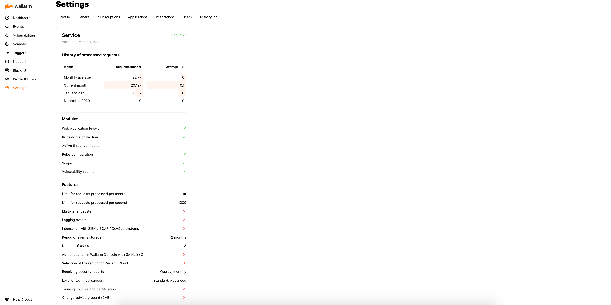

# Wallarm Subscription Plans

When subscribing to Wallarm, you choose a plan that meets your business needs the most. From this document, you can learn available subscription plans and the functionality they enable.

Wallarm provides the following subscription plans:

* **Cloud Native WAAP (Web Application & API Protection)** that is a Next-Gen WAF providing web applications and APIs with protection against common threats.
* **Advanced API Security** provides comprehensive API discovery and threat prevention across your entire portfolio, regardless of protocol.

    The Advanced API Security subscription plan is sold as an add-on for Cloud Native WAAP.

## Subscription plans

| Feature | Cloud Native WAAP | WAAP + Advanced API Security |
| ------- | ----------------- | --------------------- |
| **OWASP coverage** | | |
| [OWASP Top 10](https://owasp.org/www-project-top-ten/) | Yes | Yes |
| [OWASP API Top 10](https://owasp.org/www-project-api-security/) | Partially ⁕ | Yes |
| **Protected resource types** | | |
| Web applications | Yes | Yes |
| APIs | Partially ⁕ | Yes |
| **API protocol support** | | |
| Legacy (SOAP, XML-RPC, WebDAV, WebForm) | Yes | Yes |
| Mainstream (REST, GraphQL) | Yes | Yes |
| Modern and streaming (gRPC, WebSocket) | No | Yes |
| **Real-time threat prevention** | | |
| [Input validation attacks](../about-wallarm/protecting-against-attacks.md#input-validation-attacks), e.g. SQL injection, RCE | Yes | Yes |
| [Virtual patching](../user-guides/rules/vpatch-rule.md) | Yes | Yes |
| [Geolocation filtering](../user-guides/ip-lists/overview.md) | Yes | Yes |
| **Protection from automated threats** | | |
| [Brute-force protection](../admin-en/configuration-guides/protecting-against-bruteforce.md) | Yes | Yes |
| [BOLA (IDOR) protection](../admin-en/configuration-guides/protecting-against-bola.md) | Manual setup | Automated protection |
| [API Abuse Prevention](../about-wallarm/api-abuse-prevention.md) | No | Yes |
| [Credential Stuffing Detection](../about-wallarm/credential-stuffing.md) | No | Yes |
| **Observability options** | | |
| [API Discovery](../api-discovery/overview.md) | No | Yes |
| [Finding shadow, orphan and zombie APIs](../api-discovery/overview.md#shadow-orphan-and-zombie-apis) with API Discovery | No | Yes |
| [Sensitive data detection](../api-discovery/overview.md#sensitive-data-detection) | No | Yes |
| **Security testing and vulnerability assessment** | | |
| [Active threat verification](../about-wallarm/detecting-vulnerabilities.md#active-threat-verification) | No | Yes |
| [Vulnerability Scanner](../about-wallarm/detecting-vulnerabilities.md#vulnerability-scanner) | No | Yes |
| [OpenAPI security testing on CI/CD](../fast/openapi-security-testing.md) |  No | Yes |
| **Security event monitoring** | | |
| [Integrations](../user-guides/settings/integrations/integrations-intro.md) with SIEMs, messengers, etc | All | All |
| [Audit log](../user-guides/settings/audit-log.md) | Yes | Yes |
| **Deployment** | | |
| [Deployment options](../installation/supported-deployment-options.md) | All | All |
| [Multitenancy](../installation/multi-tenant/overview.md) | Yes (by request) | Yes (by request) |
| **User management** | | |
| [SSO (SAML) authentication for users](../admin-en/configuration-guides/sso/intro.md) | Yes | Yes |
| **Wallarm API** | | |
| [Access to Wallarm API](../api/overview.md) | Yes | Yes |

`⁕` Features may operate **Partially** when they depend on unavailable functionality, e.g. WAAP protects APIs partially because it analyzes requests sent via the limited set of API protocols.

To activate a subscription plan, please send a request to [sales@wallarm.com](mailto:sales@wallarm.com). Subscription cost will be determined based on the chosen plan, its period, and [incoming traffic volume](../admin-en/operation/learn-incoming-request-number.md).

Information about an active plan is displayed in Wallarm Console → **Settings** → **Subscriptions**.

## Subscription notifications

Wallarm notifies **Administrators** and **Global Administrators** of your account via emails about any issues with a subscription:

* Subscription time period expiration (60, 30, 15 days before and when the time period has expired)
* Exceedance of monthly quota for processed requests (when 85% and 100% of a quota has been reached)

In addition to that, the Wallarm Console UI displays the message about subscription issues for all users.

## Free tier subscription plan (US Cloud)

When a new user is registered in Wallarm Console of the **[US Cloud](overview.md#cloud)**, a new client account with a **Free Tier** subscription plan is automatically created in the Wallarm system.

The Free Tier subscription includes:

* The Wallarm features available for free up to the quota of **500 thousand requests per month** with no limitation in time. The quota resets on the first day of each month.
* Access to the Wallarm platform as [Advanced API Security](#subscription-plans), except for the following:

    * [Exposed asset](../user-guides/scanner.md) Scanner
    * The [API Abuse Prevention](api-abuse-prevention.md) module
    * Deployment of the [CDN node](../installation/cdn-node.md) type

**What happens if the quota is exceeded?**

If the company account exceeds 100% of the Free Tier monthly quota, your access to the Wallarm Console is disabled, along with all integrations. When reaching 200%, protection on your Wallarm nodes is disabled.

These restrictions will be in effect until the first day of the next month. Contact the Wallarm [sales team](mailto:sales@wallarm.com) to restore service immediately by switching to one of the paid subscription plans.

Information about the Free Tier subscription usage is displayed in Wallarm Console → **Settings** → **Subscriptions**.

Wallarm notifies **Administrators** and **Global Administrators** of your account via email when 85%, 100%, 185% and 200% of the free request quota have been exceeded.

## Trial period (EU Cloud)

When a new user is registered in Wallarm Console of the **[EU Cloud](overview.md#cloud)**, a new client account with an active trial period is automatically created in the Wallarm system.

* The trial period is free.
* The trial period lasts 14 days.
* Wallarm trial provides the maximum set of modules and features that can be included in the WAAP [plan](#subscription-plans).
* The trial period can be extended for 14 days more only once.

    The trial period can be extended in the Wallarm Console → **Settings** → **Subscriptions** section and via the button from the email notifying about the end of the trial period. The email is sent only to users with the [role **Administrator** and **Global Administrator**](../user-guides/settings/users.md#user-roles).
* If the trial period expired:

    * The account in Wallarm Console will be blocked.
    * The Wallarm node and Wallarm Cloud synchronization will be stopped.
    * The Wallarm node will operate locally but will not get any updates from the Wallarm Cloud as well as will not upload data to the Cloud.
    
    When a paid subscription to Wallarm is activated, access to the client account is restored for all users.

Information about the trial period is displayed in Wallarm Console → **Settings** → **Subscriptions**.
