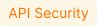

# DoS Protection 

The [unrestricted resource consumption](https://github.com/OWASP/API-Security/blob/master/editions/2023/en/0xa4-unrestricted-resource-consumption.md) is included in the [OWASP API Top 10 2023](../user-guides/dashboards/owasp-api-top-ten.md#wallarm-security-controls-for-owasp-api-2023) list of most serious API security risks. Being a threat by itself (service slow-down or complete down by overload), this also serves as foundation to different attack types, for example, enumeration attacks. Allowing too many requests per time is one of the main causes of these risks.

Wallarm provides the **DoS protection** [mitigation control](../about-wallarm/mitigation-controls-overview.md) to help prevent excessive traffic to your API.

Requires [NGINX Node](../installation/nginx-native-node-internals.md#nginx-node) 6.0.1 or [Native Node](../installation/nginx-native-node-internals.md#native-node) 0.14.1 or higher.

## Creating and applying mitigation control

Before proceeding: use the [Mitigation Controls](../about-wallarm/mitigation-controls-overview.md#configuration) article to get familiar with how **Scope**, **Scope filters** and **Mitigation mode** are set for any mitigation control.

To configure rate abuse protection:

1. Proceed to Wallarm Console → **Mitigation Controls**.
1. Use **Add control** → **DoS protection**.
1. Describe the **Scope** to apply the mitigation control to.
1. If necessary, define advanced conditions in **Scope filters**.
1. Set threshold to count number of requests per time interval.
1. In the **Mitigation mode** section, set action to be done when threshold is exceeded.
1. Click **Create**.

## Mitigation control examples

### Limiting connections by sessions to prevent brute force attacks on auth parameters

By limiting requests per time by user sessions, you can restrict brute force attempts to find real JWTs or other authentication parameters in order to gain unauthorized access to protected resources. For example, if request limit is set to allow only 10 requests per 60 seconds under a session, an attacker attempting to discover a valid JWT by making multiple requests with different token values will quickly hit the limit, and their requests will be rejected by IP or session.

Suppose your application accepts POST requests that include a Bearer JWT at the `https://example.com/api/login` endpoint. We want to block for 1 hour sessions within which more than 10 requests per 60 seconds are sent to this endpoint. For this scenario, the mitigation control limiting requests per time will appear as follows:

## Difference with rate limiting

For restricting resource consumption and preventing attacks using massive amounts of requests, besides described rate abuse protection, Wallarm provides the [advanced rate limiting](../user-guides/rules/rate-limiting.md).

The rate abuse protection blocks attackers by their IPs or sessions **while** advanced rate limiting delays some requests if rate is too high (puts to buffer) and rejects the remaining when buffer is full, when rate is back to normal, buffered requests are delivered, no blocking is applied by IP or session.
