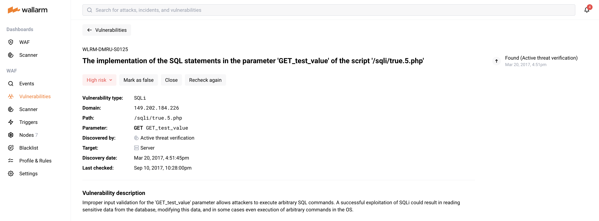

[link-using-search]:    ../search-and-filters/use-search.md
[img-current-attacks]:  ../../images/glossary/attack-with-one-hit-example.png
[img-incidents-tab]:    ../../images/user-guides/events/incident-vuln.png
[use-search]:             ../search-and-filters/use-search.md
[link-attacks]:         ../../user-guides/events/check-attack.md
[link-incidents]:       ../../user-guides/events/check-incident.md
[link-sessions]:        ../../api-sessions/overview.md

# Incident Analysis

An **incident** is an attack that successfully exploited a [security issue](../../about-wallarm/detecting-vulnerabilities.md) in your application. Wallarm detects such an attack but does not block it, because the targeted scope runs in a non-blocking [filtration mode](../../admin-en/configure-wallarm-mode.md). This article explains how to analyze and respond to incidents.

## Detection

Wallarm registers incidents through [passive detection](../../about-wallarm/detecting-vulnerabilities.md#detection-methods), which is enabled by default in every active filtering node. When Wallarm detects an attack and the response confirms that the attack succeeded, it concludes that the application has a vulnerability and that an attacker has exploited it — this is an incident.

Key points:

* Each incident is registered together with the security issue (vulnerability) it exploits. When more incidents exploit the same security issue later, they are all linked to it.
* Incidents come only from passive detection. Vulnerabilities found by [other detection methods](../../about-wallarm/detecting-vulnerabilities.md#detection-methods) do not produce incidents.

!!! info "Filtration mode"
     Passive detection relies on both the request and the response, so incidents are registered only for a scope in the `monitoring` [filtration mode](../../admin-en/configure-wallarm-mode.md).

## Importance

An incident marks the jump from a theoretical risk (an open vulnerability) to a live threat, so the security issues behind incidents should be prioritized for fixing:

* A successfully exploited vulnerability often becomes public knowledge in the attacker community.
* When one attacker succeeds, others reuse the same method. An incident means your system is a confirmed target.
* Each incident warrants investigation to identify data loss or other damage.

## Checking incidents in a list

Wallarm Console displays all detected incidents for the selected period in the **Incidents** section.

![Incidents tab][img-incidents-tab]

* **Date**: Date and time of the malicious request.
    * When several requests of the same type are detected at short intervals, the attack duration appears under the date. Duration is the time between the first and the last request of the same type within the selected time frame.
    * When the attack is ongoing, a corresponding label is displayed.
* **Payloads**: Attack type and the number of unique [malicious payloads](../../about-wallarm/protecting-against-attacks.md#malicious-payload).
* **Hits**: Number of hits (requests) in the attack within the selected time frame.
* **Top IP / Source**: IP address the malicious requests originated from. When the requests come from several IP addresses, Wallarm Console shows the address responsible for the most requests, along with:
     * The total number of IP addresses that the requests in the same attack originated from within the selected time frame.
     * The country or region where the IP address is registered (when found in databases such as IP2Location).
     * The source type, such as **Public proxy**, **Web proxy**, or **Tor**, or the cloud platform where the IP address is registered (when found in databases such as IP2Location).
     * The **Malicious IPs** label, shown when the IP address is known for malicious activity, based on public records and expert validation.
* **Domain / Path**: Domain, path, and application ID that the request targeted.
* **Status**: Attack blocking status, which depends on the [traffic filtration mode](../../admin-en/configure-wallarm-mode.md):
     * **Blocked**: all hits of the attack were blocked by the filtering node.
     * **Partially blocked**: some hits were blocked, others were only registered.
     * **Monitoring**: all hits were registered but not blocked.
* **Parameter**: Parameters of the malicious request and the tags of the [parsers](../rules/request-processing.md) applied to it.
* **Security issues**: Security issue (vulnerability) that the incident exploits. Clicking it opens the detailed description and instructions on how to fix it.

To sort incidents by the time of their last request, use the **Sort by latest hit** switch.

To find specific incidents, use the search field or set filters manually, as described in [Incident Search and Filters][use-search].

To get incidents as a file, export them as a PDF or CSV report, or receive them automatically by email. See [Creating Reports](../search-and-filters/custom-report.md#incidents-and-vulnerabilities).

## Checking incidents via security issues

You can also analyze incidents from the perspective of the [security issues](../../user-guides/vulnerabilities.md) they exploit:

* In the **Security Issues** section, look for issues that have the `Incident` tag in the **Security issue** column.
* Set the **Incident** filter to `Incident detected` to list all issues with incidents. Open an issue and view its **Related incidents** section, from which you can open the details of each incident.

## Full context of threat actor activities

--8<-- "../include/request-full-context.md"

## Responding to incidents

![Incidents tab][img-incidents-tab]

When an incident appears in the **Incidents** section, respond to it as follows:

1. Recommended: [investigate the full context](#full-context-of-threat-actor-activities) of the incident's malicious requests — which [user session](../../api-sessions/overview.md) they belong to and the full sequence of requests in that session.

     This reveals the threat actor's activity and intent, the attack vectors used, and the resources that could be compromised.

1. Follow the link in the **Security issues** column to open the security issue (vulnerability) details, including the list of related incidents and instructions on how to fix the vulnerability.

     

     Fix the security issue, then mark it closed in Wallarm. For details, see [Managing Security Issues](../vulnerabilities.md).

1. Return to the incident in the list and investigate the system reaction: check the `Blocked`, `Partially blocked`, and `Monitoring` [statuses](check-attack.md#attack-details), determine how the system will handle similar requests in the future, and adjust this behavior if necessary.

     For incidents, you investigate and adjust this behavior [in the same way](check-attack.md#responding-to-attacks) as for any other attack.

## API calls to get incidents

Besides using Wallarm Console, you can retrieve incident details by [calling the Wallarm API directly](../../api/overview.md). Incidents are returned by the `/v1/objects/attack` endpoint with the `"!vulnid": null` term, which keeps only attacks that have a vulnerability ID — this is how the system distinguishes incidents from attacks. The example below returns the first 50 incidents detected in the last 24 hours.

Replace `TIMESTAMP` with the timestamp of 24 hours ago in [Unix time](https://www.unixtimestamp.com/) format.

--8<-- "../include/api-request-examples/get-incidents-en.md"
