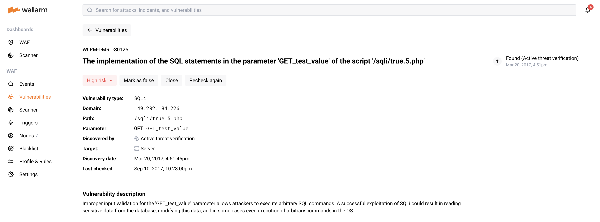

[img-incidents-statistic]:  ../../images/user-guides/events/incidents-statistic.png
[img-incident-request]:     ../../images/user-guides/events/incident-request-details.png
[link-attacks]:         ../../user-guides/events/check-attack.md
[link-incidents]:       ../../user-guides/events/check-incident.md
[link-sessions]:        ../../api-sessions/overview.md

# Incident Analysis

An **incident** is an attack that successfully exploited a [security issue](../../about-wallarm/detecting-vulnerabilities.md) in your application. Wallarm detects such an attack but does not block it, because the targeted scope runs in a non-blocking [filtration mode](../../admin-en/configure-wallarm-mode.md). This article explains how to analyze and respond to incidents.

## Detection

Wallarm registers incidents through [passive detection](../../about-wallarm/detecting-vulnerabilities.md#detection-methods), which is enabled by default in every active filtering node. When Wallarm detects an attack and the response confirms that the attack succeeded, it concludes that the application has a vulnerability and that an attacker has exploited it — this is an incident.

Key points:

* Each incident is registered together with the security issue (vulnerability) it exploits. When more incidents exploit the same security issue later, they are all linked to it.
* Incidents come only from passive detection. Vulnerabilities found by [other detection methods](../../about-wallarm/detecting-vulnerabilities.md#detection-methods) do not produce incidents.

!!! info "Filtration mode"
     Passive detection relies on both the request and the response, so incidents are registered only for a scope in the `monitoring` [filtration mode](../../admin-en/configure-wallarm-mode.md).

## Importance

An incident marks the jump from a theoretical risk (an open vulnerability) to a live threat, so the security issues behind incidents should be prioritized for fixing:

* A successfully exploited vulnerability often becomes public knowledge in the attacker community.
* When one attacker succeeds, others reuse the same method. An incident means your system is a confirmed target.
* Each incident warrants investigation to identify data loss or other damage.

## Incidents page

Wallarm Console displays detected incidents in the **Incidents** section. The page works like the [**Attacks**](check-attack.md#attacks-page) section, but it lists only incidents, and it groups them in one fixed way built for investigating them.

The page presents incidents for the selected period:

* The time range selector limits the data to a period.
* The filter field narrows the list down to the incidents you are interested in. It uses the same syntax as the **Attacks** section, described in [Attack Search and Filters](../search-and-filters/attack-filters.md#filter).
* **Statistic** is a collapsible panel with charts summarizing the filtered incidents: requests with incidents over time, top source IPs, status code breakdown, top incident endpoints and hosts, top attack types and subtypes.

![Incidents - Statistic][img-incidents-statistic]

The filter and the time range are stored in the page address. Reloading the page keeps them, and a copied link opens the same list for a colleague.

The table below the panel lists the incidents. Use **Table settings** to choose and arrange its columns. The **Security issues** column shows the severity and the state of each security issue that the incident exploits.

To get the data outside of Wallarm Console, export the incidents you currently see. The export reproduces the filter and the time range.

### Grouping

The **Incidents** section always groups incident requests by the following attributes, in this order. Each attribute is a level you open to drill down, and a row at any level summarizes all requests below it:

1. Attack type, for example, SQL Injection.
1. HTTP method.
1. Domain.
1. Path.
1. Parameter: the request point where the malicious payload was found.

Requests that exploit different security issues always stay in separate rows, even when all of the attributes match.

Unlike the **Attacks** section, the **Incidents** section has no views and no **Group by** control.

## Incident details

Clicking an incident opens its details in a drawer with the **Overview** and **Requests** tabs. The tabs work as described in [Attack details](check-attack.md#attack-details).

A single request can carry several attack signs, and only some of them exploit the security issue. In the **Requests** tab, the request details mark the attack sign that exploited the security issue and show the name of that security issue. Other attack signs of the same request are regular attacks and carry no mark.

![Incident details - Requests][img-incident-request]

## Checking incidents via security issues

You can also analyze incidents from the perspective of the [security issues](../../user-guides/vulnerabilities.md) they exploit:

* In the **Security Issues** section, look for issues that have the `Incident` tag in the **Security issue** column.
* Set the **Incident** filter to `Incident detected` to list all issues with incidents. Open an issue and view its **Related incidents** section, from which you can open the details of each incident.

!!! info "Security issues from other detection methods"
     The **Related incidents** section is displayed only for security issues found by [passive detection](../../about-wallarm/detecting-vulnerabilities.md#passive-detection). The details of security issues found by other detection methods do not include this section.

## Full context of threat actor activities

--8<-- "../include/request-full-context.md"

## Responding to incidents

When an incident appears in the **Incidents** section, respond to it as follows:

1. Recommended: [investigate the full context](#full-context-of-threat-actor-activities) of the incident's malicious requests — which [user session](../../api-sessions/overview.md) they belong to and the full sequence of requests in that session.

     This reveals the threat actor's activity and intent, the attack vectors used, and the resources that could be compromised.

1. Open the security issue (vulnerability) that the incident exploits to see its details, including the list of related incidents (for security issues found by passive detection) and instructions on how to fix the vulnerability. Its severity and state are shown in the **Security issues** column of the incident list.

     

     Fix the security issue, then mark it closed in Wallarm. For details, see [Managing Security Issues](../vulnerabilities.md).

1. Return to the incident and investigate the system reaction: check the `Blocked`, `Partially blocked`, and `Monitoring` [statuses](check-attack.md#overview), determine how the system will handle similar requests in the future, and adjust this behavior if necessary.

     For incidents, you investigate and adjust this behavior [in the same way](check-attack.md#responding-to-attacks) as for any other attack.

## API calls to get incidents

Besides using Wallarm Console, you can retrieve incident details by [calling the Wallarm API directly](../../api/overview.md). Incidents are returned by the `/v1/objects/attack` endpoint with the `"!vulnid": null` term, which keeps only attacks that have a vulnerability ID — this is how the system distinguishes incidents from attacks. The example below returns the first 50 incidents detected in the last 24 hours.

Replace `TIMESTAMP` with the timestamp of 24 hours ago in [Unix time](https://www.unixtimestamp.com/) format.

--8<-- "../include/api-request-examples/get-incidents-en.md"
