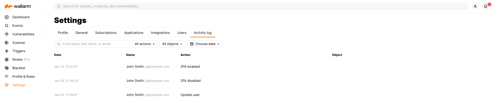

# User activity log

On the **Settings** → **Activity log** tab of Wallarm Console, you can check the history of user actions in the Wallarm system. The logs include information about creating, updating and deleting the following objects:

* IP address or subnet from the [exposed assets](../scanner.md)
* Domains from the network perimeter
* Services (ports) from the network perimeter
* Domains and associated IP addresses from the network perimeter
* [Two‑factor authentication](account.md#enabling-two-factor-authentication)
* [API tokens](api-tokens.md)
* [Users](users.md)
* Traffic processing [rules](../rules/rules.md)
* [Custom ruleset backups](../rules/rules.md#backup-and-restore)
* [Wallarm nodes](../nodes/nodes.md)
* [Triggers](../triggers/triggers.md)
* [Integrations](integrations/integrations-intro.md)
* [Blocked IP address](../ip-lists/overview.md)
* [Hit sampling](../events/grouping-sampling.md#sampling-of-hits)

The logs also include information on the following actions and objects:

* [Vulnerability marked as the false positive](../vulnerabilities.md#vulnerability-lifecycle)
* [Rechecked attack](../../vulnerability-detection/threat-replay-testing/overview.md)

**To filter the activity log records**, you can use the following parameters:

* Case sensitive data on the user performed the action

      If the action was performed by the Wallarm technical support team, the username is `Technical support`. This value cannot be used to sort the activity log records.
* Action type
* Name of the object on which the action was performed
* Date when the action was performed
