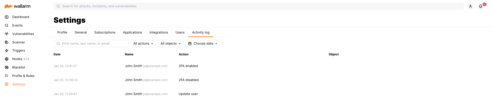

# Activity Log

The **Activity Log** (**Settings** → **Activity Log**) provides an audit trail of configuration and operational changes within your company's Wallarm account, including the actor, timestamp, affected resource, and source of each action.

Use the Activity Log to investigate configuration changes (e.g. find out who disabled a rule or removed an IP from the denylist), support compliance audits (SOC 2, PCI DSS, etc.), and troubleshoot issues caused by recent modifications.

By default, the log displays data for the last 3 months.

## What you can see

Each Activity Log entry includes:

| Column | Description |
|--------|-------------|
| **Time** | Date and time of the action. |
| **Object type** | Category of the resource that was affected (e.g. `Rule`, `Integration`, `Node`). |
| **Object** | Name and ID of the specific resource that was modified. |
| **Action** | What was done: `Create`, `Update`, `Delete`, or `Mode change`. |
| **Outcome** | Whether the action succeeded or failed. |
| **Actor** | Who performed the action — a user, a node, or Technical support (see [Actors](#actors)). |
| **Source** | How the action was triggered (see [Action sources](#action-sources)). |
| **Changes** | List of fields that were modified in this action. |

Click any row to open a detail drawer showing the full diff between the **Previous** and **New** state, with changed values highlighted.

Use the link button in the drawer to copy a direct URL to a specific event.

## Object types

The **Object type** filter and column show what kind of Wallarm resource was affected. The table below lists all available object types:

| Object type | What it means |
|-------------|---------------|
| `Client` | Changes to [tenant](../../installation/multi-tenant/overview.md) account settings — name, status, or configuration. |
| `User` | User account changes — role assignments, profile updates, enabling or disabling accounts. See [Managing Users](users.md). |
| `Sign-in` | User sign-in events — successful and failed authentication attempts. |
| `Subscription` | Changes to your Wallarm [subscription plan](../../about-wallarm/subscription-plans.md) — plan upgrades, renewals, or expiration date modifications. |
| `Application` | Changes to [protected application](applications.md) definitions — adding, renaming, or removing applications. |
| `Invitation` | Email [invitations](users.md#inviting-users) sent to new users or revoked. |
| `Integration` | Changes to third-party [integrations](integrations/integrations-intro.md) — Slack, email, SIEM connectors, webhooks, etc. |
| `API token` | [API token](api-tokens.md) creation, permission changes, regeneration, or revocation. |
| `Node` | [Filtering node](../nodes/nodes.md) registration, updates, or removal. When you see many `Create` entries with the `Node` source, these are nodes auto-registering in the Cloud. |
| `Node token` | [Node token](api-tokens.md#api-tokens-vs-node-tokens) lifecycle events — creation, regeneration, or revocation. |
| `Security Edge` | Changes to [Security Edge](../../installation/security-edge/overview.md) configuration and deployment settings. |
| `Trigger` | Changes to [triggers](../triggers/triggers.md) — automated reactions to events like new attacks or hits exceeding thresholds. |
| `Sampling` | Changes to [hit sampling](../../user-guides/events/grouping-sampling.md) configuration that controls how much attack data is stored. |
| `Extreme sampling` | Changes to extreme sampling settings applied under high-load conditions. |
| `Rule` | Creating, modifying, or deleting individual traffic processing [rules](../rules/rules.md). |
| `API spec` | Uploads or updates to [API specifications](../../api-specification-enforcement/overview.md) used for endpoint validation. |
| `API spec policy` | Changes to [policies](../../api-specification-enforcement/overview.md) that enforce API specification compliance. |
| `Session export config` | Changes to [API Sessions](../../api-sessions/overview.md) export configuration — defines which session context parameters are exported from the filtering node to the Wallarm Cloud for session analysis. |
| `Rule migration` | Events related to [copying the full ruleset](../../installation/multi-tenant/overview.md#migrating-rules) between tenant accounts. |
| `Rule settings` | Changes to global [rules](../rules/rules.md) engine configuration, such as ruleset build parameters. |
| `Attack` | Marking detected attacks as [false positives](../../about-wallarm/protecting-against-attacks.md#false-positives). |
| `2FA` | [Two-factor authentication](account.md#enabling-two-factor-authentication) enabled or disabled for a user account. |
| `IP list object` | Changes to [IP list](../../user-guides/ip-lists/overview.md) entries — adding or removing IPs, subnets, countries, or other sources in the denylist, graylist, or allowlist. |
| `LDAP settings` | Changes to [LDAP](../../admin-en/configuration-guides/ldap/ldap.md) directory authentication configuration. |
| `SAML authentication` | Changes to [SAML SSO](../../admin-en/configuration-guides/sso/intro.md) identity provider settings and provisioning rules. |
| `Email integration` | Changes to [email report](integrations/email.md) integration settings - scheduled PDF reports and instant security event notifications. |

## Action types

The **Action** filter lets you narrow results by what was done:

| Action | Description |
|--------|-------------|
| `Create` | A new resource was added. |
| `Update` | An existing resource was modified. |
| `Delete` | A resource was removed. |
| `Mode change` | Hit sampling was enabled or disabled. |

## Actors

The **Actor** column identifies who performed the action. Depending on the source, the actor can be:

* **A user** from your account's [user list](users.md) — displayed as the user's name and numeric ID.
* **A filtering node** — when the action source is `Node`, the **Actor** column shows the node's numeric ID instead of a user name. This is typical for automated operations such as node self-registration in the Cloud.
* **Technical support** — displayed when the action was performed by the Wallarm support team.

## Action sources

The **Source** column indicates how the action was triggered:

| Source | Description |
|--------|-------------|
| `UI` | Action performed manually in Wallarm Console. |
| `API token` | Action performed programmatically via the Wallarm API using an API token. |
| `Node` | Action performed automatically by a Wallarm filtering node. |
| `Unknown` | Source could not be determined (e.g. system-level operations). |

## Access restrictions

The Activity Log respects [user role](users.md#user-roles) permissions. You will only see entries for resources and actions that your role has access to.

For example, if your role does not grant access to rule management, rule-related activity will not appear in your log.

## Exporting data

Click **Export CSV** at the top right to download the currently displayed log entries (respecting all active filters) as a CSV file.

Export is useful for compliance audits (SOC 2, ISO 27001), incident post-mortems, or sharing activity data with teams that do not have Wallarm Console access. Since Wallarm [retains](../../about-wallarm/data-retention-policy.md) Activity Log data for a limited period, consider exporting regularly to your own storage (SIEM, data lake, or archive) if your retention policy requires longer history.
