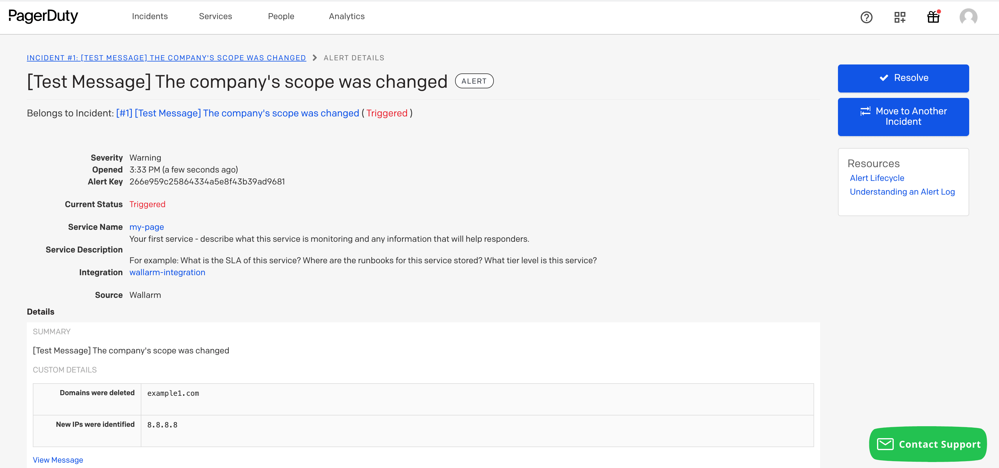

[link-pagerduty-docs]: https://support.pagerduty.com/docs/services-and-integrations

#   PagerDuty

[PagerDuty](https://www.pagerduty.com/) is an incident management and response platform that helps organizations manage and resolve incidents more effectively, ensuring the reliability of digital operations. You can set up Wallarm to send incidents to PagerDuty.

##  Setting up integration

In PagerDuty UI, [set up an integration][link-pagerduty-docs] for any existing service or create a new service specifically for Wallarm:

1. Go to **Configuration** → **Services**.
2. Open the settings of the existing service or click the **New Service** button.
3. Create a new integration:

    *   If you are configuring integrations of the existing service, go to the **Integrations** tab and click the **New Integration** button.
    *   If you are creating a new service, enter the service name and proceed to the **Integration Settings** section.
4. Enter the integration name and select the **Use our API directly** option as an integration type.
5. Save the settings:

    *   If you are configuring integrations of the existing service, click the **Add Integration** button.
    *   If you are creating a new service, configure the rest of the settings sections and click the **Add Service** button.
    
5. Copy the provided **Integration Key**.

In Wallarm UI:

1. Open the **Integrations** section.
1. Click the **PagerDuty** block or click the **Add integration** button and choose **PagerDuty**. 
1. Enter an integration name.
1. Paste the **Integration Key** value into the appropriate field.
1. Choose event types to trigger notifications.

    

    Details on available events:
      
    --8<-- "../include/integrations/events-for-integrations.md"

1. Click **Test integration** to check configuration correctness, availability of the target system, and the notification format.

    This will send the test notifications with the prefix `[Test message]`:

    

1. Click **Add integration**.

--8<-- "../include/cloud-ip-by-request.md"

## Setting up additional alerts

--8<-- "../include/integrations/integrations-trigger-setup.md"

## Disabling and deleting an integration

--8<-- "../include/integrations/integrations-disable-delete.md"

## System unavailability and incorrect integration parameters

--8<-- "../include/integrations/integration-not-working.md"
