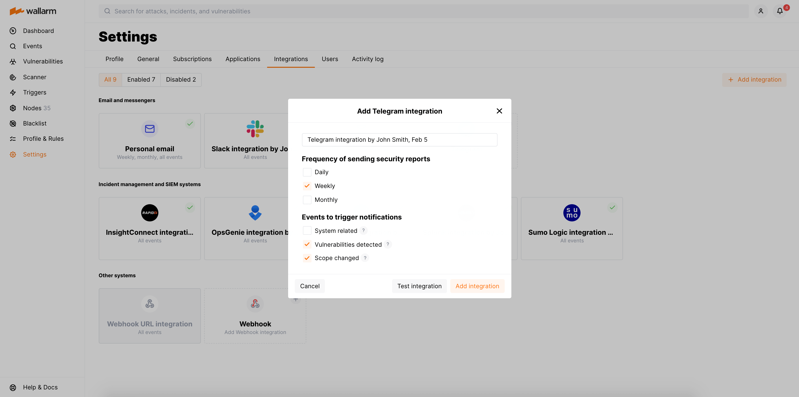

# Telegram

[Telegram](https://telegram.org/) is a cloud-based instant messaging platform and social media application. You can set up Wallarm to send scheduled reports and instant notifications to Telegram.

Scheduled reports can be sent on a daily, weekly, or monthly basis. Reports include detailed information about vulnerabilities, attacks, and incidents detected in your system over the selected period. Notifications include brief details of triggered events.

## Setting up integration

1. Open the **Integrations** section.
1. Click the **Telegram** block or click the **Add integration** button and choose **Telegram**.
1. Add [@WallarmUSBot](https://t.me/WallarmUSBot) (if you are using the Wallarm US Cloud) or [@WallarmBot](https://t.me/WallarmBot) (if you are using the Wallarm EU Cloud) to the Telegram group receiving Wallarm notifications and follow the authentication link.
1. After redirection to Wallarm UI, authenticate the bot.
1. Enter an integration name.
1. Choose the frequency of sending security reports. If the frequency is not chosen, then reports will not be sent.
1. Choose event types to trigger notifications.

    

    Details on available events:

    --8<-- "../include/integrations/events-for-integrations.md"

    The integration with Telegram can be tested only if this integration is already created.

1. Click **Add integration**.
1. Re-open the created integration card.
1. Click **Test integration** to check configuration correctness, availability of the target system, and the notification format.

    This will send the test notifications with the prefix `[Test message]`:

    ```
    [Test message] [Test partner] Network perimeter has changed

    Notification type: new_scope_object_ips

    New IP addresses were discovered in the network perimeter:
    8.8.8.8

    Client: TestCompany
    Cloud: EU
    ```

You can also start the chat with [@WallarmUSBot](https://t.me/WallarmUSBot) or [@WallarmBot](https://t.me/WallarmBot) directly. The bot will send reports and notifications as well.

## Setting up additional alerts

--8<-- "../include/integrations/integrations-trigger-setup-limited.md"

## Disabling and deleting an integration

--8<-- "../include/integrations/integrations-disable-delete.md"

## System unavailability and incorrect integration parameters

--8<-- "../include/integrations/integration-not-working.md"
