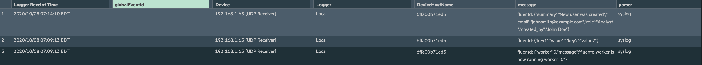

# Micro Focus ArcSight Logger via Fluentd

These instructions provide you with the example integration of Wallarm with the Fluentd data collector to further forward events to the ArcSight Logger system.

--8<-- "../include/integrations/webhook-examples/overview.md"


!!! info "Integration with the Enterprise version of ArcSight ESM"
    To configure forwarding logs from Fluentd to the Enterprise version of ArcSight ESM, it is recommended to configure the Syslog Connector on the ArcSight side and then forward logs from Fluentd to the connector port. To get a more detailed description of the connectors, please download the **SmartConnector User Guide** from the [official ArcSight SmartConnector documentation](https://community.microfocus.com/t5/ArcSight-Connectors/ct-p/ConnectorsDocs).

## Used resources

* [ArcSight Logger 7.1](#arcsight-logger-configuration) with the WEB URL `https://192.168.1.73:443` installed on CentOS 7.8
* [Fluentd](#fluentd-configuration) installed on Debian 11.x (bullseye) and available on `https://fluentd-example-domain.com`
* Administrator access to Wallarm Console in [EU cloud](https://my.wallarm.com) to [configure the Fluentd integration](#configuration-of-fluentd-integration)

--8<-- "../include/cloud-ip-by-request.md"

Since the links to the ArcSight Logger and Fluentd services are cited as examples, they do not respond.

### ArcSight Logger configuration

ArcSight Logger has logs receiver `Wallarm Fluentd logs` configured as follows:

* Logs are received via UDP (`Type = UDP Receiver`)
* Listening port is `514`
* Events are parsed with the syslog parser
* Other default settings


To get a more detailed description of the receiver configuration, please download the **Logger Installation Guide** of an appropriate version from the [official ArcSight Logger documentation](https://community.microfocus.com/t5/Logger-Documentation/ct-p/LoggerDoc).

### Fluentd configuration

Since Wallarm sends logs to the Fluentd intermediate data collector via webhooks, the Fluentd configuration should meet the following requirements:

* Accept the POST or PUT requests
* Accept HTTPS requests
* Have public URL
* Forward logs to ArcSight Logger, this example uses the `remote_syslog` plugin to forward logs

Fluentd is configured in the `td-agent.conf` file:

* Incoming webhook processing is configured in the `source` directive:
    * Traffic is sent to port 9880
    * Fluentd is configured to accept only HTTPS connections
    * Fluentd TLS certificate signed by a publicly trusted CA is located within the file `/etc/ssl/certs/fluentd.crt`
    * Private key for TLS certificate is located within the file `/etc/ssl/private/fluentd.key`
* Forwarding logs to ArcSight Logger and log output are configured in the `match` directive:
    * All event logs are copied from Fluentd and forwarded to ArcSight Logger at the IP address `https://192.168.1.73:514`
    * Logs are forwarded from Fluentd to ArcSight Logger in the JSON format according to the [Syslog](https://en.wikipedia.org/wiki/Syslog) standard
    * Connection with ArcSight Logger is established via UDP
    * Fluentd logs are additionally printed on the command line in JSON format (19-22 code lines). The setting is used to verify that events are logged via Fluentd

```bash linenums="1"
<source>
  @type http # input plugin for HTTP and HTTPS traffic
  port 9880 # port for incoming requests
  <transport tls> # configuration for connections handling
    cert_path /etc/ssl/certs/fluentd.crt
    private_key_path /etc/ssl/private/fluentd.key
  </transport>
</source>
<match **>
  @type copy
  <store>
      @type remote_syslog # output plugin to forward logs from Fluentd via Syslog
      host 192.168.1.73 # IP address to forward logs to
      port 514 # port to forward logs to
      protocol udp # connection protocol
    <format>
      @type json # format of forwarded logs
    </format>
  </store>
  <store>
     @type stdout # output plugin to print Fluentd logs on the command line
     output_type json # format of logs printed on the command line
  </store>
</match>
```

A more detailed description of configuration files is available in the [official Fluentd documentation](https://docs.fluentd.org/configuration/config-file).

!!! info "Testing Fluentd configuration"
    To check that Fluentd logs are created and forwarded to ArcSight Logger, the PUT or POST request can be sent to Fluentd.

    **Request example:**
    ```curl
    curl -X POST 'https://fluentd-example-domain.com' -H "Content-Type: application/json" -d '{"key1":"value1", "key2":"value2"}'
    ```

    **Fluentd logs:**
    

    **Event in ArcSight Logger:**
    

### Configuration of Fluentd integration

--8<-- "../include/integrations/webhook-examples/create-fluentd-webhook.md"


[More details on the Fluentd integration configuration](../fluentd.md)

## Example testing

--8<-- "../include/integrations/webhook-examples/send-test-webhook.md"

Fluentd will log the event as follows:


The following entry will be displayed in ArcSight Logger events:


