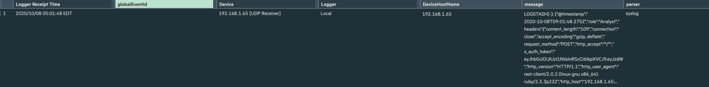

# Micro Focus ArcSight Logger via Logstash

## Example overview

--8<-- "../include/integrations/webhook-examples/overview.md"

In the provided example, events are sent via webhooks to the Logstash log collector and forwarded to the ArcSight Logger system.


!!! info "Integration with the Enterprise version of ArcSight ESM"
    To configure forwarding logs from Logstash to the Enterprise version of ArcSight ESM, it is recommended to configure the Syslog Connector on the ArcSight side and then forward logs from Logstash to the connector port. To get a more detailed description of the connectors, please download the **SmartConnector User Guide** from the [official ArcSight SmartConnector documentation](https://community.microfocus.com/t5/ArcSight-Connectors/ct-p/ConnectorsDocs).

## Used resources

* [ArcSight Logger 7.1](#arcsight-logger-configuration) with the WEB URL `https://192.168.1.73:443` installed on CentOS 7.8
* [Logstash 7.7.0](#logstash-configuration) installed on Debian 10.4 (Buster) and available on `https://192.168.1.65:5044`
* Administrator access to Wallarm Console in [EU cloud](https://my.wallarm.com) to [configure the webhook integration](#configuration-of-webhook-integration)

### ArcSight Logger configuration

ArcSight Logger has logs receiver `Wallarm Logstash logs` configured as follows:

* Logs are received via UDP (`Type = UDP Receiver`)
* Listening port is `514`
* Events are parsed with the syslog parser
* Other default settings


To get a more detailed description of the receiver configuration, please download the **Logger Installation Guide** of an appropriate version from the [official ArcSight Logger documentation](https://community.microfocus.com/t5/Logger-Documentation/ct-p/LoggerDoc).

### Logstash configuration

Logstash is configured in the `logstash-sample.conf` file:

* Incoming webhook processing is configured in the `input` section:
    * All HTTP and HTTPS traffic is sent to 5044 Logstash port
    * SSL certificate for HTTPS connection is located within the file `/etc/pki/ca.pem`
* Forwarding logs to ArcSight Logger and log output are configured in the `output` section:
    * All event logs are forwarded from Logstash to ArcSight Logger at the IP address `https://192.168.1.73:514`
    * Logs are forwarded from Logstash to ArcSight Logger in the JSON format according to the [Syslog](https://en.wikipedia.org/wiki/Syslog) standard
    * Connection with ArcSight Logger is established via UDP
    * Logstash logs are additionally printed on the command line (15th code line). The setting is used to verify that events are logged via Logstash

```bash linenums="1"
input {
  http { # input plugin for HTTP and HTTPS traffic
    port => 5044 # port for incoming requests
    ssl => true # HTTPS traffic processing
    ssl_certificate => "/etc/pki/ca.pem" # certificate for HTTPS connection
  }
}
output {
  syslog { # output plugin to forward logs from Logstash via Syslog
    host => "192.168.1.73" # IP address to forward logs to
    port => "514" # port to forward logs to
    protocol => "udp" # connection protocol
    codec => json # format of forwarded logs
  }
  stdout {} # output plugin to print Logstash logs on the command line
}
```

A more detailed description of the configuration files is available in the [official Logstash documentation](https://www.elastic.co/guide/en/logstash/current/configuration-file-structure.html).

!!! info "Testing Logstash configuration"
    To check that Logstash logs are created and forwarded to ArcSight Logger, the POST request can be sent to Logstash.

    **Request example:**
    ```curl
    curl -X POST 'https://192.168.1.65:5044' -H "Content-Type: application/json" -d '{"key1":"value1", "key2":"value2"}'
    ```

    **Logstash logs:**
    

    **Event in ArcSight Logger:**
    

### Configuration of webhook integration

--8<-- "../include/integrations/webhook-examples/create-logstash-webhook-ip.md"


## Example testing

--8<-- "../include/integrations/webhook-examples/send-test-webhook.md"

Logstash will log the event as follows:


The following entry will be displayed in ArcSight Logger events:


