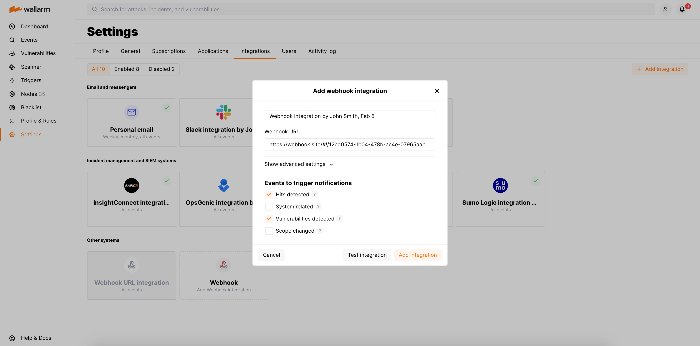

# Webhook

You can set up Wallarm to send instant notifications to any system that accepts incoming webhooks via HTTPS protocol.

## Notification format

Notifications are sent in either JSON Array or New Line Delimited JSON (NDJSON) format depending on your choice during integration setup. The set of JSON objects depends on the event for which the notification is sent. For example:

* Hit detected

    === "JSON Array"
        ```json
        [
        {
            "summary": "[Wallarm] New hit detected",
            "details": {
              "client_name": "Test Company",
              "cloud": "EU",
              "notification_type": "new_hits",
              "hit": {
                "host": "example.com",
                "heur_distance": 20.714285714285715,
                "method": "GET",
                "path": "/",
                "payloads": [
                  "1' select version();"
                ],
                "point": [
                  "get",
                  "id"
                ],
                "probability": 20.714285714285715,
                "remote_country": null,
                "remote_port": 41253,
                "remote_addr4": "8.8.8.8",
                "remote_addr6": null,
                "datacenter": "unknown",
                "tor": "none",
                "request_time": 1703519823,
                "create_time": 1703519826,
                "response_len": 345,
                "response_status": 404,
                "response_time": 359,
                "stamps": [
                  7965
                ],
                "regex": [],
                "stamps_hash": 271168947,
                "regex_hash": -2147483648,
                "type": "sqli",
                "block_status": "monitored",
                "brute_counter": "b:1111:xxxxxxxxxxxxxxxx",
                "final_wallarm_mode": "monitoring",
                "libproton_version": "4.8.0",
                "lom_id": 932,
                "protocol": "rest",
                "proxy_type": null,
                "request_id": "xxxxxxxxxxxxxxxx",
                "wallarm_mode": null,
                "id": [
                  "hits_production_1111_202312_v_1",
                  "xxxxxxxxxxxxxxxx"
                ],
                "object_type": "hit",
                "anomaly": 1.0357142857142858,
                "parameter": "GET_id_value",
                "applications": [
                  "default"
                ]
              }
           }
        },
        {
            "summary": "[Wallarm] New hit detected",
            "details": {
              "client_name": "Test Company",
              "cloud": "EU",
              "notification_type": "new_hits",
              "hit": {
                "host": "example.com",
                "heur_distance": 2.5,
                "method": "GET",
                "path": "/etc/passwd",
                "payloads": [
                  "/etc/passwd"
                ],
                "point": [
                  "uri"
                ],
                "probability": 2.5,
                "remote_country": null,
                "remote_port": 41254,
                "remote_addr4": "8.8.8.8",
                "remote_addr6": null,
                "datacenter": "unknown",
                "tor": "none",
                "request_time": 1703519826,
                "create_time": 1703519829,
                "response_len": 345,
                "response_status": 404,
                "response_time": 339,
                "stamps": [
                  2907
                ],
                "regex": [],
                "stamps_hash": -1063984326,
                "regex_hash": -2147483648,
                "type": "ptrav",
                "block_status": "monitored",
                "brute_counter": "b:1111:xxxxxxxxxxxxxxxx",
                "final_wallarm_mode": "monitoring",
                "libproton_version": "4.8.0",
                "lom_id": 932,
                "protocol": "none",
                "proxy_type": null,
                "request_id": "xxxxxxxxxxxxxxxx",
                "wallarm_mode": null,
                "id": [
                  "hits_production_1111_202312_v_1",
                  "xxxxxxxxxxxxxxxx"
                ],
                "object_type": "hit",
                "anomaly": 0.22727272727272727,
                "parameter": "URI_value",
                "applications": [
                  "default"
                ]
              }
           }
        }
        ]
        ```
    === "New Line Delimited JSON (NDJSON)"
        ```json
        {"summary":"[Wallarm] New hit detected","details":{"client_name":"Test Company","cloud":"EU","notification_type":"new_hits","hit":{"host":"example.com","heur_distance":20.714285714285715,"method":"GET","path":"/","payloads":["1' select version();"],"point":["get","id"],"probability":20.714285714285715,"remote_country":null,"remote_port":41253,"remote_addr4":"8.8.8.8","remote_addr6":null,"datacenter":"unknown","tor":"none","request_time":1703519823,"create_time":1703519826,"response_len":345,"response_status":404,"response_time":359,"stamps":[7965],"regex":[],"stamps_hash":271168947,"regex_hash":-2147483648,"type":"sqli","block_status":"monitored","brute_counter":"b:1111:xxxxxxxxxxxxxxxx","final_wallarm_mode":"monitoring","libproton_version":"4.8.0","lom_id":932,"protocol":"rest","proxy_type":null,"request_id":"xxxxxxxxxxxxxxxx","wallarm_mode":null,"id":["hits_production_1111_202312_v_1","xxxxxxxxxxxxxxxx"],"object_type":"hit","anomaly":1.0357142857142858,"parameter":"GET_id_value","applications":["default"]}}
        {"summary":"[Wallarm] New hit detected","details":{"client_name":"Test Company","cloud":"EU","notification_type":"new_hits","hit":{"host":"example.com","heur_distance":2.5,"method":"GET","path":"/etc/passwd","payloads":["/etc/passwd"],"point":["uri"],"probability":2.5,"remote_country":null,"remote_port":41254,"remote_addr4":"8.8.8.8","remote_addr6":null,"datacenter":"unknown","tor":"none","request_time":1703519826,"create_time":1703519829,"response_len":345,"response_status":404,"response_time":339,"stamps":[2907],"regex":[],"stamps_hash":-1063984326,"regex_hash":-2147483648,"type":"ptrav","block_status":"monitored","brute_counter":"b:1111:xxxxxxxxxxxxxxxx","final_wallarm_mode":"monitoring","libproton_version":"4.8.0","lom_id":932,"protocol":"none","proxy_type":null,"request_id":"xxxxxxxxxxxxxxxx","wallarm_mode":null,"id":["hits_production_1111_202312_v_1","xxxxxxxxxxxxxxxx"],"object_type":"hit","anomaly":0.22727272727272727,"parameter":"URI_value","applications":["default"]}}
        ```
* Security issue detected

    === "JSON Array"
        ```json
        [
            {
                summary:"[Wallarm] New security issue detected",
                description:"Notification type: security_issue

                            New security issue was detected in your system.

                            ID: 
                            Title: Test
                            Host: example.com
                            Path: 
                            Method: 
                            Discovered by: 
                            Parameter: 
                            Type: Info
                            Risk: Medium

                            More details: https://us1.my.wallarm.com/object/555


                            Client: TestCompany
                            Cloud: US
                            ",
                details:{
                    client_name:"TestCompany",
                    cloud:"US",
                    notification_type:"security_issue",
                    security_issue_link:"https://us1.my.wallarm.com/object/555",
                    security_issue:{
                        host:"example.com",
                        id:null,
                        method:null,
                        parameter:null,
                        path:null,
                        title:"Test",
                        discovered_by:null,
                        risk:"Medium",
                        type:"Info"
                    }
                }
            }
        ]
        ```
    === "New Line Delimited JSON (NDJSON)"
        ```json
        {"summary":"[Wallarm] New security issue detected","description":"Notification type: security_issue\nNew security issue was detected in your system.\nID: \nTitle: Test\nHost: example.com\nPath: \nMethod: \nDiscovered by: \nParameter: \nType: Info\nRisk: Medium\nMore details: https://us1.my.wallarm.com/object/555\nClient: TestCompany\nCloud: US","details":{"client_name":"TestCompany","cloud":"US","notification_type":"security_issue","security_issue_link":"https://us1.my.wallarm.com/object/555","security_issue":{"host":"example.com","id":null,"method":null,"parameter":null,"path":null,"title":"Test","discovered_by":null,"risk":"Medium","type":"Info"}}}
        ```

## Setting up integration

1. Open Wallarm UI → **Integrations**.
1. Click the **Webhook** block or click the **Add integration** button and choose **Webhook**.
1. Enter an integration name.
1. Enter target Webhook URL.
1. If required, configure advanced settings:

    --8<-- "../include/integrations/webhook-advanced-settings.md"

    
1. Choose event types to trigger notifications.

    

    Details on available events:

    --8<-- "../include/integrations/advanced-events-for-integrations.md"

1. Click **Test integration** to check configuration correctness, availability of the target system, and the notification format. Test notifications are always sent in the JSON Array format, even if New Line Delimited JSON (NDJSON) is chosen.
1. Click **Add integration**.

--8<-- "../include/cloud-ip-by-request.md"

## Setting up additional alerts

--8<-- "../include/integrations/integrations-trigger-setup.md"

### Example: notification to Webhook URL if IP address is added to the denylist

If an IP address was added to the denylist, the webhook about this event will be sent to Webhook URL.


**To test the trigger:**

1. Open the Wallarm Console → **IP lists** → **Denylist** and add the IP address to the denylist. For example:

    
2. Check that the following webhook was sent to the Webhook URL:

    ```
    [
        {
            "summary": "[Wallarm] Trigger: New IP address was denylisted",
            "description": "Notification type: ip_blocked\n\nIP address 1.1.1.1 was denylisted until 2021-06-10 02:27:15 +0300 for the reason Produces many attacks. You can review blocked IP addresses in the \"Denylist\" section of Wallarm Console.\nThis notification was triggered by the \"Notification about denylisted IP\" trigger. The IP is blocked for the application Application #8.\n\nClient: TestCompany\nCloud: EU\n",
            "details": {
            "client_name": "TestCompany",
            "cloud": "EU",
            "notification_type": "ip_blocked",
            "trigger_name": "Notification about denylisted IP",
            "application": "Application #8",
            "reason": "Produces many attacks",
            "expire_at": "2021-06-10 02:27:15 +0300",
            "ip": "1.1.1.1"
            }
        }
    ]
    ```

    * `Notification about denylisted IP` is the trigger name
    * `TestCompany` is the name of your company account in Wallarm Console
    * `EU` is the Wallarm Cloud where your company account is registered

## Disabling and deleting an integration

--8<-- "../include/integrations/integrations-disable-delete.md"

## System unavailability and incorrect integration parameters

--8<-- "../include/integrations/integration-not-working.md"
