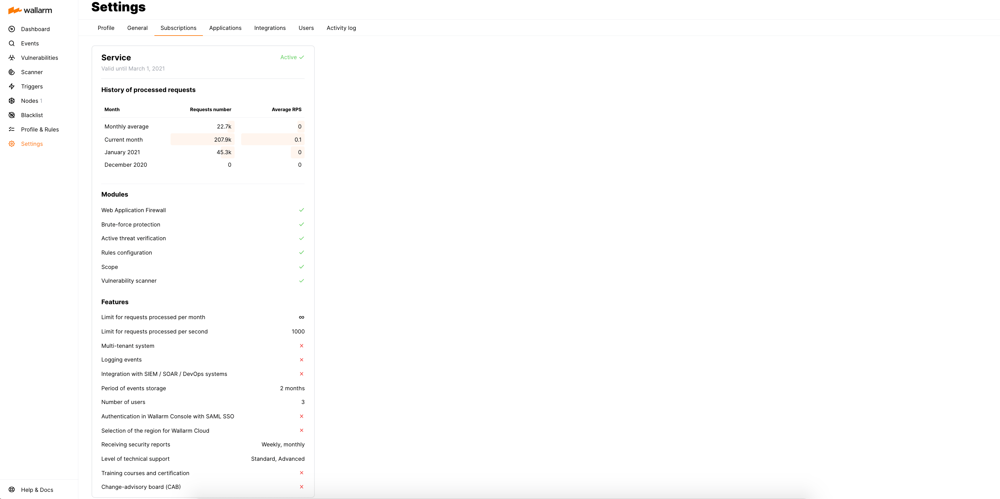

# Subscriptions

The section **Settings** → **Subscriptions** of Wallarm Console displays your Wallarm [subscription plan](../../about-wallarm/subscription-plans.md) details.

## Paid subscription plan

If you have the paid Wallarm subscription plan, the subscription card displays the following information:

* Subscription name and status
* Subscription expiration date
* Statistics on the requests processed by the filtering node
* The set of modules and features included in the subscription plan (the set depends on the chosen subscription plan)

To activate, cancel, or change a subscription, please send a request to [sales@wallarm.com](mailto:sales@wallarm.com).
