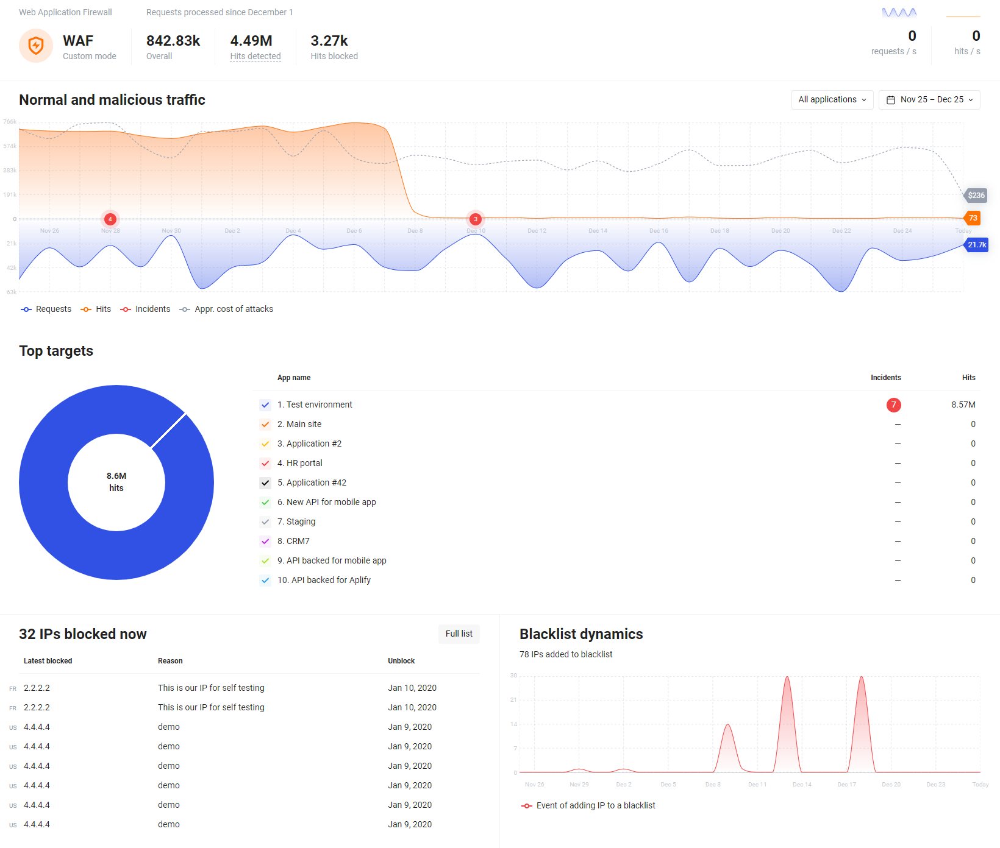
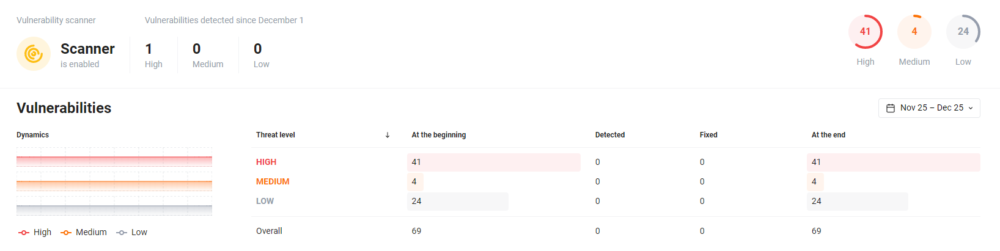

[img-dashboard-waf]:        ../../images/user-guides/dashboard/dashboard-waf.png
[img-dashboard-scanner]:    ../../images/user-guides/dashboard/dashboard-scanner.png

[doc-scanner]:              ../scanner/intro.md

# Dashboards Overview

The **Dashboards** section in your Wallarm account shows graphs and metrics on the history of events in your system and on the current status of resources. Data is displayed on two dashboards:

* [WAF dashboard](waf.md) with statistics on the WAF node operation

    
* [Scanner Dashboard](scanner.md) with statistics on detected vulnerabilities

    

!!! info "Getting started with WAF"
    The dashboard section also includes the **Get Started** button for new users. When you press the button, you will get a list of basic steps for installing and configuring a WAF node.