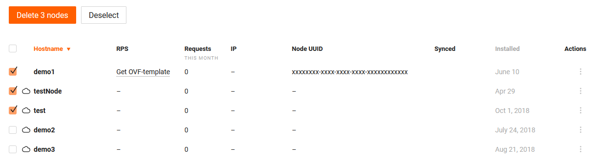

# Regular WAF nodes

The regular WAF node is used in Linux‑based, Kubernetes sidecar and Docker‑based deployments.

## Creating WAF node

The regular WAF node is created while setting up integration with the platform:

* [NGINX](../../admin-en/installation-nginx-en.md)
* [NGINX Plus](../../admin-en/installation-nginxplus-en.md)
* [Docker](../../admin-en/installation-docker-en.md)
* [Kubernetes sidecar container](../../admin-en/installation-guides/kubernetes/wallarm-sidecar-container.md)
* [Kong](../../admin-en/installation-kong-en.md)

If the integration is successfully finished, then the created WAF node will be displayed in the list of nodes in Wallarm UI.

## Viewing details of WAF node

The details of the installed WAF node are displayed in the table and card of each WAF node. To open the card, click the appropriate table record.

The following node properties and metrics are available:

* Node name that was given to the node upon creation
* The average number of requests per second (RPS)
* Node IP address
* Unique node identifier (UUID)
* Time of the last synchronization of the WAF node and Wallarm cloud
* Date of the WAF node creation
* Number of requests processed by the node in the current month
* Versions of the installed WAF node components

## Deleting WAF node

When the WAF node is deleted, filtration of requests to your application will be stopped. The deleting of the WAF node cannot be undone. The WAF node will be deleted from the list of nodes permanently.

1. Open Wallarm UI → **Nodes**.
2. Select one or more WAF nodes and click **Delete**. You can also delete the WAF node by selecting a button off the node menu or node card.
3. Confirm the action.

