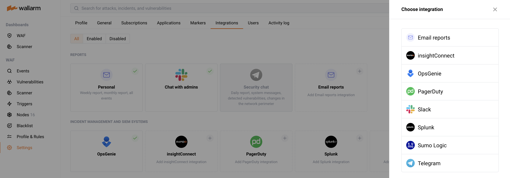

# Email Reports and Notifications

You can enter email addresses that will be used to deliver scheduled reports and instant notifications.

Notifications can be set up for the following events:

--8<-- "../include/integrations/events-for-integrations.md"

You can also schedule a full report delivery on a daily, weekly, or monthly basis.

!!! info
    To add the email addresses, you must have the *Administrator* role in the Wallarm system.

## Add Email Addresses and Configure Notifications

1. Open **Settings** → **Integrations** tab.
2. Click the **Email reports** block or click the **Add integration** button and choose **Email reports**. 

    
3. Enter email addresses using a comma as a separator.
4. Enter an integration name.
5. Choose the notification types and reports you need.
6. Click **Create**.

Wallarm will now deliver reports and notifications to those email addresses. 

## Disabling Reports and Notifications

--8<-- "../include/integrations/disable-integration.md"

## Removing Integration

--8<-- "../include/integrations/remove-integration.md"

!!! info "See also"
    * [Slack notifications](slack.md)
    * [Telegram reports and notifications](telegram.md)
    * [OpsGenie notifications](opsgenie.md)
    * [InsightConnect notifications](insightconnect.md)
    * [PagerDuty notifications](pagerduty.md)
    * [Splunk notifications](splunk.md)
    * [Sumo Logic notifications](sumologic.md)