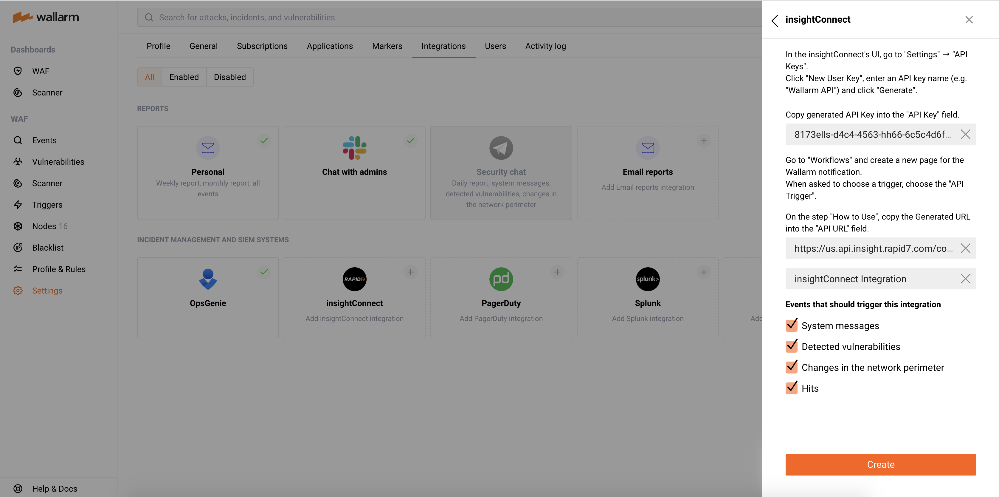

# InsightConnect

You can set up Wallarm to send real time notifications to InsightConnect for the following events:

--8<-- "../include/integrations/advanced-events-for-integrations.md"

## Setting up integration

First, generate and copy an API key as follows:

1. Open the InsightConnect's UI → **Settings** → [**API Keys** page](https://insight.rapid7.com/platform#/apiKeyManagement) and click **New User Key**.
2. Enter an API key name (e.g. `Wallarm API`) and click **Generate**.
3. Copy the generated API key.
4. Go to Wallarm UI → **Settings** → **Integrations** in the [EU](https://my.wallarm.com/settings/integrations/) or [US](https://us1.my.wallarm.com/settings/integrations/) cloud and click **InsightConnect**.
4. Paste the API key that you copied before into the **API key** field.

Secondly, generate and copy an API URL as follows:

1. Go back to the InsightConnect's UI, open the **Automation** → **Workflows** page and create a new workflow for the Wallarm notification.
2. When asked to choose a trigger, choose the **API Trigger**.
3. Copy the generated URL.
4. Go back to Wallarm UI → **InsightConnect** configuration and paste the API URL that you copied before into the **API URL** field.

Thirdly, finish the setup in Wallarm UI:

1. Enter an integration name.
2. Choose events to trigger notifications. If the events are not chosen, notifications will not be sent.
3. Press **Add integration**.

## Updating integration

--8<-- "../include/integrations/update-integration.md"

## Disabling integration

--8<-- "../include/integrations/disable-integration.md"

## Deleting integration

--8<-- "../include/integrations/remove-integration.md"
