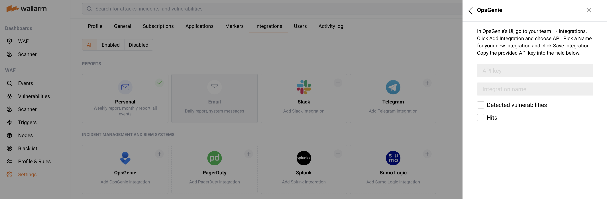

# OpsGenie

You can set up Wallarm to send alerts to OpsGenie when following events are triggered:

* [Hits](../../../glossary-en.md#hit) detected
* [Vulnerabilities](../../../glossary-en.md#vulnerability) detected

## Setting up integration

In [OpsGenie UI](https://app.opsgenie.com/teams/list):

1. Go to your team ➝ **Integrations**.
5. Press the **Add integration** button and choose **API**.
6. Enter the name for a new integration and press **Save Integration**.
7. Copy the provided API key.

In Wallarm UI:

1. Open **Settings** → **Integrations** tab.
2. Click the **OpsGenie** block or press the **Add integration** button and choose **OpsGenie**.
3. Enter an integration name.
4. Paste the copied API key to the **API key** field.
5. Choose events to trigger notifications. If the events are not chosen, notifications will not be sent.
6. Press **Add integration**.

    

## Updating integration

--8<-- "../include/integrations/update-integration.md"

## Disabling integration

--8<-- "../include/integrations/disable-integration.md"

## Deleting integration

--8<-- "../include/integrations/remove-integration.md"
