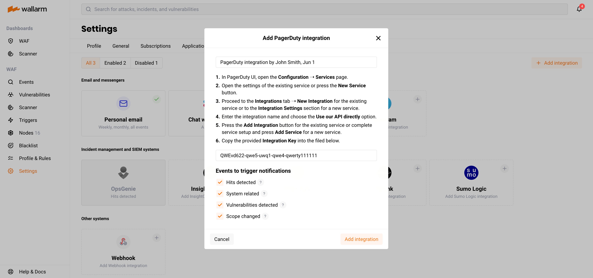

[link-pagerduty-docs]: https://support.pagerduty.com/docs/services-and-integrations

#   PagerDuty

You can set up Wallarm to send incidents to PagerDuty when the following events are triggered:

--8<-- "../include/integrations/advanced-events-for-integrations.md"

##  Setting up integration

In PagerDuty UI, [set up an integration][link-pagerduty-docs] for any existing service or create a new service specifically for Wallarm:

1. Go to **Configuration** → **Services**.
2. Open the settings of the existing service or press the **New Service** button.
3. Create a new integration:

    *   If you are configuring integrations of the existing service, go to the **Integrations** tab and click the **New Integration** button.
    *   If you are creating a new service, enter the service name and proceed to the **Integration Settings** section.
4. Enter the integration name and select the **Use our API directly** option as an integration type.
5. Save the settings:

    *   If you are configuring integrations of the existing service, click the **Add Integration** button.
    *   If you are creating a new service, configure the rest of the settings sections and click the **Add Service** button.
    
5. Copy the provided **Integration Key**.

In Wallarm UI:

1. Open **Settings** → **Integrations** tab.
2. Click the **PagerDuty** block or click the **Add integration** button and choose **PagerDuty**. 
3. Enter an integration name.
4. Paste the **Integration Key** value into the appropriate field.
5. Choose event types to trigger notifications. If the events are not chosen, PagerDuty incidents will not be added.
6. Click **Add integration**.

    

## Updating integration

--8<-- "../include/integrations/update-integration.md"

## Disabling integration

--8<-- "../include/integrations/disable-integration.md"

## Deleting integration

--8<-- "../include/integrations/remove-integration.md"
