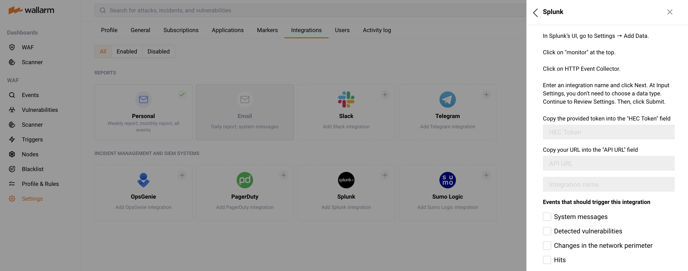

#   Splunk

You can set up Wallarm to send alerts to Splunk when the following events are triggered:

--8<-- "../include/integrations/advanced-events-for-integrations.md"

##  Setting up integration

In Splunk UI:

1. Open the **Settings** ➝ **Add Data** page and select **Monitor**.
2. Select the **HTTP Event Collector** option, enter an integration name and click **Next**.
3. Skip choosing the data type at the **Input Settings** page and continue to **Review Settings**.
4. Review and **Submit** the settings.
5. Copy the provided token.

In Wallarm UI:

1. Open **Settings** → **Integrations** tab.
2. Click the **Splunk** block or click the **Add integration** button and choose **Splunk**.
3. Enter an integration name.
4. Paste the copied token into the **HEC token** field.
5. Paste HEC URI and the port number of your Splunk instance into the **HEC URI:PORT** field. For example: `https://hec.splunk.com:8088`.
6. Choose event types to trigger notifications. If the events are not chosen, then Splunk alerts will not be sent.
7. Click **Add integration**.

## Updating integration

--8<-- "../include/integrations/update-integration.md"

## Disabling integration

--8<-- "../include/integrations/disable-integration.md"

## Deleting integration

--8<-- "../include/integrations/remove-integration.md"
