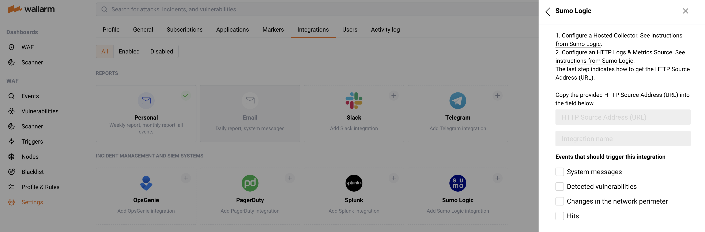

# Sumo Logic Notifications

You can set up Wallarm to send notifications to Sumo Logic for the following events:

*   System-related:
    *   new user created
    *   integration settings changed
*   Vulnerability detected
*   [Vulnerability](../../../glossary-en.md#vulnerability) detected
*   Network perimeter changed
*  [Hit](../../../glossary-en.md#hit) detected

## Setting up Notifications

Perform the following actions in the Sumo Logic interface:

1. Configure a Hosted Collector following the [instructions](https://help.sumologic.com/03Send-Data/Hosted-Collectors/Configure-a-Hosted-Collector).
2. Configure an HTTP Logs & Metrics Source following the [instructions](https://help.sumologic.com/03Send-Data/Sources/02Sources-for-Hosted-Collectors/HTTP-Source).
3. Copy the provided *HTTP Source Address (URL)*.

Perform the following actions in your Wallarm account:

1. Go to your Wallarm account > *Settings* > *Integrations* by the link below:
      * https://my.wallarm.com/settings/integrations/ for the [EU cloud](../../../quickstart-en/how-wallarm-works/qs-intro-en.md#eu-cloud)
      * https://us1.my.wallarm.com/settings/integrations/ for the [US cloud](../../../quickstart-en/how-wallarm-works/qs-intro-en.md#us-cloud)
2. Click the *Sumo Logic* block or click the *Add integration* button and choose *Sumo Logic*.

   
3. Paste the copied value of *HTTP Source Address (URL)* to the *HTTP Source Address (URL)* field.
4. Enter the integration name and select the event types you want to be notified of.
5. Click *Create*.

Now notifications for events of the selected types will appear in Sumo Logic.

## Disabling Notifications

1. Go to your Wallarm account > *Settings* > *Integrations* by the link below:
      * https://my.wallarm.com/settings/integrations/ for the [EU cloud](../../../quickstart-en/how-wallarm-works/qs-intro-en.md#eu-cloud)
      * https://us1.my.wallarm.com/settings/integrations/ for the [US cloud](../../../quickstart-en/how-wallarm-works/qs-intro-en.md#us-cloud)
2. Select an integration and click *Disable*.
3. Click *Save*.

## Removing Integration

1. Go to your Wallarm account > *Settings* > *Integrations* by the link below:
      * https://my.wallarm.com/settings/integrations/ for the [EU cloud](../../../quickstart-en/how-wallarm-works/qs-intro-en.md#eu-cloud)
      * https://us1.my.wallarm.com/settings/integrations/ for the [US cloud](../../../quickstart-en/how-wallarm-works/qs-intro-en.md#us-cloud)
2. Select an integration and click *Remove*.
3. Click *Sure?*.

!!! info "See also"
    * [Email reports and notifications](email.md)
    * [Slack notifications](slack.md)
    * [Telegram reports and notifications](telegram.md)
    * [OpsGenie notifications](opsgenie.md)
    * [PagerDuty notifications](pagerduty.md)
    * [Splunk notifications](splunk.md)
