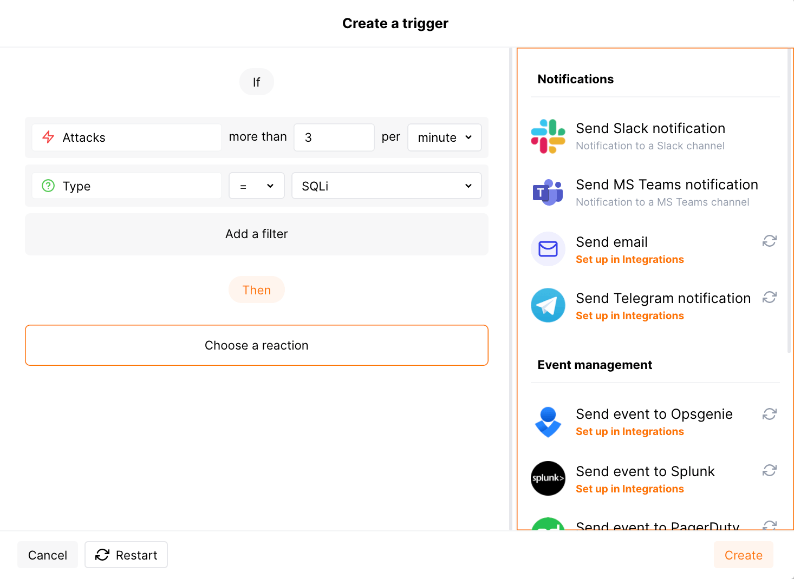

### Etapa 1: Escolhendo uma condição

As seguintes condições estão disponíveis para notificação:

* Número de [ataques](../../glossary-en.md#attack) (ataques experimentais baseados em [expressões regulares personalizadas](../rules/regex-rule.md) não são contados)
* Número de [acertos](../../glossary-en.md#hit) exceto por:

    * Acertos experimentais detectados com base na [expressão regular personalizada](../rules/regex-rule.md). Apenas acertos não experimentais são contados.
    * Acertos não salvos na [amostra](../events/analyze-attack.md#sampling-of-hits).
* Número de incidentes
* IP na lista de negação
* [Mudanças na API](../../api-discovery/overview.md#tracking-changes-in-api)
* Usuário adicionado

### Etapa 2: Adicionando filtros

Filtros são usados para detalhar a condição. Os seguintes filtros estão disponíveis:

* **Tipo** é um [tipo](../../attacks-vulns-list.md) de ataque detectado na solicitação ou um tipo de vulnerabilidade para a qual a solicitação é direcionada.
* **Aplicação** é a [aplicação](../settings/applications.md) que recebe a solicitação ou na qual um incidente é detectado.
* **IP** é um endereço IP a partir do qual a solicitação é enviada.

    O filtro espera apenas IPs únicos, não permite sub-redes, localizações e tipos de origem.
* **Domínio** é o domínio que recebe a solicitação ou no qual um incidente é detectado.
* **Status da resposta** é o código de resposta retornado à solicitação.
* **Alvo** é uma parte da arquitetura da aplicação para a qual o ataque é direcionado ou na qual o incidente é detectado. Pode ter os seguintes valores: `Servidor`, `Cliente`, `Banco de Dados`.

Escolha um ou mais filtros na interface do Console Wallarm e defina valores para eles.

### Etapa 3: Selecionando a integração

Nesta etapa, você seleciona a integração através da qual o alerta selecionado deve ser enviado. Você pode selecionar várias integrações simultaneamente.

### Etapa 4: Salvando o gatilho

1. Clique no botão **Criar** na caixa de diálogo de criação de gatilho.
2. Opcionalmente, especifique o nome e a descrição do gatilho e clique no botão **Concluído**.

Se o nome e a descrição do gatilho não forem especificados, então o gatilho é criado com o nome `Novo gatilho por <nome_do_usuário>, <data_de_criação>` e uma descrição vazia.